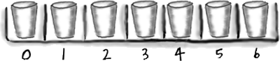

# Arrays - Head First Java, 3rd ed. (Sierra, Bates, Gee)

<!-- HF p.59 -->

### An array is like a tray of cups

The Java standard library includes lots of sophisticated data structures including maps, trees, and sets (see Appendix B), but arrays are great when you just want a quick, ordered, efficient list of things. Arrays give you fast random access by letting you use an index position to get to any element in the array.

Every element in an array is just a variable. In other words, one of the eight primitive variable types (think: Large Furry Dog) or a reference variable. Anything you would put in a *variable* of that type can be assigned to an

```java
int[] nums;


           nums = new int[7];
```

```java
nums[0] = 6;
nums[1] = 19;
nums[2] = 44;
nums[3] = 42;
nums[4] = 10;
nums[5] = 20;
nums[6] = 1;
```

### Arrays are objects too

You can have an array object that’s declared to *hold* primitive values. In other words, the array object can have *elements* that are primitives, but the array itself is *never* a primitive. **Regardless of what the array holds, the array itself is always an object!**

*array element* of that type. So in an array of type int (int[]), each element can hold an int. In a Dog array (Dog[]) each element can hold...a Dog? No, remember that a reference variable just holds a reference (a remote control), not the object itself. So in a Dog array, each element can hold a *remote control* to a Dog. Of course, we still have to make the Dog objects...and you’ll see all that on the next page. Be sure to notice one key thing in the picture—***the array is an object, even though it’s an array of primitives***.



> *Figure/sidebar text on this page:* Declare an int array variable. An array variable is / Arrays are always objects, / a remote control to an array object. / whether they’re declared to / hold primitives or object / Create a new int array with a length / references. / of 7, and assign it to the previously / declared int[] variable nums / 7 int variables / Give each element in the array / some int value. / Remember, elements in an int / array are just int variables. / 7 int variables / int int int int int int int / int array object (int[]) / nums / int[] / Notice that the array itself is an object, / even though the 7 elements are primitives.
