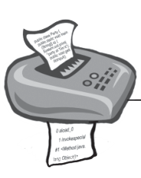
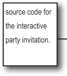
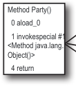
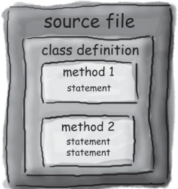
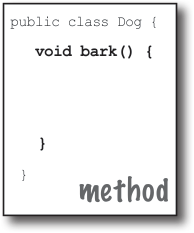
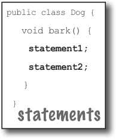
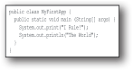
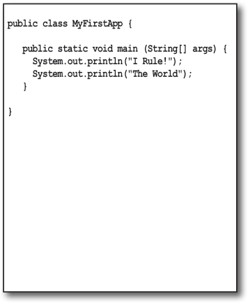
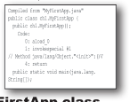

# Introduction to Java - Head First Java, 3rd ed. (Sierra, Bates, Gee)

<!-- HF p.2 -->

### The way Java works

```text

```

Create a source document. Use an The compiler creates a established protocol Run your document new document, coded (in this case, the Java through a source code into Java ***bytecode***. language). compiler. The compiler Any device capable of checks for errors and running Java will be able won’t let you compile to interpret/translate until it’s satisfied that this file into something everything will run it can run. The compiled correctly. bytecode is platform-independent.

```text

```

Your friends all have a Java ***virtual*** machine (JVM), implemented in software, running inside their electronic gadgets. When your friends run your program, the virtual machine reads and runs the bytecode.









> *Figure/sidebar text on this page:* The goal is to write one application (in this / example, an interactive party invitation) and have / it work on whatever device your friends have. / source code for / Method Party() / the interactive / 0 aload_0 / 1 invokespecial #1 / party invitation. / <Method java.lang. / Object()> / 4 return / Output / Source / (code) / Compiler / Virtual / Machines

<!-- HF p.7 -->

### Code structure in Java

#### What goes in a source file?

A source code file (with the *.java* extension) typically holds one ***class*** definition. The class represents a *piece* of your program, although a very tiny application might need just a single class. The class must go within a pair of curly braces.

#### What goes in a class?

A class has one or more ***methods***. In the Dog class, the ***bark*** method will hold instructions for how the Dog should bark. Your methods must be declared *inside* a class (in other words, within the curly braces of the class).

#### What goes in a method?

Within the curly braces of a method, write your instructions for how that method should be performed. Method *code* is basically a set of statements, and for now you can think of a method kind of like a function or procedure.








> *Figure/sidebar text on this page:* public class Dog { / class / } / In a source file, put a class. / public class Dog { / void bark() { / In a class, put methods. / In a method, put statements. / } / } / method / public class Dog { / void bark() { / statement1; / statement2; / } / } / statements

<!-- HF p.8 -->

### Anatomy of a class

When the JVM starts running, it looks for the class you give it at the command line. Then it starts looking for a specially written method that looks exactly like:

```java
public static void main (String[] args) {
   // your code goes here
}
```

Next, the JVM runs everything between the curly braces { } of your main method. Every Java application has to have at least one **class**, and at least one **main** method (not one main per *class*; just one main per *application*).

```java
public class MyFirstApp {
```

```java
   public static void main (String[] args) {

      System.out.print("I Rule!");

   }
}
```

> *Figure/sidebar text on this page:* The name of / This is a / Opening curly / Public so everyone / this class / class (duh) / brace of the class / can access it / Arguments to the method. / This method must be given / The return type. / an array of Strings, and the / (We’ll cover this / The name of / void means there’s / array will be called ‘args’ / this method / Opening brace / one later.) / no return value. / of the method / Every statement MUST / end in a semicolon!! / This says print to standard output / (defaults to command line) / The String you / want to print / Closing brace of the main method / Closing brace of the MyFirstApp class / Don’t worry about memorizing anything right now... / this chapter is just to get you started.

<!-- HF p.9 -->

### Writing a class with a main()

In Java, everything goes in a **class**. You’ll type your source code file (with a *.java* extension), then compile it into a new class file (with a *.class* extension). When you run your program, you’re really running a class.

Running a program means telling the Java Virtual Machine (JVM) to “Load the `MyFirstApp` class, then start executing its `main()` method. Keep running ’til all the code in main is finished.”

In Chapter 2, *A Trip to Objectville*, we go deeper into the whole *class* thing, but for now, the only question you need to ask is, ***how do I write Java code so that it will run?*** And it all begins with **main()**.

The **main()** method is where your program starts running.

No matter how big your program is (in other words, no matter how many *classes* your program uses), there’s got to be a **main()** method to get the ball rolling.

```text
1
```

#### • Save

```text
MyFirstApp.java
```

```text
2
```

#### • Compile

```text
javac MyFirstApp.java
```

```text
3
```

#### • Run

```text
                    java MyFirstApp

%java MyFirstApp
I Rule!
The World
```







> *Figure/sidebar text on this page:* public class MyFirstApp { / public static void main (String[] args) { / System.out.print("I Rule!"); / System.out.println("The World"); / } / } / public class MyFirstApp { / MyFirstApp.java / public static void main (String[] args) { / System.out.println("I Rule!"); / System.out.println("The World"); / compiler / } / } / Compiled from "MyFirstApp.java" / public class ch1.MyFirstApp { / public ch1.MyFirstApp(); / Code: / 0: aload_0 / 1: invokespecial #1 / // Method java/lang/Object."<init>":()V / 4: return / public static void main(java.lang. / String[]); / MyFirstApp.class / File Edit Window Help Scream
