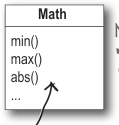
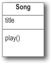
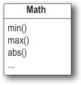

# Methods - Head First Java, 3rd ed. (Sierra, Bates, Gee)

<!-- HF p.276 -->

### MATH methods: as close as you’ll ever get to a global method

Except there’s no global *anything* in Java. But think about this: what if you have a method whose behavior doesn’t depend on an instance variable value. Take the round() method in the Math class, for example. It does the same thing every time— rounds a floating-point number (the argument to the method) to the nearest integer. Every time. If you had 10,000 instances of class Math, and ran the round(42.2) method, you’d get an integer value of 42. Every time. In other words, the method acts on the argument but is never affected by an instance variable state. The only value that changes the way the round() method runs is the argument passed to the method!

Doesn’t it seem like a waste of perfectly good heap space to make an instance of class Math simply to run the round() method? And what about *other* Math methods like min(), which takes two numerical primitives and returns the smaller of the two? Or max(). Or abs(), which returns the absolute value of a number. ***These methods never use instance variable values***. In fact, the Math class doesn’t *have* any instance variables. So there’s nothing to be gained by making an instance of class Math. So guess what? You don’t have to. As a matter of fact, you can’t.

```java
Math mathObject = new Math();
```

```java
%javac TestMath
TestMath.java:3: Math() has private
access in java.lang.Math
     Math mathObject = new Math();
                       ^
1 error
```

```java
long x = Math.round(42.2);
int y = Math.min(56, 12);
int z = Math.abs(-343);
```

> *Figure/sidebar text on this page:* Methods in the Math class / don’t use any instance / variable values. And because / the methods are “static,” / you don’t need to have an / instance of Math. All you / need is the Math class. / These methods never use / instance variables, so their / behavior doesn’t need to / know about a specific object. / If you try to make an instance of / class Math: / You’ll get this error: / File Edit Window Help IwasToldThereWouldBeNoMaths / This error shows that the Math / constructor is marked private! That / means you can NEVER say ‘new’ on the / Math class to make a new Math object.

<!-- HF p.277 -->

### The difference between regular (non-static) and static methods

Java is object-oriented, but once in a while you have a special case, typically a utility method (like the Math methods), where there is no need to have an instance of the class. The keyword `static` lets a method run ***without any instance of the class***. A static method means “behavior not dependent on an instance variable, so no instance/object is required. Just the class.”

#### regular (non-static) method

```java
public class Song {
  String title;

  public Song(String t) {
    title = t;
  }

  public void play() {
    SoundPlayer player = new SoundPlayer();
    player.playSound(title);
  }
}
```

```java
                s3.play();
s2.play();
```

#### static method

```java
public static int min(int a, int b) {
  //returns the smallest of a and b
}
```

```java
Math.min(42,36);
```





> *Figure/sidebar text on this page:* Instance variable value affects the / behavior of the play() method. / Math / No instance variables. The / method behavior doesn’t / The current value of the ‘title’ / min() / change with instance / instance variable is the song that / max() / variable state. / plays when you call play(). / abs() / Song / ... / My Way / title / Sex Pistols / play() / Politik / c / t / b / j / e / n / g / o / Coldplay / S / o / two instances / t / e / c / o / b / j / of class Song / S / o / n / g / Use the Class name, rather / than a reference variable / s3 / name. / s2 / Song / Song / NO OBJECTS!! / Calling play() on this / reference will cause / Absolutely NO OBJECTS / “Politik” to play. / Calling play() on this / anywhere in this picture! / reference will cause “My / Way” to play.

<!-- HF p.278 -->

#### Call a static method using a class name

```java
Math.min(88,86);
```

#### Call a non-static method using a reference variable name

```java
Song t2 = new Song();
t2.play();
```

### What it means to have a class with static methods

Often (although not always), a class with static methods is not meant to be instantiated. In Chapter 8, *Serious Polymorphism*, we talked about abstract classes, and how marking a class with the `abstract` modifier makes it impossible for anyone to say “new” on that class type. In other words, ***it’s impossible to instantiate an abstract class.***

But you can restrict other code from instantiating a *non*-abstract class by marking the constructor `private`. Remember, a *method* marked private means that only code from within the class can invoke the method. A *constructor* marked private means essentially the same thing—only code from within the class can invoke the constructor. Nobody can say “new” from *outside* the class. That’s how it works with the Math class, for example. The constructor is private; you cannot make a new instance of Math. The compiler knows that your code doesn’t have access to that private constructor.

This does *not* mean that a class with one or more static methods should never be instantiated. In fact, every class you put a main() method in is a class with a static method in it!

Typically, you make a main() method so that you can launch or test another class, nearly always by instantiating a class in main and then invoking a method on that new instance.

So you’re free to combine static and non-static methods in a class, although even a single non-static method means there must be *some* way to make an instance of the class. The only ways to get a new object are through “new” or deserialization (or something called the Java Reflection API that we don’t go into). No other way. But exactly *who* says new can be an interesting question, and one we’ll look at a little later in this chapter.



> *Figure/sidebar text on this page:* Math / min() / max() / abs() / ... / t2
