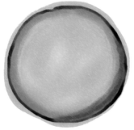
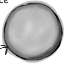

# Object references (Head First only) - Head First Java, 3rd ed. (Sierra, Bates, Gee)

<!-- HF p.54 -->

### Controlling your Dog object

You know how to declare a primitive variable and assign it a value. But now what about non-primitive variables? In other words, *what about objects?*

Foo object into the variable named myFoo.”

But that’s not what happens. There aren’t giant expandable cups that can grow to the size of any object. Objects live in one place and one place only—the garbage-collectible heap! (You’ll learn more about that later in this chapter.)

Although a primitive variable is full of bits representing the actual ***value*** of the variable, an object reference variable is full of bits representing ***a way to get to the object.***

You use the dot operator (.) on a reference variable to say, “use the thing *before* the dot to get me the thing *after* the dot.” For example:

```java
myDog.bark();
```

control for that object.

#### Dog d = new Dog(); d.bark();


> *Figure/sidebar text on this page:* • There is actually no such thing as an object variable. / think of this / • There’s only an object reference variable. / • An object reference variable holds bits that represent a / like this / way to access an object. / • It doesn’t hold the object itself, but it holds something / like a pointer. Or an address. Except, in Java we don’t / really know what is inside a reference variable. We do / know that whatever it is, it represents one and only one / object. And the JVM knows how to use the reference to / get to the object. / You can’t stuff an object into a variable. We often think of it that / way...we say things like, “I passed the String to the System.out. / println() method.” Or, “The method returns a Dog” or, “I put a new / Think of a Dog / reference variable as / a Dog remote control. / You use it to get the / object to do something / (invoke methods). / means, “use the object referenced by the variable myDog to invoke / the bark() method.” When you use the dot operator on an object / reference variable, think of it like pressing a button on the remote

<!-- HF p.55 -->

### An object reference is just another variable value

**Something that goes in a cup. Only this time, the value is a remote control.**

```java
byte x = 7;
```

The bits representing 7 go into the variable (00000111).

```java
Dog myDog = new Dog();
```

The bits representing a way to get to the Dog object go into the variable.

***The Dog object itself does not go into the variable!***

```java
Dog myDog = new Dog();


      1

 Dog myDog = new Dog();
```

Tells the JVM to allocate space for a reference variable, and names that variable *myDog*. The reference variable is, forever, of type Dog. In other words, a remote control that has buttons to control a Dog, but not a Cat or a Button or a Socket.

```java
   2
Dog myDog = new Dog();
```

Tells the JVM to allocate space for a new Dog object on the heap (we’ll learn a lot more about that process, especially in Chapter 9, *Life and Death of an Object*).

```java
        3

Dog myDog = new Dog();
```

Assigns the new Dog to the reference variable myDog. In other words, ***programs the remote control.***






> *Figure/sidebar text on this page:* The 3 steps of object / declaration, creation and / assignment / 2 / 1 / 3 / byte short int long reference / 8 16 32 64 (bit depth not relevant) / Declare a reference / variable / Primitive Variable / myDog / 00000111 / primitive / Dog / value / byte / Create an object / Reference Variable / ct / j / e / D / o / g / o / b / reference / value / Dog object / Dog / With primitive variables, the value of the vari­ / able is...the value (5, -26.7, ‘a’). / Link the object / and the reference / With reference variables, the value of the / variable is...bits representing a way to get to a / specific object. / You don’t know (or care) how any particular / JVM implements object references. Sure, they / might be a pointer to a pointer to...but even / if you know, you still can’t use the bits for / Dog object / anything other than accessing an object. / myDog / We don’t care how many 1s and 0s there are in a reference variable. It’s / Dog / up to each JVM and the phase of the moon.

<!-- HF p.56 -->

there are no

Dumb Questions

Java Exposed

Q:**How big is a reference**

**variable?**

A:You don’t know. Unless

**HeadFirst:** So, tell us, what’s life like for an object reference?

**Reference:** Pretty simple, really. I’m a remote control, and I can be programmed to

you’re cozy with someone on the JVM’s development team, you

control different objects.

don’t know how a reference is

**HeadFirst:** Do you mean different objects even while you’re running? Like, can you

represented. There are pointers

refer to a Dog and then five minutes later refer to a Car?

in there somewhere, but you can’t access them. You won’t

**Reference:** Of course not. Once I’m declared, that’s it. If I’m a Dog remote control,

need to. (OK, if you insist, you

then I’ll never be able to point (oops—my bad, we’re not supposed to say *point*), I mean,

might as well just imagine it

*refer* to anything but a Dog.

to be a 64-bit value.) But when

**HeadFirst:** Does that mean you can refer to only one Dog?

you’re talking about memory allocation issues, your Big

**Reference:** No. I can be referring to one Dog, and then five minutes later I can refer to

Concern should be about how

some *other* Dog. As long as it’s a Dog, I can be redirected (like reprogramming your remote

many *objects* (as opposed to

to a different TV) to it. Unless...no never mind.

object *references*) you’re creating and how big *they* (the *objects*)

**HeadFirst:** No, tell me. What were you gonna say?

really are.

**Reference:** I don’t think you want to get into this now, but I’ll just give you the short

Q:**So, does that mean that**

version—if I’m marked as `final`, then once I am assigned a Dog, I can never be reprogrammed to anything else but *that* one and only Dog. In other words, no other object can

be assigned to me.

**all object references are the**

**same size, regardless of the size**

**HeadFirst:** You’re right, we don’t want to talk about that now. OK, so unless you’re

**of the actual objects to which**

`final`, then you can refer to one Dog and then refer to a different Dog later. Can you ever

**they refer?**

refer to *nothing at all*? Is it possible to not be programmed to anything?

A:Yep. All references for a

**Reference:** Yes, but it disturbs me to talk about it.

**HeadFirst:** Why is that?

given JVM will be the same size regardless of the objects

**Reference:** Because it means I’m `null`, and that’s upsetting to me.

they reference, but each JVM

**HeadFirst:** You mean, because then you have no value?

might have a different way of representing references, so

**Reference:** Oh, `null` *is* a value. I’m still a remote control, but it’s like you brought

references on one JVM may be

home a new universal remote control and you don’t have a TV. I’m not programmed to

smaller or larger than references

control anything. They can press my buttons all day long, but nothing good happens. I

on another JVM.

just feel so...useless. A waste of bits. Granted, not that many bits, but still. And that’s not

Q:**Can I do arithmetic on a**

the worst part. If I am the only reference to a particular object and then I’m set to `null` (deprogrammed), it means that now *nobody* can get to that object I had been referring to.

**reference variable, increment**

**HeadFirst:** And that’s bad because...

**it, you know—C stuff?**

**Reference:** You have to *ask*? Here I’ve developed a relationship with this object, an

A:Nope. Say it with me again,

intimate connection, and then the tie is suddenly, cruelly, severed. And I will never see that object again, because now it’s eligible for [producer, cue tragic music] *garbage collection*.

“Java is not C.”

Sniff. But do you think programmers ever consider *that*? Snif. Why, *why* can’t I be a primitive? *I hate being a reference.* The responsibility, all the broken attachments...


> *Figure/sidebar text on this page:* This week’s interview: / Object Reference

<!-- HF p.57 -->

```java
Book b = new Book();
Book c = new Book();
```

Declare two Book reference variables. Create two new Book objects. Assign the Book objects to the reference variables.

The two Book objects are now living on the heap.

References: 2

Objects: 2

```java
Book d = c;
```

Declare a new Book reference variable. Rather than creating a new, third Book object, assign the value of variable ***c*** to variable ***d***. But what does this mean? It’s like saying “Take the bits in ***c***, make a copy of them, and stick that copy into ***d***.”

References: 3

Objects: 2

```java
c = b;
```

Assign the value of variable ***b*** to variable ***c***. By now you know what this means. The bits inside variable ***b*** are copied, and that new copy is stuffed into variable ***c***.

References: 3

Objects: 2

p a e e h l b i t c e o l l c e g a b r a g

p a e e h l b t i c e o l l c e g a b r a g

•

p a e e h b l i t c e l o l c e g a b r a g

> *Figure/sidebar text on this page:* Life on the garbage-collectible heap / 1 / B / ec / t / 2 / o / o / k / b / j / o / b / B / ec / t / o / o / j / k / o / b / Book / C / Book / 1 / t / B / o / ec / 2 / o / k / o / b / j / b / ec / t / B / j / Both c and d refer to the same / o / o / k / o / b / object. / Book / The c and d variables hold / two different copies of the / same value. Two remotes / C / programmed to one TV. / d / Book / Book / 1 / t / ec / b / j / 2 / B / o / o / k / o / ec / t / Both b and c refer to the / b / B / o / o / k / o / b / j / same object. / The c variable no longer / Book / refers to its old Book / object. / C / d

<!-- HF p.58 -->

```java
Book b = new Book();
Book c = new Book();
```

Declare two Book reference variables. Create two new Book objects. Assign the Book objects to the reference variables.

The two book objects are now living on the heap.

Active References: 2

Reachable Objects: 2

```java
b = c;
```

Assign the value of variable ***c*** to variable ***b***. The bits inside variable ***c*** are copied, and that new copy is stuffed into variable ***b***. Both variables hold identical values.

Active References: 2

Reachable Objects: 1

Abandoned Objects: 1

The first object that ***b*** referenced, Object 1, has no more references. It’s *unreachable*.

```java
c = null;
```

Assign the value `null` to variable ***c***. This makes ***c*** a *null reference*, meaning it doesn’t refer to anything. But it’s still a reference variable, and another Book object can still be assigned to it.

Active References: 1

*null* References: 1

Reachable Objects: 1

Abandoned Objects: 1

p a e e h l b t i c e o l l c e g a b r a g

p a e e h b l t i e c o l l c e g a b r a g

p a

•

e h e l ib t c e l o l -c e g a b r a g

> *Figure/sidebar text on this page:* Life and death on the heap / 1 / B / ec / t / 2 / o / o / k / b / j / o / b / B / ec / t / o / o / j / k / o / b / Book / C / Book / This dude is toast. / Garbage-collector bait. / 1 / B / ec / t / o / o / k / b / j / o / 2 / Both b and c refer to the same / object. Object 1 is abandoned / and eligible for Garbage Collec­ / t / b / B / ec / tion (GC). / o / o / k / o / b / j / Book / C / Book / Still toast / 1 / Not yet toast / (safe as long as b / B / ec / t / refers to it) / o / o / k / j / 2 / o / b / Object 2 still has an active / t / reference (b), and as long / b / ec / B / o / o / k / o / b / j / as it does, the object is not / eligible for GC. / Book / null reference / (not programmed to anything) / C / Book
