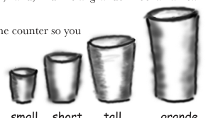
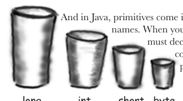
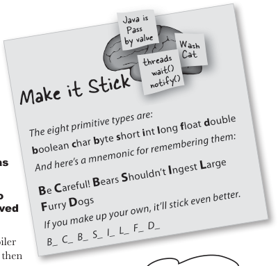
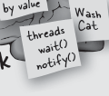

# Variables & Data Types - Head First Java, 3rd ed. (Sierra, Bates, Gee)

<!-- HF p.49 -->

#### Know Your Variables

So far you’ve used variables in two places—as object **state** (instance variables) and as **local**

variables (variables declared within a *method*). Later, we’ll use variables as **arguments** (values

sent to a method by the calling code), and as **return types** (values sent back to the caller of the

method). You’ve seen variables declared as simple **primitive** integer values (type `int`). You’ve

seen variables declared as something more **complex** like a String or an array. But **there’s gotta**

**be more to life** than integers, Strings, and arrays. What if you have a PetOwner object with a

Dog instance variable? Or a Car with an Engine? In this chapter we’ll unwrap the mysteries of Java

types (like the difference between primited and references) and look at what you can *declare* as a

variable, what you can *put* in a variable, and what you can *do* with a variable. And we’ll finally see

what life is *truly* like on the garbage-collectible heap.


> *Figure/sidebar text on this page:* 3 primitives and references / Variables can store two types of things: primitives and references.

<!-- HF p.50 -->

### Declaring a variable

**Java cares about type.** It won’t let you do something bizarre and dangerous like stuff a Giraffe reference into a Rabbit variable—what happens when someone tries to ask the so-called *Rabbit* to `hop()`? And it won’t let you put a floating-point number into an integer variable, unless you *tell the compiler* that you know you might lose precision (like, everything after the decimal point).

The compiler can spot most problems:

```java
Rabbit hopper = new Giraffe();
```

Don’t expect that to compile. *Thankfully*.

For all this type-safety to work, you must declare the type of your variable. Is it an integer? a Dog? A single character? Variables come in two flavors: ***primitive*** and ***object reference***. Primitives hold fundamental values (think: simple bit patterns) including integers, booleans, and floating-point numbers. Object references hold, well, *references* to *objects* (gee, didn’t *that* clear it up).

We’ll look at primitives first and then move on to what an object reference really means. But regardless of the type, you must follow two declaration rules:

#### variables must have a type

Besides a type, a variable needs a name so that you can use that name in code.

#### variables must have a name

```java
int count;
```

Note: When you see a statement like: “an object of **type** X,” think of *type* and *class* as synonyms. (We’ll refine that a little more in later chapters.)


> *Figure/sidebar text on this page:* Java cares about type. / You can’t put a Giraffe / reference in a Rabbit / variable. / type / name

<!-- HF p.51 -->

### “I’d like a double mocha, no, make it an int.”

When you think of Java variables, think of cups. Coffee cups, tea cups, giant cups that hold lots and lots of your favorite drink, those big cups the popcorn comes in at the movies, cups with wonderful tactile handles, and cups with metallic trim that you learned can never, ever go in the microwave. **A variable is just a cup. A container. It *holds* something.**

It has a size and a type. In this chapter, we’re going to look first at the variables (cups) that hold **primitives**: then a little later we’ll look at cups that hold *references to objects*. Stay with us here on the whole cup analogy—as simple as it is right now, it’ll give us a common way to look at things when the discussion gets more complex. And that’ll happen soon.

Primitives are like the cups they have at the coffee shop. If you’ve been to a Starbucks, you know what we’re talking about here. They come in different sizes, and each has a name like “short,” “tall,” and, “I’d like a ‘grande’ mocha half-caff with extra whipped cream.”

You might see the cups displayed on the counter so you can order appropriately:

And in Java, primitives come in different sizes, and those sizes have names. When you declare any variable in Java, you must declare it with a specific type. The four containers here are for the four integer primitives in Java.

Each cup holds a value, so for Java primitives, rather than saying, “I’d like a tall french roast,” you say to the compiler, “I’d like an int variable with the number 90 please.” Except for one tiny difference...in Java you also have to give your cup a *name*. So it’s actually, “I’d like an int please, with the value of 2486, and name the variable ***height***.” Each primitive variable has a fixed number of bits (cup size). The sizes for the six numeric primitives in Java are shown below:

#### Primitive Types

| Type | Bit Depth | Value Range |
|---|---|---|
| boolean and char |  |  |
| boolean | (JVM-specific) | true or false |
| char | 16 bits | 0 to 65535 |
| numeric (all are signed) |  |  |
| integer |  |  |
| byte | 8 bits | -128 to 127 |
| short | 16 bits | -32768 to 32767 |
| int | 32 bits | -2147483648 to 2147483647 |
| long | 64 bits | -huge to huge |
| floating point |  |  |
| float | 32 bits | varies |
| double | 64 bits | varies |

```java
int x;
x = 234;
byte b = 89;
boolean isFun = true;
double d = 3456.98;
char c = 'f';
int z = x;
boolean isPunkRock;
isPunkRock = false;
boolean powerOn;
powerOn = isFun;
long big = 3456789L;
float f = 32.5f;
```






> *Figure/sidebar text on this page:* Primitive declarations / small short tall grande / with assignments: / long int short byte / Note the ‘f’ and ‘L’. With / some number types, you have to / specifically tell the compiler / what you mean, or it might / get confused between similar- / looking number types. You can / byte short int long / float double / use upper or lowercase. / 8 16 32 64 32 64

<!-- HF p.52 -->

### You really don’t want to spill that...

**Be sure the value can fit into the variable.**

You can’t put a large value into a small cup.

Well, OK, you can, but you’ll lose some. You’ll get, as we say, *spillage*. The compiler tries to help prevent this if it can tell from your code that something’s not going to fit in the container (variable/cup) you’re using.

For example, you can’t pour an int-full of stuff into a byte-sized container, as follows:

```java
int x = 24;
byte b = x;
//won't work!!
```

Why doesn’t this work, you ask? After all, the value of *x* is 24, and 24 is definitely small enough to fit into a byte. *You* know that, and *we* know that, but all the compiler cares about is that you’re trying to put a big thing into a small thing, and there’s the *possibility* of spilling. Don’t expect the compiler to know what the value of *x* is, even if you happen to be able to see it literally in your code.

**You can assign a value to a variable in one of several ways including:**

- type a *literal* value after the equals sign (x=***12***, isGood = ***true***, etc.)
- assign the value of one variable to another (x = y)
- use an expression combining the two (x = y + ***43***)

In the examples below, the literal values are in bold italics:

```java
int size = 32;
char initial = 'j';
double d = 456.709;
boolean isLearning;
isLearning = true;
int y = x + 456;
```

#### Sharpen your pencil

The compiler won’t let you put a value from a large cup into a small one. But what about the other way—pouring a small cup into a big one? ***No problem.***

Based on what you know about the size and type of the primitive variables, see if you can figure out which of these are legal and which aren’t. We haven’t covered all the rules yet, so on some of these you’ll have to use your best judgment. ***Tip:*** The compiler always errs on the side of safety.

From the following list, ***Circle*** the statements that would be legal if these lines were in a single method:

```java
1. int x = 34.5;

2. boolean boo = x;

3. int g = 17;

4. int y = g;

5. y = y + 10;

6. short s;

7. s = y;

8. byte b = 3;

9. byte v = b;

10. short n = 12;

11. v = n;

12. byte k = 128;
```


> *Figure/sidebar text on this page:* declare an int named size, assign it the value 32 / declare a char named initial, assign it the value ‘j’ / declare a double named d, assign it the value 456.709 / declare a boolean named isCrazy (no assignment) / assign the value true to the previously declared isCrazy / declare an int named y, assign it the value that is the sum / of whatever x is now plus 456 / Answers on page 68.

<!-- HF p.53 -->

### Back away from that keyword!

You know you need a name and a type for your variables.

You already know the primitive types. ***But what can you use as names?*** The rules are simple. You can name a class, method, or variable according to the following rules (the real rules are slightly more flexible, but these will keep you safe):

Reserved words are keywords (and other things) that the compiler recognizes. And if you really want to play confuse-a-compiler, then just *try* using a reserved word as a name.

You’ve already seen some reserved words:

```java
public   static   void
```

And the primitive types are reserved as well:

```java
boolean char byte short int long float double
```

But there are a lot more we haven’t discussed yet. Even if you don’t need to know what they mean, you still need to know you can’t use ’em yourself. ***Do not—****under any circumstances****—try to memorize these now.*** To make room for these in your head, you’d probably have to lose something else. Like where your car is parked. Don’t worry, by the end of the book you’ll have most of them down cold.

### This table reserved

| _ | catch | double | float | int | private | super | true |
|---|---|---|---|---|---|---|---|
| abstract | char | else | for | interface | protected | switch | try |
| assert | class | enum | goto | long | public | synchronized | void |
| boolean | const | extends | if | native | return | this | volatile |
| break | continue | false | implements | new | short | throw | while |
| byte | default | final | import | null | static | throws |  |
| case | do | finally | instanceof | package | strictfp | transient |  |







> *Figure/sidebar text on this page:* Make it Stick / The eight primitive types are: / ■ It must start with a letter, underscore (_), or / boolean char byte short int long float double / dollar sign ($). You can’t start a name with a / And here’s a mnemonic for remembering them: / number. / ■ After the first character, you can use numbers as / Be Careful! Bears Shouldn’t Ingest Large / well. Just don’t start it with a number. / ■ It can be anything you like, subject to those two / If you make up your own, it’ll stick even better. / Furry Dogs / rules, just so long as it isn’t one of Java’s reserved / words. / B_ C_ B_ S_ I_ L_ F_ D_ / don’t use any of these / No matter what / for your own names. / you hear, do not, I / repeat, do not let me / ingest another large / furry dog. / Java’s keywords, reserved words, and special identifiers. If you use these for names, the compiler will probably be very, very upset.
