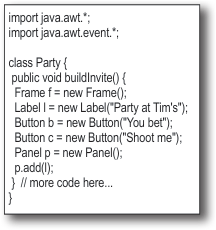
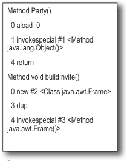
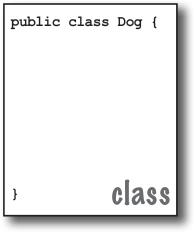
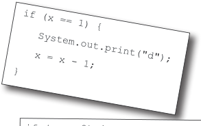
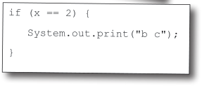
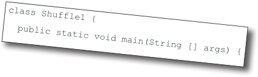
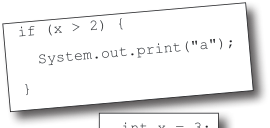
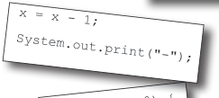
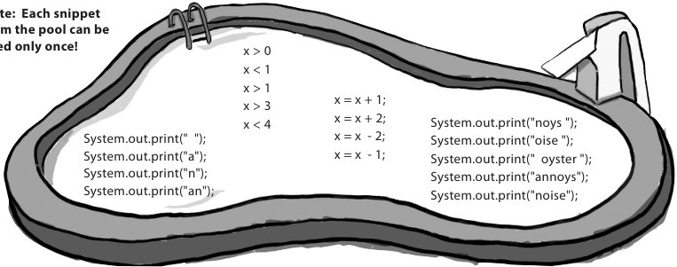

# ch01 Breaking the Surface

<!-- HF p.1 -->

#### B r ng ea k i

**Java takes you to new places.** From its humble release to the public as the (wimpy)

version 1.02, Java seduced programmers with its friendly syntax, object-oriented features, memory

management, and best of all—the promise of portability. The lure of **write-once/run-anywhere**

is just too strong. A devoted following exploded, as programmers fought against bugs, limita

tions, and, oh yeah, the fact that it was dog slow. But that was ages ago. If you’re just starting in

Java, **you’re lucky**. Some of us had to walk five miles in the snow, uphill both ways (barefoot), to

get even the most trivial application to work. But *you*, why, *you* get to ride the **sleeker, faster,**

#### t h c e fa e S u r


> *Figure/sidebar text on this page:* 1 dive in: a quick dip / Come on, the / water’s great! We’ll / dive right in and write some code, / then compile and run it. We’re / talking syntax, looping and branching, / and a look at what makes Java so / cool. You’ll be coding in no / time. / easier-to-read-and-write Java of today.

<!-- HF p.2 -->

### The way Java works

```text

```

Create a source document. Use an The compiler creates a established protocol Run your document new document, coded (in this case, the Java through a source code into Java ***bytecode***. language). compiler. The compiler Any device capable of checks for errors and running Java will be able won’t let you compile to interpret/translate until it’s satisfied that this file into something everything will run it can run. The compiled correctly. bytecode is platform-independent.

```text

```

Your friends all have a Java ***virtual*** machine (JVM), implemented in software, running inside their electronic gadgets. When your friends run your program, the virtual machine reads and runs the bytecode.


> *Figure/sidebar text on this page:* The goal is to write one application (in this / example, an interactive party invitation) and have / it work on whatever device your friends have. / source code for / Method Party() / the interactive / 0 aload_0 / 1 invokespecial #1 / party invitation. / <Method java.lang. / Object()> / 4 return / Output / Source / (code) / Compiler / Virtual / Machines

<!-- HF p.3 -->

### What you’ll do in Java

```text
%javac Party.java
```

```text
2
```

Compile the ***Party.java*** file by running `javac` (the compiler application).

```text
1
```

If you don’t have errors, you’ll get a second document named ***Party.class***. Type your source code. The compiler-generated Save as: ***Party.java*** Party.class file is made up of *bytecodes*.

```text
%java Party
```

```text
4
```

Run the program by starting the Java Virtual Machine (JVM) with the ***Party.class*** file. The JVM translates the *bytecode*

```text
3
```

into something the underlying platform understands, and runs Compiled code: ***Party.class*** your program.





> *Figure/sidebar text on this page:* You’ll type a source code file, compile it using / the javac compiler, and then run the compiled / bytecode on a Java virtual machine. / import java.awt.*; / File Edit Window Help Plead / Method Party() / File Edit Window Help Swear / import java.awt.event.*; / 0 aload_0 / class Party { / 1 invokespecial #1 <Method / public void buildInvite() { / java.lang.Object()> / Frame f = new Frame(); / Label l = new Label("Party at Tim's"); / 4 return / Button b = new Button("You bet"); / Method void buildInvite() / Button c = new Button("Shoot me"); / Compiler / Panel p = new Panel(); / 0 new #2 <Class java.awt.Frame> / Virtual / p.add(l); / 3 dup / } // more code here... / Machines / } / 4 invokespecial #3 <Method / java.awt.Frame()> / Source / Output / (code) / (Note: this is not meant to be a tutorial... / you’ll be writing real code in a moment, but / for now, we just want you to get a feel for / how it all fits together. / In other words, the code on this page isn’t / quite real; don’t try to compile it .)

<!-- HF p.4 -->

### A very brief history of Java

Java was initially released (some would say “escaped”), on January 23, 1996. It’s over 25 years old! In the first 25 years, Java as a language evolved, and the Java API grew enormously. The best estimate we have is that over 17 gazillion lines of Java code have been written in the last 25 years. As you spend time programming in Java, you will most certainly come across Java code that’s quite old, and some that’s much newer. Java is famous for its backward compatibility, so old code can run quite happily on new JVMs.

In this book we’ll generally start off by using older coding styles (remember, you’re likely to encounter such code in the “real world”), and then we’ll introduce newer-style code.

In a similar fashion, we will sometimes show you older classes in the Java API, and then show you newer alternatives.

### Speed and memory usage

When Java was first released, it was slow. But soon after, the HotSpot VM was created, as were other performance enhancers. While it’s true that Java isn’t the fastest language out there, it’s considered to be a very fast language—almost as fast as languages like C and Rust, and ***much*** faster than most other languages out there.

Java has a magic super-power—the JVM. The Java Virtual Machine can optimize your code *while it’s running*, so it’s possible to create very fast applications without having to write specialized high-performance code.

But—full disclosure—compared to C and Rust, Java uses a lot of memory.

> *Figure/sidebar text on this page:* I’ve heard that / Java isn’t very fast / compared to compiled / languages like C and / Rust.

<!-- HF p.5 -->

#### Sharpen your pencil

Try to guess what each line of code is doing... (answers are on the next page).

```java
int size = 27;
String name = "Fido";
Dog myDog = new Dog(name, size);
x = size - 5;
if (x < 15) myDog.bark(8);


while (x > 3) {
  myDog.play();
}


int[] numList = {2, 4, 6, 8};
System.out.print("Hello");
System.out.print("Dog: " + name);
String num = "8";
int z = Integer.parseInt(num);


try {
  readTheFile("myFile.txt");
}
catch (FileNotFoundException ex) {
  System.out.print("File not found.");
}
```

Q: **The naming conventions for Java’s versions are**

**confusing. There was JDK 1.0, and 1.2, 1.3, 1.4, then a jump to J2SE 5.0, then it changed to Java 6, Java 7, and last time I checked, Java was up to Java 18. What’s going on?**

A: The version numbers have varied a lot over the last

25+ years! We can ignore the letters (J2SE/SE) since these are not really used now. The numbers are a little more involved. Technically Java SE 5.0 was actually Java **1.**5. Same for 6 (1.6), 7 (1.7), and 8 (1.8). In theory, Java is still on version

1.x because new versions are backward compatible, all the way back to 1.0. However, it was a bit confusing having a version number that was different to the name everyone used, so the official version number from Java 9 onward is just the number, without the “1” prefix; i.e., Java 9 really is version 9, not version 1.9. In this book we’ll use the common convention of 1.0–1.4, then from 5 onward we’ll drop the “1” prefix. Also, since Java 9 was released in September 2017, there’s been a release of Java every six months, each with a new “major” version number, so we moved very quickly from 9 to 18!

> *Figure/sidebar text on this page:* Answers on page 6. / Look how easy it / is to write Java / declare an integer variable named ‘size’ and give it the value 27 / if x (value of 22) is less than 15, tell the dog to bark 8 times / print out “Hello”... probably at the command line

<!-- HF p.6 -->

#### Sharpen your pencil

***Don’t worry about whether you understand any of this yet!*** Everything here is explained in great detail in the book (most within the first 40 pages). If Java resembles a language you’ve used in the past, some of this will be simple. If not, don’t worry about it. *We’ll get there...*

```java
int size = 27;
String name = "Fido";
Dog myDog = new Dog(name, size);
x = size - 5;
if (x < 15) myDog.bark(8);


while (x > 3) {
  myDog.play();
}


int[] numList = {2, 4, 6, 8};
System.out.print("Hello");
System.out.print("Dog: " + name);
String num = "8";
int z = Integer.parseInt(num);


try {
  readTheFile("myFile.txt");
}
catch (FileNotFoundException ex) {
  System.out.print("File not found.");
}
```

> *Figure/sidebar text on this page:* answers / Look how easy it / is to write Java / declare an integer variable named ‘size’ and give it the value 27 / declare a string of characters variable named ‘name’ and give it the value “Fido” / declare a new Dog variable ‘myDog’ and make the new Dog using ‘name’ and ‘size’ / subtract 5 from 27 (value of ‘size’) and assign it to a variable named ‘x’ / if x (value of 22) is less than 15, tell the dog to bark 8 times / keep looping as long as x is greater than 3... / tell the dog to play (whatever THAT means to a dog...) / this looks like the end of the loop -- everything in { } is done in the loop / declare a list of integers variable ‘numList’, and put 2,4,6,8 into the list. / print out “Hello”... probably at the command line / print out “Dog: Fido” (the value of ‘name’ is “Fido”) at the command line / declare a character string variable ‘num’ and give it the value of “8” / convert the string of characters “8” into an actual numeric value 8 / try to do something...maybe the thing we’re trying isn’t guaranteed to work... / read a text file named “myFile.txt” (or at least TRY to read the file...) / must be the end of the “things to try”, so I guess you could try many things... / this must be where you find out if the thing you tried didn’t work... / if the thing we tried failed, print “File not found” out at the command line / looks like everything in the { } is what to do if the ‘try’ didn’t work...

<!-- HF p.7 -->

### Code structure in Java

#### What goes in a source file?

A source code file (with the *.java* extension) typically holds one ***class*** definition. The class represents a *piece* of your program, although a very tiny application might need just a single class. The class must go within a pair of curly braces.

#### What goes in a class?

A class has one or more ***methods***. In the Dog class, the ***bark*** method will hold instructions for how the Dog should bark. Your methods must be declared *inside* a class (in other words, within the curly braces of the class).

#### What goes in a method?

Within the curly braces of a method, write your instructions for how that method should be performed. Method *code* is basically a set of statements, and for now you can think of a method kind of like a function or procedure.





> *Figure/sidebar text on this page:* public class Dog { / class / } / In a source file, put a class. / public class Dog { / void bark() { / In a class, put methods. / In a method, put statements. / } / } / method / public class Dog { / void bark() { / statement1; / statement2; / } / } / statements

<!-- HF p.8 -->

### Anatomy of a class

When the JVM starts running, it looks for the class you give it at the command line. Then it starts looking for a specially written method that looks exactly like:

```java
public static void main (String[] args) {
   // your code goes here
}
```

Next, the JVM runs everything between the curly braces { } of your main method. Every Java application has to have at least one **class**, and at least one **main** method (not one main per *class*; just one main per *application*).

```java
public class MyFirstApp {
```

```java
   public static void main (String[] args) {

      System.out.print("I Rule!");

   }
}
```

> *Figure/sidebar text on this page:* The name of / This is a / Opening curly / Public so everyone / this class / class (duh) / brace of the class / can access it / Arguments to the method. / This method must be given / The return type. / an array of Strings, and the / (We’ll cover this / The name of / void means there’s / array will be called ‘args’ / this method / Opening brace / one later.) / no return value. / of the method / Every statement MUST / end in a semicolon!! / This says print to standard output / (defaults to command line) / The String you / want to print / Closing brace of the main method / Closing brace of the MyFirstApp class / Don’t worry about memorizing anything right now... / this chapter is just to get you started.

<!-- HF p.9 -->

### Writing a class with a main()

In Java, everything goes in a **class**. You’ll type your source code file (with a *.java* extension), then compile it into a new class file (with a *.class* extension). When you run your program, you’re really running a class.

Running a program means telling the Java Virtual Machine (JVM) to “Load the `MyFirstApp` class, then start executing its `main()` method. Keep running ’til all the code in main is finished.”

In Chapter 2, *A Trip to Objectville*, we go deeper into the whole *class* thing, but for now, the only question you need to ask is, ***how do I write Java code so that it will run?*** And it all begins with **main()**.

The **main()** method is where your program starts running.

No matter how big your program is (in other words, no matter how many *classes* your program uses), there’s got to be a **main()** method to get the ball rolling.

```java
public class MyFirstApp {
                                                               1
  public static void main (String[] args) {
```

#### • Save

```java
    System.out.print("I Rule!");
    System.out.println("The World");
  }
}
                                                                MyFirstApp.java
```

```text
2
```

#### • Compile

```java
                                                                javac MyFirstApp.java

Compiled from "MyFirstApp.java"
public class ch1.MyFirstApp {
  public ch1.MyFirstApp();
    Code:
       0: aload_0
       1: invokespecial #1
// Method java/lang/Object."<init>":()V
       4: return
  public static void main(java.lang.
String[]);

                                                                3
```

#### • Run

```text
                    java MyFirstApp

%java MyFirstApp
I Rule!
The World
```


> *Figure/sidebar text on this page:* public class MyFirstApp { / MyFirstApp.java / public static void main (String[] args) { / System.out.println("I Rule!"); / System.out.println("The World"); / compiler / } / } / MyFirstApp.class / File Edit Window Help Scream

<!-- HF p.10 -->

```text
The Java Virtual Machine
```

What, are you kidding? ***HELLO***. I am Java. I’m the one who actually makes a program run. The compiler just gives you a file. That’s it. Just a file. You can print it out and use it for wallpaper, kindling, lining the bird cage, whatever, but the file doesn’t do anything unless I’m there to run it.

And that’s another thing, the compiler has no sense of humor. Then again, if you had to spend all day checking nitpicky little syntax violations...

I’m not saying you’re, like, *completely* useless. But really, what is it that you do? Seriously. I have no idea. A programmer could just write bytecode by hand, and I’d take it. You might be out of a job soon, buddy.

(I rest my case on the humor thing.) But you still didn’t answer my question, what *do* you actually do?

```text
Tonight's Talk: The compiler and
the JVM battle over the question,
"Who's more important?"


      The Compiler
```

I don’t appreciate that tone.

Excuse me, but without *me,* what exactly would you run? There’s a *reason* Java was designed to use a bytecode compiler, for your information. If Java were a purely interpreted language, where—at runtime—the virtual machine had to translate straight-from-a-text-editor source code, a Java program would run at a ludicrously glacial pace.

Excuse me, but that’s quite an ignorant (not to mention *arrogant*) perspective. While it *is* true that—*theoretically—*you can run any properly formatted bytecode even if it didn’t come out of a Java compiler, in practice that’s absurd. A programmer writing bytecode by hand is like painting pictures of your vacation instead of taking photos—sure, it’s an art, but most people prefer to use their time differently. And I would appreciate it if you would *not* refer to me as “buddy.”

Remember that Java is a strongly typed language, and that means I can’t allow variables to hold data of the wrong type. This is a crucial safety feature, and I’m able to stop the vast majority of violations before they ever get to you. And I also—


<!-- HF p.11 -->

```text
The Java Virtual Machine
```

But some still get through! I can throw ClassCastExceptions and sometimes I get people trying to put the wrong type of thing in an array that was declared to hold something else, and—

OK. Sure. But what about *security*? Look at all the security stuff I do, and you’re like, what, checking for *semicolons*? Oooohhh big security risk! Thank goodness for you!

Whatever. I have to do that same stuff *too*, though, just to make sure nobody snuck in after you and changed the bytecode before running it.

Oh, you can count on it. *Buddy*.

```text
The Compiler
```

Excuse me, but I wasn’t done. And yes, there *are* some datatype exceptions that can emerge at runtime, but some of those have to be allowed to support one of Java’s other important features— dynamic binding. At runtime, a Java program can include new objects that weren’t even *known* to the original programmer, so I have to allow a certain amount of flexibility. But my job is to stop anything that would never—*could* never—succeed at runtime. Usually I can tell when something won’t work, for example, if a programmer accidentally tried to use a Button object as a Socket connection, I would detect that and thus protect them from causing harm at runtime.

Excuse me, but I am the first line of defense, as they say. The datatype violations I previously described could wreak havoc in a program if they were allowed to manifest. I am also the one who prevents access violations, such as code trying to invoke a private method, or change a method that—for security reasons—must never be changed. I stop people from touching code they’re not meant to see, including code trying to access another class’ critical data. It would take hours, perhaps days even, to describe the significance of my work.

Of course, but as I indicated previously, if I didn’t prevent what amounts to perhaps 99% of the potential problems, you would grind to a halt. And it looks like we’re out of time, so we’ll have to revisit this in a later chat.

<!-- HF p.12 -->

Once you’re inside main (or *any* method), the fun begins. You can say all the normal things that you say in most programming languages to ***make the computer do something.***

Your code can tell the JVM to:

```text
1
```

**Statements**: declarations, assignments, method calls, etc.

```java
int x = 3;
String name = "Dirk";
x = x * 17;
System.out.print("x is " + x);
double d = Math.random();
// this is a comment


   2
```

**Loops**: *for* and *while*

```java
             while (x > 12) {
               x = x - 1;
             }

             for (int i = 0; i < 10; i = i + 1) {
               System.out.print("i is now " + i);
             }

3
```

**Branching**: *if/else* tests

```java
if (x == 10) {
  System.out.print("x must be 10");
} else {
  System.out.print("x isn't 10");
}
if ((x < 3) && (name.equals("Dirk"))) {
  System.out.println("Gently");
}
System.out.print("this line runs no matter what");
```

± Each statement must end in a

semicolon.

```java
x = x + 1;
```

± A single-line comment begins

with two forward slashes.

```java
x = 22;
// this line disturbs me
```

± Most white space doesn’t matter.

```java
x      =      3  ;
```

± Variables are declared with a

**name** and a **type** (you’ll learn about all the Java *types* in Chapter 3).

```java
int weight;
//type: int, name: weight
```

± Classes and methods must be

defined within a pair of curly braces.

```java
public void go() {
   // amazing code here
}
```


> *Figure/sidebar text on this page:* loops / What can you say in the main method? / statements / branching / do something / Syntax / Fun / do something again and again / do something under this condition

<!-- HF p.13 -->

### Looping and looping and...

Java has a lot of looping constructs: while, do-while, and *for*, being the oldest. You’ll get the full loop scoop later in the book, but not right now. Let’s start with while.

The syntax (not to mention logic) is so simple you’re probably asleep already. As long as some condition is true, you do everything inside the loop *block*. The loop block is bounded by a pair of curly braces, so whatever you want to repeat needs to be inside that block.

The key to a loop is the *conditional test*. In Java, a conditional test is an expression that results in a *boolean* value—in other words, something that is either ***true*** or ***false***.

If you say something like, “While *iceCreamInTheTub is true*, keep scooping,” you have a clear boolean test. There either *is* ice cream in the tub or there *isn’t*. But if you were to say, “While *Bob* keep scooping,” you don’t have a real test. To make that work, you’d have to change it to something like, “While Bob is snoring...” or “While Bob is *not* wearing plaid...”

You can do a simple boolean test by checking the value of a variable, using a comparison operator like:

< (less than)

> (greater than)

== (equality) (yes, that’s *two* equals signs)

Notice the difference between the *assignment* operator (a *single* equals sign) and the *equals* operator (*two* equals signs). Lots of programmers accidentally type = when they *want* ==. (But not you.)

```java
int x = 4; // assign 4 to x
while (x > 3) {
  // loop code will run because
  // x is greater than 3
  x = x - 1; // or we'd loop forever
}
int z = 27; //
while (z == 17) {
  // loop code will not run because
  // z is not equal to 17
}
```


> *Figure/sidebar text on this page:* while (moreBalls == true) { / keepJuggling( ) ; / } / Simple boolean tests

<!-- HF p.14 -->

there are no

Dumb Questions

Q: **Why does everything have**

```java
public class Loopy {
  public static void main(String[] args) {
```

**to be in a class?**

```java
int x = 1;
System.out.println("Before the Loop");
```

A: Java is an object-oriented

```java
while (x < 4) {
  System.out.println("In the loop");
```

(OO) language. It’s not like the old days when you had steam-

```java
System.out.println("Value of x is " + x);
```

driven compilers and wrote one

```java
x = x + 1;
```

monolithic source file with a pile

```java
}
```

of procedures. In Chapter 2, *A Trip*

```java
System.out.println("This is after the loop");
```

*to Objectville*, you’ll learn that a class is a blueprint for an object,

```java
}
```

and that nearly everything in Java

```java
}
```

is an object.

```text
% java Loopy
```

Q: **Do I have to put a main in**

```text
Before the Loop
In the loop
```

**every class I write?**

```text
Value of x is 1
```

A: Nope. A Java program

```text
In the loop
Value of x is 2
```

might use dozens of classes (even

```text
In the loop
```

hundreds), but you might only

```text
Value of x is 3
```

have *one* with a main method— the one that starts the program

```text
This is after the loop
```

running.

Q: **In my other language I can**

**do a boolean test on an integer. In Java, can I say something like:**

�

```java
int x = 1;
```

�

```java
while (x){ }
```

�

A: No. A *boolean* and an

�

*integer* are not compatible types in

�

Java. Since the result of a condi

�

tional test *must* be a boolean, the only variable you can directly test (without using a comparison op

�

erator) is a ***boolean.*** For example, you can say:

```java
boolean isHot = true;
while(isHot) { }
```

�

```java
while (x == 4) { }
```

> *Figure/sidebar text on this page:* Example of a while loop / This is the output / BULLET POINTS / Statements end in a semicolon ; / Code blocks are defined by a pair of curly braces { } / Declare an int variable with a name and a type: int x; / The assignment operator is one equals sign = / The equals operator uses two equals signs == / A while loop runs everything within its block (defined by curly / braces) as long as the conditional test is true. / If the conditional test is false, the while loop code block won’t / run, and execution will move down to the code immediately / after the loop block. / Put a boolean test inside parentheses:

<!-- HF p.15 -->

### Conditional branching

In Java, an *if* test is basically the same as the boolean test in a *while* loop—except instead of saying, “***while*** there’s still chocolate,” you’ll say, “***if*** there’s still chocolate...”

```java
class IfTest {
  public static void main (String[] args) {
    int x = 3;
    if (x == 3) {
      System.out.println("x must be 3");
    }
    System.out.println("This runs no matter what");
  }
}

% java IfTest
x must be 3
This runs no matter what
```

The preceding code executes the line that prints “x must be 3” only if the condition (*x* is equal to 3) is true. Regardless of whether it’s true, though, the line that prints “This runs no matter what” will run. So depending on the value of *x*, either one statement or two will print out.

But we can add an *else* to the condition so that we can say something like, “*If* there’s still chocolate, keep coding, *else* (otherwise) get more chocolate, and then continue on...”

```java
class IfTest2 {
  public static void main(String[] args) {
    int x = 2;
    if (x == 3) {
      System.out.println("x must be 3");
    } else {
      System.out.println("x is NOT 3");
    }
    System.out.println("This runs no matter what");
  }
}

% java IfTest2
x is NOT 3
This runs no matter what
```

If you’ve been paying attention (of course you have), then you’ve noticed us switching between **print** and **println.**

**Did you spot the difference?**

System.out.***println*** inserts a newline (think of print***ln*** as **print*****new*****line**), while System.out.***print*** keeps printing to the *same* line. If you want each thing you print out to be on its own line, use print**ln**. If you want everything to stick together on one line, use print.

#### Sharpen your pencil

***Given the output:***

```text
% java DooBee
DooBeeDooBeeDo
```

***Fill in the missing code:***

```java
public class DooBee {
  public static void main(String[] args) {
    int x = 1;
    while (x < _____ ) {
      System.out._________("Doo");
      System.out._________("Bee");
      x = x + 1;
    }
    if (x == ______  ) {
      System.out.print("Do");
    }
  }
}
```

> *Figure/sidebar text on this page:* System.out.print vs. / System.out.println / Code output / New output / Answers on page 25.

<!-- HF p.16 -->

### Coding a serious business application

Let’s put all your new Java skills to good use with something practical. We need a class with a *main()*, an *int* and a *String* variable, a *while* loop, and an *if* test. A little more polish, and you’ll be building that business back-end in no time. But *before* you look at the code on this page, think for a moment about how *you* would code that classic children’s favorite, “10 green bottles.”

```java
public class BottleSong {
  public static void main(String[] args) {
    int bottlesNum = 10;
    String word = "bottles";

    while (bottlesNum > 0) {

      if (bottlesNum == 1) {
        word = "bottle"; // singular, as in ONE bottle.
      }

      System.out.println(bottlesNum + " green " + word + ", hanging on the wall");
      System.out.println(bottlesNum + " green " + word + ", hanging on the wall");
      System.out.println("And if one green bottle should accidentally fall,");
      bottlesNum = bottlesNum - 1;

      if (bottlesNum > 0) {
        System.out.println("There'll be " + bottlesNum +
                           " green " + word + ", hanging on the wall");
      } else {
        System.out.println("There'll be no green bottles, hanging on the wall");
      } // end else
    } // end while loop
  } // end main method
} // end class
```

There’s still one little flaw in our

Q: **Didn't this use to be "99 Bottles of Beer"?**

code. It compiles and runs, but the output isn’t 100% perfect. See if you can spot the flaw and fix it.

A: Yes, but Trisha wanted us to use the UK version of

the song. If you'd prefer the 99 bottles version, take that as a fun exercise.

there are no

Dumb Questions

<!-- HF p.17 -->

Bob’s alarm clock rings at 8:30 Monday morning, just like every other weekday. But Bob had a wild weekend and reaches for the SNOOZE button. And that’s when the action starts, and the Java-enabled appliances come to life...

First, the alarm clock sends a message to the coffee maker “Hey, the geek’s sleeping in again, delay the coffee 12 minutes.”

The coffee maker sends a message to the Motorola™ toaster, “Hold the toast, Bob’s snoozing.”

The alarm clock then sends a message to Bob’s Android, “Call Bob’s 9 o’clock and tell him we’re running a little late.”

Finally, the alarm clock sends a message to Sam’s (Sam is the dog) wireless collar, with the too-familiar signal that means, “Get the paper, but don’t expect a walk.”

A few minutes later, the alarm goes off again. And *again* Bob hits SNOOZE and the appliances start chattering. Finally, the alarm rings a third time. But just as Bob reaches for the snooze button, the clock sends the “jump and bark” signal to Sam’s collar. Shocked to full consciousness, Bob rises, grateful that his Java skills, and spontaneous internet shopping purchases, have enhanced the daily routines of his life.

***His toast is toasted.***

***His coffee steams.***

***His paper awaits.***

Just another wonderful morning in ***The Java-Enabled House***.

Could this story be true? Mostly, yes! There *are* versions of Java running in devices including cell phones (*especially* cell phones), ATMs, credit cards, home security systems, parking meters, game consoles and more—but you might not find a Java dog collar...yet.

Java has multiple ways to use just a tiny part of the Java platform to run on smaller devices (depending upon the version of Java you’re using). It’s very popular for IoT (Internet of Things) development. And, of course, lots of Android development is done with Java and JVM languages.

AS IF ON

TV


> *Figure/sidebar text on this page:* Monday morning at Bob’s Java-enabled house / Java inside / Java here too / Sam’s collar / Java / has Java / toaster / butter here

<!-- HF p.18 -->

```java
  public class PhraseOMatic {
    public static void main (String[] args) {

1
      String[] wordListOne = {"agnostic", "opinionated",
  "voice activated", "haptically driven", "extensible",
  "reactive", "agent based", "functional", "AI enabled",
  "strongly typed"};

      String[] wordListTwo = {"loosely coupled", "six sigma",
  "asynchronous", "event driven", "pub-sub", "IoT", "cloud
  native", "service oriented", "containerized", "serverless",
  "microservices", "distributed ledger"};

      String[] wordListThree = {"framework", "library",
  "DSL", "REST API", "repository", "pipeline", "service
```

OK, so the bottle song wasn’t *really* a

```text
mesh", "architecture", "perspective", "design",
```

serious business application. Still need

```java
"orientation"};
```

something practical to show the boss? Check out the Phrase-O-Matic code.

```java
2
      int oneLength = wordListOne.length;
      int twoLength = wordListTwo.length;
      int threeLength = wordListThree.length;


      java.util.Random randomGenerator = new java.util.Random();
3
      int rand1 = randomGenerator.nextInt(oneLength);
      int rand2 = randomGenerator.nextInt(twoLength);
      int rand3 = randomGenerator.nextInt(threeLength);

4
      String phrase = wordListOne[rand1] + " " +
  wordListTwo[rand2] + " " + wordListThree[rand3];


5
      System.out.println("What we need is a " + phrase);
    }
  }
```


> *Figure/sidebar text on this page:* Try my new / phrase-o-matic and / you’ll be a slick talker / just like the boss or those / hotshots in marketing. / // make three sets of words to choose from. Add your own! / // find out how many words are in each list / Note: when you type this into an editor, let / the code do its own word/line-wrapping! / // generate three random numbers / Never hit the return key when you’re typing / a String (a thing between “quotes”) or it / won’t compile. So the hyphens you see on / this page are real, and you can type them, / but don’t hit the return key until AFTER / you’ve closed a String. / // now build a phrase / // print out the phrase

<!-- HF p.19 -->

### Phrase-O-Matic

In a nutshell, the program makes three lists of words, then randomly picks one word from each of the three lists, and prints out the result. Don’t worry if you don’t understand *exactly* what’s happening in each line. For goodness sake, you’ve got the whole book ahead of you, so relax. This is just a quick look from a 30,000-foot outside-the-box targeted leveraged paradigm.

1. The first step is to create three String arrays—the containers that will hold all the words.

Declaring and creating an array is easy; here’s a small one:

```java
String[] pets = {"Fido", "Zeus", "Bin"};
```

Each word is in quotes (as all good Strings must be) and separated by commas.

2. For each of the three lists (arrays), the goal is to pick a random word, so we have to know

how many words are in each list. If there are 14 words in a list, then we need a random number between 0 and 13 (Java arrays are zero-based, so the first word is at position 0, the second word position 1, and the last word is position 13 in a 14-element array). Quite handily, a Java array is more than happy to tell you its length. You just have to ask. In the pets array, we’d say:

```java
int x = pets.length;
```

and `x` would now hold the value 3.

3. We need three random numbers. Java ships out of the box with several ways to generate

random numbers, including java.util.Random (we will see later why this class name is prefixed with java.util). The `nextInt()` method returns a random number between 0 and some-number-we-give-it, *not including* the number that we give it. So we’ll give it the number of elements (the array length) in the list we’re using. Then we assign each result to a new variable. We could just as easily have asked for a random number between 0 and 5, not including 5:

```java
int x = randomGenerator.nextInt(5);
```

4. Now we get to build the phrase, by picking a word from each of the three lists and

smooshing them together (also inserting spaces between words). We use the “+” operator, which *concatenates* (we prefer the more technical *smooshes*) the String objects together. To get an element from an array, you give the array the index number (position) of the thing you want by using:

```java
String s = pets[0]; // s is now the String "Fido"
s = s + " " + "is a dog"; // s is now "Fido is a dog"
```

5. Finally, we print the phrase to the command line and...voilà! *We’re in marketing*.

> *Figure/sidebar text on this page:* How it works / what we need / here is a... / extensible microser­ / vices pipeline / opinionated loosely / coupled REST API / agent-based / microservices library / AI-enabled service / oriented orientation / agnostic pub-sub / DSL / functional IoT / perspective

<!-- HF p.20 -->

Code Magnets

Exercise

A working Java program is all scrambled up on the fridge. Can you rearrange the code snippets to make a working Java program that produces the output listed below? Some of the curly braces fell on the floor and they were too small to pick up, so feel free to add as many of those as you need!

```text
% java Shuffle1
a-b c-d
```

```java
}
```

```java
while (x > 0) {
```











> *Figure/sidebar text on this page:* if (x == 1) { / System.out.print("d"); / x = x - 1; / } / if (x == 2) { / System.out.print("b c"); / class Shuff le1 { / public static void main(String [] args) { / if (x > 2) { / System.out.print("a"); / } / int x = 3; / x = x - 1; / System.out.print("-"); / Output: / File Edit Window Help Sleep / Answers on page 25.

<!-- HF p.21 -->

Exercise

**BE the Compiler**

```java
class Exercise1a {
  public static void main(String[] args) {
    int x = 1;
    while (x < 10) {
      if (x > 3) {
        System.out.println("big x");
      }
    }
  }
}
```

```java
public static void main(String [] args) {
  int x = 5;
  while ( x > 1 ) {
    x = x - 1;
    if ( x < 3) {
      System.out.println("small x");
    }
  }
}
```

```java
class Exercise1c {
  int x = 5;
  while (x > 1) {
    x = x - 1;
    if (x < 3) {
      System.out.println("small x");
    }
  }
}
```


> *Figure/sidebar text on this page:* B / Each of the Java files on this page / represents a complete source file. / Your job is to play compiler and / determine whether each of these files / will compile. If they won’t / compile, how would you / fix them? / Answers on page 25. / A / C

<!-- HF p.22 -->

4 5

8

Let’s give your right brain something to do.

It’s your standard crossword, but almost all of the solution words are from Chapter 1.

14

Just to keep you awake, we also threw in a few (non-Java) words from the high-tech world.

18

**Across**

4. Command line invoker
6. Back again?
8. Can’t go both ways
9. Acronym for your laptop’s power
12. Number variable type

**Down**

13. Acronym for a chip
1. Not an integer (or _____ your boat)
14. Say something
2. Come back empty-handed
18. Quite a crew of characters
3. Open house
19. Announce a new class or method
5. ‘Things’ holders
21. What’s a prompt good for?
7. Until attitudes improve
10. Source code consumer
11. Can’t pin it down
13. Department for programmers and operations
15. Shocking modifier
16. Just gotta have one
17. How to get things done
20. Bytecode consumer

1 2 3

6

7

9 10 11

12

13

15 16

17

19

20

21

> *Figure/sidebar text on this page:* JavaCross / Answers on page 26.

<!-- HF p.23 -->

A short Java program is listed below. One block of the program is missing. Your challenge is to **match the candidate block of code** (on the left) **with the output** that you’d see if the block were inserted. Not all the lines of output will be used, and some

Mixed

of the lines of output might be used more than once. Draw lines

Messages

connecting the candidate blocks of code with their matching command-line output.

```java
class Test {
  public static void main(String [] args) {
    int x = 0;
    int y = 0;
    while (x < 5) {
```

```java
      System.out.print(x + "" + y +" ");
      x = x + 1;
    }
  }
}
```

**Candidates:**

```java
y = x - y;

y = y + x;

y = y + 2;
if( y > 4 ) {
  y = y - 1;
}

x = x + 1;
y = y + x;

if ( y < 5 ) {
  x = x + 1;
  if ( y < 3 ) {
    x = x - 1;
  }
}
y = y + 2;
```

**Possible output:**

```text
22 46


11 34 59


02 14 26 38


02 14 36 48


00 11 21 32 42


11 21 32 42 53


00 11 23 36 410


02 14 25 36 47
```

> *Figure/sidebar text on this page:* Candidate code / goes here / Match each / candidate with / one of the / possible outputs / Answers on page 26.

<!-- HF p.24 -->

Your ***job*** is to take code snippets from the pool and place them into the blank lines in the code. You may **not** use the same snippet more than once, and you won’t need to use all the snippets. Your ***goal*** is to make a class that will compile and run and produce the output listed. Don’t be fooled—this one’s harder than it looks.

**Output**

```text
%java PoolPuzzleOne
a noise
annoys
an oyster
```

```java
class PoolPuzzleOne {
  public static void main(String [] args) {
    int x = 0;

    while ( __________ ) {

      _____________________________
      if ( x < 1 ) {
        ___________________________
      }
      _____________________________

      if ( __________ ) {

        ____________________________

        ___________
      }
      if ( x == 1 ) {

        ____________________________
      }
      if ( ___________ ) {

        ____________________________
      }
      System.out.println();

      ____________
    }
  }
}
```



> *Figure/sidebar text on this page:* Pool Puzzle / Answers on page 26. / File Edit Window Help Cheat / Note: Each snippet / from the pool can be / used only once! / x > 0 / x < 1 / x > 1 / x > 3 / x = x + 1; / x < 4 / x = x + 2; / System.out.print("noys "); / System.out.print(" "); / x = x - 2; / System.out.print("oise "); / System.out.print("a"); / x = x - 1; / System.out.print(" oyster "); / System.out.print("n"); / System.out.print("annoys"); / System.out.print("an"); / System.out.print("noise");

<!-- HF p.25 -->

**BE the Compiler**

Exercise Solutions

```java
public class DooBee {
  public static void main(String[] args) {
    int x = 1;
    while (x < 3) {
      System.out.print("Doo");
      System.out.print("Bee");
      x = x + 1;
    }
    if (x == 3) {
      System.out.print("Do");
    }
  }
}
```

Code Magnets **(from page 20)**

```java
class Shuffle1 {
  public static void main(String[] args) {

    int x = 3;
    while (x > 0) {

      if (x > 2) {
        System.out.print("a");
      }

      x = x - 1;
      System.out.print("-");

      if (x == 2) {
        System.out.print("b c");
      }

      if (x == 1) {
        System.out.print("d");
        x = x - 1;
      }
    }
  }
                       % java Shuffle1
}
                       a-b c-d
```

```java
class Exercise1a {
  public static void main(String [] args) {
    int x = 1;
```

**(from page 21)**

```java
while ( x < 10 ) {


  if ( x > 3) {
    System.out.println("big x");
  }
}
```

```java
public static void main(String [] args) {
  int x = 5;
  while ( x > 1 ) {
    x = x - 1;
    if ( x < 3) {
      System.out.println("small x");
    }
```

```java
class Exercise1c {


    int x = 5;
    while ( x > 1 ) {
      x = x - 1;
      if ( x < 3) {
        System.out.println("small x");
      }
    }


}
```

> *Figure/sidebar text on this page:* Add this line to prevent / Sharpen your pencil (from page 14) / x = x + 1; / it running forever... / A / } This will compile and run (no output), but / } without a line added to the program, it / would run forever in an infinite while loop! / Needs a class declaration / class Exercise1b { / B / } This file won’t compile without a / } class declaration, and don’t forget / } the matching curly brace! / Needs a “main” / public static void main(String [] args) { / C / File Edit Window Help Poet / The while loop code must be inside a / } / method. It can’t just be hanging out / inside the class.

<!-- HF p.26 -->

4

8

Pool Puzzle **(from page 24)**

```java
class PoolPuzzleOne {
  public static void main(String [] args) {
    int x = 0;
```

`while (` **x < 4** ) {

**System.out.print("a");**

```java
if ( x < 1 ) {
```

**System.out.print(" ");**

```java
}
```

**System.out.print("n");**

`if (` **x > 1** ) { **System.out.print(" oyster");**

Messages

**x = x + 2;**

```java
}
if ( x == 1 ) {
```

Mixed

**System.out.print("noys");**

```java
}
```

`if (` **x < 1** ) { **System.out.print("oise");**

```java
}
System.out.println();
```

**x = x + 1;**

```java
     }
   }
}
                            %java PoolPuzzleOne
                            a noise
                            annoys
                            an oyster
```

JavaCross **(from page 22)**

1 2 3

5 6

7

9 10 11

12

13

15 14 16

17

18 19

20

21

```java
class Test {
  public static void main(String [] args) {
    int x = 0;
    int y = 0;
    while ( x < 5 ) {
```

```java
      System.out.print(x + "" + y +" ");
      x = x + 1;
    }
  }
}
```

**Candidates: Possible output:**

```java
y = x - y;
                               22 46

y = y + x;
                               11 34 59
y = y + 2;
                               02 14 26 38
if( y > 4 ) {
  y = y - 1;
}
                               02 14 36 48

x = x + 1;
                               00 11 21 32 42
y = y + x;
                               11 21 32 42 53
if ( y < 5 ) {
  x = x + 1;
                               00 11 23 36 410
  if ( y < 3 ) {
    x = x - 1;
  }
                               02 14 25 36 47
}
y = y + 2;
```

**(from page 23)**

> *Figure/sidebar text on this page:* F / V / P / J A V A / L / O P / O / U / R / W / O / I / B / B A N C H / R / C / V / A / D / L / A / I / N T / O / A / I / Y / L / M / R / I C / S / M / Y T E O U T P R I N T / S / T / A / I / A / A / I / L / B / M / S R I G / T / N / D E C L A R E / I / R / E / T / C / J / H / V / O / C O M M A N D / File Edit Window Help Cheat
