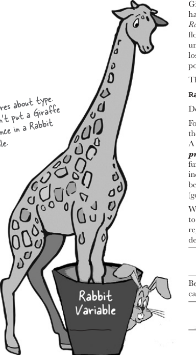
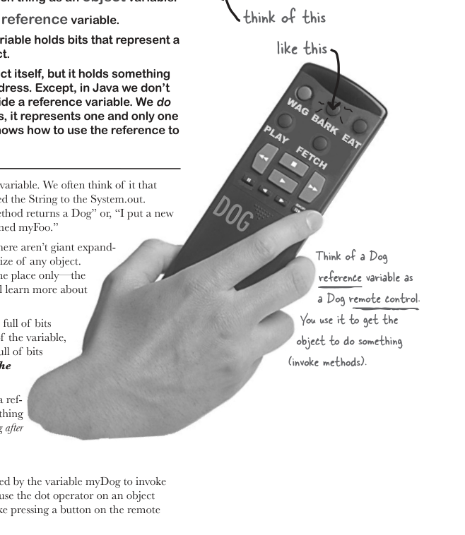
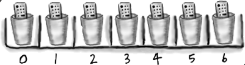
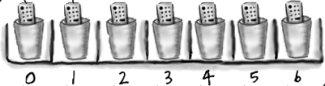
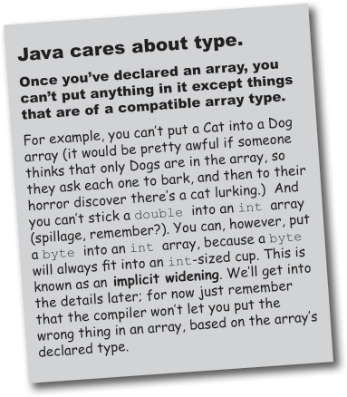
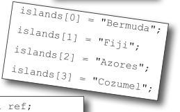
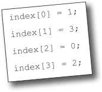
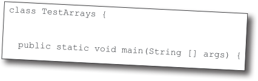
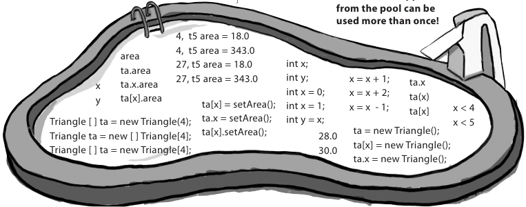

# ch03 Know Your Variables

<!-- HF p.49 -->

#### Know Your Variables

So far you’ve used variables in two places—as object **state** (instance variables) and as **local**

variables (variables declared within a *method*). Later, we’ll use variables as **arguments** (values

sent to a method by the calling code), and as **return types** (values sent back to the caller of the

method). You’ve seen variables declared as simple **primitive** integer values (type `int`). You’ve

seen variables declared as something more **complex** like a String or an array. But **there’s gotta**

**be more to life** than integers, Strings, and arrays. What if you have a PetOwner object with a

Dog instance variable? Or a Car with an Engine? In this chapter we’ll unwrap the mysteries of Java

types (like the difference between primited and references) and look at what you can *declare* as a

variable, what you can *put* in a variable, and what you can *do* with a variable. And we’ll finally see

what life is *truly* like on the garbage-collectible heap.


> *Figure/sidebar text on this page:* 3 primitives and references / Variables can store two types of things: primitives and references.

<!-- HF p.50 -->

### Declaring a variable

**Java cares about type.** It won’t let you do something bizarre and dangerous like stuff a Giraffe reference into a Rabbit variable—what happens when someone tries to ask the so-called *Rabbit* to `hop()`? And it won’t let you put a floating-point number into an integer variable, unless you *tell the compiler* that you know you might lose precision (like, everything after the decimal point).

The compiler can spot most problems:

```java
Rabbit hopper = new Giraffe();
```

Don’t expect that to compile. *Thankfully*.

For all this type-safety to work, you must declare the type of your variable. Is it an integer? a Dog? A single character? Variables come in two flavors: ***primitive*** and ***object reference***. Primitives hold fundamental values (think: simple bit patterns) including integers, booleans, and floating-point numbers. Object references hold, well, *references* to *objects* (gee, didn’t *that* clear it up).

We’ll look at primitives first and then move on to what an object reference really means. But regardless of the type, you must follow two declaration rules:

#### variables must have a type

Besides a type, a variable needs a name so that you can use that name in code.

#### variables must have a name

```java
int count;
```

Note: When you see a statement like: “an object of **type** X,” think of *type* and *class* as synonyms. (We’ll refine that a little more in later chapters.)



> *Figure/sidebar text on this page:* Java cares about type. / You can’t put a Giraffe / reference in a Rabbit / variable. / type / name

<!-- HF p.51 -->

### “I’d like a double mocha, no, make it an int.”

When you think of Java variables, think of cups. Coffee cups, tea cups, giant cups that hold lots and lots of your favorite drink, those big cups the popcorn comes in at the movies, cups with wonderful tactile handles, and cups with metallic trim that you learned can never, ever go in the microwave. **A variable is just a cup. A container. It *holds* something.**

It has a size and a type. In this chapter, we’re going to look first at the variables (cups) that hold **primitives**: then a little later we’ll look at cups that hold *references to objects*. Stay with us here on the whole cup analogy—as simple as it is right now, it’ll give us a common way to look at things when the discussion gets more complex. And that’ll happen soon.

Primitives are like the cups they have at the coffee shop. If you’ve been to a Starbucks, you know what we’re talking about here. They come in different sizes, and each has a name like “short,” “tall,” and, “I’d like a ‘grande’ mocha half-caff with extra whipped cream.”

You might see the cups displayed on the counter so you can order appropriately:

And in Java, primitives come in different sizes, and those sizes have names. When you declare any variable in Java, you must declare it with a specific type. The four containers here are for the four integer primitives in Java.

Each cup holds a value, so for Java primitives, rather than saying, “I’d like a tall french roast,” you say to the compiler, “I’d like an int variable with the number 90 please.” Except for one tiny difference...in Java you also have to give your cup a *name*. So it’s actually, “I’d like an int please, with the value of 2486, and name the variable ***height***.” Each primitive variable has a fixed number of bits (cup size). The sizes for the six numeric primitives in Java are shown below:

#### Primitive Types

| Type | Bit Depth | Value Range |
|---|---|---|
| boolean and char |  |  |
| boolean | (JVM-specific) | true or false |
| char | 16 bits | 0 to 65535 |
| numeric (all are signed) |  |  |
| integer |  |  |
| byte | 8 bits | -128 to 127 |
| short | 16 bits | -32768 to 32767 |
| int | 32 bits | -2147483648 to 2147483647 |
| long | 64 bits | -huge to huge |
| floating point |  |  |
| float | 32 bits | varies |
| double | 64 bits | varies |

```java
int x;
x = 234;
byte b = 89;
boolean isFun = true;
double d = 3456.98;
char c = 'f';
int z = x;
boolean isPunkRock;
isPunkRock = false;
boolean powerOn;
powerOn = isFun;
long big = 3456789L;
float f = 32.5f;
```


> *Figure/sidebar text on this page:* Primitive declarations / small short tall grande / with assignments: / long int short byte / Note the ‘f’ and ‘L’. With / some number types, you have to / specifically tell the compiler / what you mean, or it might / get confused between similar- / looking number types. You can / byte short int long / float double / use upper or lowercase. / 8 16 32 64 32 64

<!-- HF p.52 -->

### You really don’t want to spill that...

**Be sure the value can fit into the variable.**

You can’t put a large value into a small cup.

Well, OK, you can, but you’ll lose some. You’ll get, as we say, *spillage*. The compiler tries to help prevent this if it can tell from your code that something’s not going to fit in the container (variable/cup) you’re using.

For example, you can’t pour an int-full of stuff into a byte-sized container, as follows:

```java
int x = 24;
byte b = x;
//won't work!!
```

Why doesn’t this work, you ask? After all, the value of *x* is 24, and 24 is definitely small enough to fit into a byte. *You* know that, and *we* know that, but all the compiler cares about is that you’re trying to put a big thing into a small thing, and there’s the *possibility* of spilling. Don’t expect the compiler to know what the value of *x* is, even if you happen to be able to see it literally in your code.

**You can assign a value to a variable in one of several ways including:**

- type a *literal* value after the equals sign (x=***12***, isGood = ***true***, etc.)
- assign the value of one variable to another (x = y)
- use an expression combining the two (x = y + ***43***)

In the examples below, the literal values are in bold italics:

```java
int size = 32;
char initial = 'j';
double d = 456.709;
boolean isLearning;
isLearning = true;
int y = x + 456;
```

#### Sharpen your pencil

The compiler won’t let you put a value from a large cup into a small one. But what about the other way—pouring a small cup into a big one? ***No problem.***

Based on what you know about the size and type of the primitive variables, see if you can figure out which of these are legal and which aren’t. We haven’t covered all the rules yet, so on some of these you’ll have to use your best judgment. ***Tip:*** The compiler always errs on the side of safety.

From the following list, ***Circle*** the statements that would be legal if these lines were in a single method:

```java
1. int x = 34.5;

2. boolean boo = x;

3. int g = 17;

4. int y = g;

5. y = y + 10;

6. short s;

7. s = y;

8. byte b = 3;

9. byte v = b;

10. short n = 12;

11. v = n;

12. byte k = 128;
```


> *Figure/sidebar text on this page:* declare an int named size, assign it the value 32 / declare a char named initial, assign it the value ‘j’ / declare a double named d, assign it the value 456.709 / declare a boolean named isCrazy (no assignment) / assign the value true to the previously declared isCrazy / declare an int named y, assign it the value that is the sum / of whatever x is now plus 456 / Answers on page 68.

<!-- HF p.53 -->

### Back away from that keyword!

You know you need a name and a type for your variables.

You already know the primitive types. ***But what can you use as names?*** The rules are simple. You can name a class, method, or variable according to the following rules (the real rules are slightly more flexible, but these will keep you safe):

Reserved words are keywords (and other things) that the compiler recognizes. And if you really want to play confuse-a-compiler, then just *try* using a reserved word as a name.

You’ve already seen some reserved words:

```java
public   static   void
```

And the primitive types are reserved as well:

```java
boolean char byte short int long float double
```

But there are a lot more we haven’t discussed yet. Even if you don’t need to know what they mean, you still need to know you can’t use ’em yourself. ***Do not—****under any circumstances****—try to memorize these now.*** To make room for these in your head, you’d probably have to lose something else. Like where your car is parked. Don’t worry, by the end of the book you’ll have most of them down cold.

### This table reserved

| _ | catch | double | float | int | private | super | true |
|---|---|---|---|---|---|---|---|
| abstract | char | else | for | interface | protected | switch | try |
| assert | class | enum | goto | long | public | synchronized | void |
| boolean | const | extends | if | native | return | this | volatile |
| break | continue | false | implements | new | short | throw | while |
| byte | default | final | import | null | static | throws |  |
| case | do | finally | instanceof | package | strictfp | transient |  |


> *Figure/sidebar text on this page:* Make it Stick / The eight primitive types are: / ■ It must start with a letter, underscore (_), or / boolean char byte short int long float double / dollar sign ($). You can’t start a name with a / And here’s a mnemonic for remembering them: / number. / ■ After the first character, you can use numbers as / Be Careful! Bears Shouldn’t Ingest Large / well. Just don’t start it with a number. / ■ It can be anything you like, subject to those two / If you make up your own, it’ll stick even better. / Furry Dogs / rules, just so long as it isn’t one of Java’s reserved / words. / B_ C_ B_ S_ I_ L_ F_ D_ / don’t use any of these / No matter what / for your own names. / you hear, do not, I / repeat, do not let me / ingest another large / furry dog. / Java’s keywords, reserved words, and special identifiers. If you use these for names, the compiler will probably be very, very upset.

<!-- HF p.54 -->

### Controlling your Dog object

You know how to declare a primitive variable and assign it a value. But now what about non-primitive variables? In other words, *what about objects?*

Foo object into the variable named myFoo.”

But that’s not what happens. There aren’t giant expandable cups that can grow to the size of any object. Objects live in one place and one place only—the garbage-collectible heap! (You’ll learn more about that later in this chapter.)

Although a primitive variable is full of bits representing the actual ***value*** of the variable, an object reference variable is full of bits representing ***a way to get to the object.***

You use the dot operator (.) on a reference variable to say, “use the thing *before* the dot to get me the thing *after* the dot.” For example:

```java
myDog.bark();
```

control for that object.

#### Dog d = new Dog(); d.bark();



> *Figure/sidebar text on this page:* • There is actually no such thing as an object variable. / think of this / • There’s only an object reference variable. / • An object reference variable holds bits that represent a / like this / way to access an object. / • It doesn’t hold the object itself, but it holds something / like a pointer. Or an address. Except, in Java we don’t / really know what is inside a reference variable. We do / know that whatever it is, it represents one and only one / object. And the JVM knows how to use the reference to / get to the object. / You can’t stuff an object into a variable. We often think of it that / way...we say things like, “I passed the String to the System.out. / println() method.” Or, “The method returns a Dog” or, “I put a new / Think of a Dog / reference variable as / a Dog remote control. / You use it to get the / object to do something / (invoke methods). / means, “use the object referenced by the variable myDog to invoke / the bark() method.” When you use the dot operator on an object / reference variable, think of it like pressing a button on the remote

<!-- HF p.55 -->

### An object reference is just another variable value

**Something that goes in a cup. Only this time, the value is a remote control.**

```java
byte x = 7;
```

The bits representing 7 go into the variable (00000111).

```java
Dog myDog = new Dog();
```

The bits representing a way to get to the Dog object go into the variable.

***The Dog object itself does not go into the variable!***

```java
Dog myDog = new Dog();


      1

 Dog myDog = new Dog();
```

Tells the JVM to allocate space for a reference variable, and names that variable *myDog*. The reference variable is, forever, of type Dog. In other words, a remote control that has buttons to control a Dog, but not a Cat or a Button or a Socket.

```java
   2
Dog myDog = new Dog();
```

Tells the JVM to allocate space for a new Dog object on the heap (we’ll learn a lot more about that process, especially in Chapter 9, *Life and Death of an Object*).

```java
        3

Dog myDog = new Dog();
```

Assigns the new Dog to the reference variable myDog. In other words, ***programs the remote control.***


> *Figure/sidebar text on this page:* The 3 steps of object / declaration, creation and / assignment / 2 / 1 / 3 / byte short int long reference / 8 16 32 64 (bit depth not relevant) / Declare a reference / variable / Primitive Variable / myDog / 00000111 / primitive / Dog / value / byte / Create an object / Reference Variable / ct / j / e / D / o / g / o / b / reference / value / Dog object / Dog / With primitive variables, the value of the vari­ / able is...the value (5, -26.7, ‘a’). / Link the object / and the reference / With reference variables, the value of the / variable is...bits representing a way to get to a / specific object. / You don’t know (or care) how any particular / JVM implements object references. Sure, they / might be a pointer to a pointer to...but even / if you know, you still can’t use the bits for / Dog object / anything other than accessing an object. / myDog / We don’t care how many 1s and 0s there are in a reference variable. It’s / Dog / up to each JVM and the phase of the moon.

<!-- HF p.56 -->

there are no

Dumb Questions

Java Exposed

Q:**How big is a reference**

**variable?**

A:You don’t know. Unless

**HeadFirst:** So, tell us, what’s life like for an object reference?

**Reference:** Pretty simple, really. I’m a remote control, and I can be programmed to

you’re cozy with someone on the JVM’s development team, you

control different objects.

don’t know how a reference is

**HeadFirst:** Do you mean different objects even while you’re running? Like, can you

represented. There are pointers

refer to a Dog and then five minutes later refer to a Car?

in there somewhere, but you can’t access them. You won’t

**Reference:** Of course not. Once I’m declared, that’s it. If I’m a Dog remote control,

need to. (OK, if you insist, you

then I’ll never be able to point (oops—my bad, we’re not supposed to say *point*), I mean,

might as well just imagine it

*refer* to anything but a Dog.

to be a 64-bit value.) But when

**HeadFirst:** Does that mean you can refer to only one Dog?

you’re talking about memory allocation issues, your Big

**Reference:** No. I can be referring to one Dog, and then five minutes later I can refer to

Concern should be about how

some *other* Dog. As long as it’s a Dog, I can be redirected (like reprogramming your remote

many *objects* (as opposed to

to a different TV) to it. Unless...no never mind.

object *references*) you’re creating and how big *they* (the *objects*)

**HeadFirst:** No, tell me. What were you gonna say?

really are.

**Reference:** I don’t think you want to get into this now, but I’ll just give you the short

Q:**So, does that mean that**

version—if I’m marked as `final`, then once I am assigned a Dog, I can never be reprogrammed to anything else but *that* one and only Dog. In other words, no other object can

be assigned to me.

**all object references are the**

**same size, regardless of the size**

**HeadFirst:** You’re right, we don’t want to talk about that now. OK, so unless you’re

**of the actual objects to which**

`final`, then you can refer to one Dog and then refer to a different Dog later. Can you ever

**they refer?**

refer to *nothing at all*? Is it possible to not be programmed to anything?

A:Yep. All references for a

**Reference:** Yes, but it disturbs me to talk about it.

**HeadFirst:** Why is that?

given JVM will be the same size regardless of the objects

**Reference:** Because it means I’m `null`, and that’s upsetting to me.

they reference, but each JVM

**HeadFirst:** You mean, because then you have no value?

might have a different way of representing references, so

**Reference:** Oh, `null` *is* a value. I’m still a remote control, but it’s like you brought

references on one JVM may be

home a new universal remote control and you don’t have a TV. I’m not programmed to

smaller or larger than references

control anything. They can press my buttons all day long, but nothing good happens. I

on another JVM.

just feel so...useless. A waste of bits. Granted, not that many bits, but still. And that’s not

Q:**Can I do arithmetic on a**

the worst part. If I am the only reference to a particular object and then I’m set to `null` (deprogrammed), it means that now *nobody* can get to that object I had been referring to.

**reference variable, increment**

**HeadFirst:** And that’s bad because...

**it, you know—C stuff?**

**Reference:** You have to *ask*? Here I’ve developed a relationship with this object, an

A:Nope. Say it with me again,

intimate connection, and then the tie is suddenly, cruelly, severed. And I will never see that object again, because now it’s eligible for [producer, cue tragic music] *garbage collection*.

“Java is not C.”

Sniff. But do you think programmers ever consider *that*? Snif. Why, *why* can’t I be a primitive? *I hate being a reference.* The responsibility, all the broken attachments...

> *Figure/sidebar text on this page:* This week’s interview: / Object Reference

<!-- HF p.57 -->

```java
Book b = new Book();
Book c = new Book();
```

Declare two Book reference variables. Create two new Book objects. Assign the Book objects to the reference variables.

The two Book objects are now living on the heap.

References: 2

Objects: 2

```java
Book d = c;
```

Declare a new Book reference variable. Rather than creating a new, third Book object, assign the value of variable ***c*** to variable ***d***. But what does this mean? It’s like saying “Take the bits in ***c***, make a copy of them, and stick that copy into ***d***.”

References: 3

Objects: 2

```java
c = b;
```

Assign the value of variable ***b*** to variable ***c***. By now you know what this means. The bits inside variable ***b*** are copied, and that new copy is stuffed into variable ***c***.

References: 3

Objects: 2

p a e e h l b i t c e o l l c e g a b r a g

p a e e h l b t i c e o l l c e g a b r a g

•

p a e e h b l i t c e l o l c e g a b r a g

> *Figure/sidebar text on this page:* Life on the garbage-collectible heap / 1 / B / ec / t / 2 / o / o / k / b / j / o / b / B / ec / t / o / o / j / k / o / b / Book / C / Book / 1 / t / B / o / ec / 2 / o / k / o / b / j / b / ec / t / B / j / Both c and d refer to the same / o / o / k / o / b / object. / Book / The c and d variables hold / two different copies of the / same value. Two remotes / C / programmed to one TV. / d / Book / Book / 1 / t / ec / b / j / 2 / B / o / o / k / o / ec / t / Both b and c refer to the / b / B / o / o / k / o / b / j / same object. / The c variable no longer / Book / refers to its old Book / object. / C / d

<!-- HF p.58 -->

```java
Book b = new Book();
Book c = new Book();
```

Declare two Book reference variables. Create two new Book objects. Assign the Book objects to the reference variables.

The two book objects are now living on the heap.

Active References: 2

Reachable Objects: 2

```java
b = c;
```

Assign the value of variable ***c*** to variable ***b***. The bits inside variable ***c*** are copied, and that new copy is stuffed into variable ***b***. Both variables hold identical values.

Active References: 2

Reachable Objects: 1

Abandoned Objects: 1

The first object that ***b*** referenced, Object 1, has no more references. It’s *unreachable*.

```java
c = null;
```

Assign the value `null` to variable ***c***. This makes ***c*** a *null reference*, meaning it doesn’t refer to anything. But it’s still a reference variable, and another Book object can still be assigned to it.

Active References: 1

*null* References: 1

Reachable Objects: 1

Abandoned Objects: 1

p a e e h l b t i c e o l l c e g a b r a g

p a e e h b l t i e c o l l c e g a b r a g

p a

•

e h e l ib t c e l o l -c e g a b r a g

> *Figure/sidebar text on this page:* Life and death on the heap / 1 / B / ec / t / 2 / o / o / k / b / j / o / b / B / ec / t / o / o / j / k / o / b / Book / C / Book / This dude is toast. / Garbage-collector bait. / 1 / B / ec / t / o / o / k / b / j / o / 2 / Both b and c refer to the same / object. Object 1 is abandoned / and eligible for Garbage Collec­ / t / b / B / ec / tion (GC). / o / o / k / o / b / j / Book / C / Book / Still toast / 1 / Not yet toast / (safe as long as b / B / ec / t / refers to it) / o / o / k / j / 2 / o / b / Object 2 still has an active / t / reference (b), and as long / b / ec / B / o / o / k / o / b / j / as it does, the object is not / eligible for GC. / Book / null reference / (not programmed to anything) / C / Book

<!-- HF p.59 -->

### An array is like a tray of cups

The Java standard library includes lots of sophisticated data structures including maps, trees, and sets (see Appendix B), but arrays are great when you just want a quick, ordered, efficient list of things. Arrays give you fast random access by letting you use an index position to get to any element in the array.

Every element in an array is just a variable. In other words, one of the eight primitive variable types (think: Large Furry Dog) or a reference variable. Anything you would put in a *variable* of that type can be assigned to an

```java
int[] nums;


           nums = new int[7];
```

```java
nums[0] = 6;
nums[1] = 19;
nums[2] = 44;
nums[3] = 42;
nums[4] = 10;
nums[5] = 20;
nums[6] = 1;
```

### Arrays are objects too

You can have an array object that’s declared to *hold* primitive values. In other words, the array object can have *elements* that are primitives, but the array itself is *never* a primitive. **Regardless of what the array holds, the array itself is always an object!**

*array element* of that type. So in an array of type int (int[]), each element can hold an int. In a Dog array (Dog[]) each element can hold...a Dog? No, remember that a reference variable just holds a reference (a remote control), not the object itself. So in a Dog array, each element can hold a *remote control* to a Dog. Of course, we still have to make the Dog objects...and you’ll see all that on the next page. Be sure to notice one key thing in the picture—***the array is an object, even though it’s an array of primitives***.

> *Figure/sidebar text on this page:* Declare an int array variable. An array variable is / Arrays are always objects, / a remote control to an array object. / whether they’re declared to / hold primitives or object / Create a new int array with a length / references. / of 7, and assign it to the previously / declared int[] variable nums / 7 int variables / Give each element in the array / some int value. / Remember, elements in an int / array are just int variables. / 7 int variables / int int int int int int int / int array object (int[]) / nums / int[] / Notice that the array itself is an object, / even though the 7 elements are primitives.

<!-- HF p.60 -->

### Make an array of Dogs

```java
Dog[] pets;
```

```java
pets = new Dog[7];
```

**Dogs! We have an array of Dog *references*****, but no actual Dog *objects***!

```text
3
```

```java
pets[0] = new Dog();
pets[1] = new Dog();
```

#### Sharpen your pencil

What is the current value of pets[2]? ___________

What code would make pets[3] refer to one of the two existing Dog objects?

_______________________





> *Figure/sidebar text on this page:* Declare a Dog array variable / Create a new Dog array with / a length of 7, and assign it to / the previously declared Dog[] / variable pets / Dog Dog Dog Dog Dog Dog Dog / What’s missing? / pets / Dog array object (Dog[]) / Dog[] / Create new Dog objects, and / assign them to the array / og / O / b / j / ec / og / O / b / j / ec / D / t / t / elements. / D / Remember, elements in a Dog / array are just Dog reference / variables. We still need Dogs! / Yours to solve. / Dog Dog Dog Dog Dog Dog Dog / pets / Dog array object (Dog[]) / Dog[]

<!-- HF p.61 -->

### Control your Dog

```java
Dog fido = new Dog();
fido.name = "Fido";
```

We created a Dog object and used the dot operator on the reference variable ***fido*** to access the name variable.* We can use the ***fido*** reference to get the dog to bark() or eat() or chaseCat().

```java
fido.bark();
fido.chaseCat();
```

We know we can access the Dog’s instance variables and methods using the dot operator, but *on what?*

When the Dog is in an array, we don’t have an actual variable name (like ***fido***). Instead we use array notation and push the remote control button (dot operator) on an object at a particular index (position) in the array:

```java
Dog[] myDogs = new Dog[3];
myDogs[0] = new Dog();
myDogs[0].name = "Fido";
myDogs[0].bark();
```




> *Figure/sidebar text on this page:* Dog / (with a reference variable) / name / bark() / name / eat() / chaseCat() / String / ct / e / D / o / g / o / b / j / fido / Dog / Java cares about type. / Once you’ve declared an array, you / can’t put anything in it except things / What happens if the Dog is in / that are of a compatible array type. / a Dog array? / For example, you can’t put a Cat into a Dog / array (it would be pretty awful if someone / thinks that only Dogs are in the array, so / they ask each one to bark, and then to their / horror discover there’s a cat lurking.) And / you can’t stick a double into an int array / (spillage, remember?). You can, however, put / a byte into an int array, because a byte / will always fit into an int-sized cup. This is / known as an implicit widening. We’ll get into / the details later; for now just remember / that the compiler won’t let you put the / wrong thing in an array, based on the array’s / declared type. / *Yes we know we’re not demonstrating encapsulation here, but we’re / trying to keep it simple. For now. We’ll do encapsulation in Chapter 4.

<!-- HF p.62 -->

```java
class Dog {
  String name;

  public static void main(String[] args) {
    // make a Dog object and access it
    Dog dog1 = new Dog();
    dog1.bark();
    dog1.name = "Bart";

    // now make a Dog array
    Dog[] myDogs = new Dog[3];
    // and put some dogs in it
    myDogs[0] = new Dog();
    myDogs[1] = new Dog();
    myDogs[2] = dog1;

    // now access the Dogs using the array
    // references
    myDogs[0].name = "Fred";
    myDogs[1].name = "Marge";

    // Hmmmm... what is myDogs[2] name?
    System.out.print("last dog's name is ");
    System.out.println(myDogs[2].name);

    // now loop through the array
    // and tell all dogs to bark
    int x = 0;
    while (x < myDogs.length) {
      myDogs[x].bark();
      x = x + 1;
    }
  }

  public void bark() {
    System.out.println(name + " says Ruff!");
  }

  public void eat() {
  }

  public void chaseCat() {
  }
}
```

### A Dog example

**Output**

```text
%java Dog
null says Ruff!
last dog's name is Bart
Fred says Ruff!
Marge says Ruff!
Bart says Ruff!
```

�

�

�

�

�

�

�

> *Figure/sidebar text on this page:* Dog / name / Strings are a special type / of object. You can create / bark() / and assign them as if they / eat() / were primitives (even though / chaseCat() / they're references). / File Edit Window Help Howl / BULLET POINTS / Variables come in two flavors: primitive and / reference. / Arrays have a variable ‘length’ / Variables must always be declared with a name / that gives you the number of / and a type. / elements in the array. / A primitive variable value is the bits representing / the value (5, ‘a’, true, 3.1416, etc.). / A reference variable value is the bits / representing a way to get to an object on the / heap. / A reference variable is like a remote control. / Using the dot operator (.) on a reference / variable is like pressing a button on the remote / control to access a method or instance variable. / A reference variable has a value of null when / it is not referencing any object. / An array is always an object, even if the array / is declared to hold primitives. There is no such / thing as a primitive array, only an array that / holds primitives.

<!-- HF p.63 -->

**BE the Compiler**

Exercise

```java
class Books {
  String title;
  String author;
}

class BooksTestDrive {
  public static void main(String[] args) {
    Books[] myBooks = new Books[3];
    int x = 0;
    myBooks[0].title = "The Grapes of Java";
    myBooks[1].title = "The Java Gatsby";
    myBooks[2].title = "The Java Cookbook";
    myBooks[0].author = "bob";
    myBooks[1].author = "sue";
    myBooks[2].author = "ian";

    while (x < 3) {
      System.out.print(myBooks[x].title);
      System.out.print(" by ");
      System.out.println(myBooks[x].author);
      x = x + 1;
    }
  }
}
```

```java
class Hobbits {
  String name;

  public static void main(String[] args) {
    Hobbits[] h = new Hobbits[3];
    int z = 0;

    while (z < 4) {
      z = z + 1;
      h[z] = new Hobbits();
      h[z].name = "bilbo";
      if (z == 1) {
        h[z].name = "frodo";
      }
      if (z == 2) {
        h[z].name = "sam";
      }
      System.out.print(h[z].name + " is a ");
      System.out.println("good Hobbit name");
    }
  }
}
```


> *Figure/sidebar text on this page:* Each of the Java files on this page / represents a complete source file. / Your job is to play compiler and / determine whether each of these / files will compile and run / without exception. If / they won’t, how would / you fix them? / A / B / Answers on page 68.

<!-- HF p.64 -->

Code Magnets

Exercise

A working Java program is all scrambled up on the fridge. Can you reconstruct the code snippets to make a working Java program that produces the output listed below? Some of the curly braces fell on the floor and they were too small to pick up, so feel free to add as many of those as you need!

```text
% java TestArrays
island = Fiji
island = Cozumel
island = Bermuda
island = Azores
```

```java
int y = 0;

          ref = index[y];
```

```java
int ref;
while (y < 4) {

  System.out.println(islands[ref]);
```

```java
String [] islands = new String[4];
```

```java
 System.out.print("island = ");

    int [] index = new int[4];


y = y + 1;
```







> *Figure/sidebar text on this page:* islands[0] = "Bermuda"; / islands[1] = "Fiji"; / islands[2] = "Azores"; / islands[3] = "Cozumel"; / index[0] = 1; / index[1] = 3; / index[2] = 0; / index[3] = 2; / File Edit Window Help Sunscreen / class TestArrays { / public static void main(String [] args) { / Answers on page 68.

<!-- HF p.65 -->

```java
class Triangle {
  double area;
  int height;
  int length;
```

Your ***job*** is to take code snippets from

```java
public static void main(String[] args) {
```

the pool and place them into the

```text
____________
```

blank lines in the code. You **may**

```text
_______________________
```

use the same snippet more than once, and you won’t need to use

```java
while ( __________ ) {
```

all the snippets. Your ***goal*** is to

```text
__________________________
```

make a class that will compile and

```java
________.height = (x + 1) * 2;
```

run and produce the output listed.

```java
________.length = x + 4;
__________________________
```

**Output**

```java
                                               System.out.print("triangle " + x + ", area");
                                               System.out.println(" = " + _______.area);
%java Triangle
                                               ________________
triangle 0, area = 4.0
                                             }
triangle 1, area = 10.0
                                             ______________
triangle 2, area = 18.0
                                             x = 27;
triangle 3, area = ____
                                             Triangle t5 = ta[2];
y = ______________________
                                             ta[2].area = 343;
                                             System.out.print("y = " + y);
                                             System.out.println(", t5 area = " + t5.area);
```

**Bonus Question!**

```java
}
```

For extra bonus points, use snippets from the pool to fill in the missing

```java
void setArea() {
```

output (above).

```java
  ____________ = (height * length) / 2;
}
```

**Note: Each snippet**



> *Figure/sidebar text on this page:* (Sometimes we don’t use a separate / test class, because we’re trying to / save space on the page.) / Pool Puzzle / File Edit Window Help Bermuda / } / from the pool can be / used more than once! / 4, t5 area = 18.0 / 4, t5 area = 343.0 / area / 27, t5 area = 18.0 / int x; / ta.area / 27, t5 area = 343.0 / int y; / x = x + 1; / ta.x / x / ta.x.area / int x = 0; / x = x + 2; / ta(x) / y / ta[x].area / ta[x] = setArea(); / int x = 1; / x = x - 1; / x < 4 / ta[x] / Triangle [ ] ta = new Triangle(4); / ta.x = setArea(); / int y = x; / x < 5 / ta = new Triangle(); / Triangle ta = new [ ] Triangle[4]; / ta[x].setArea(); / 28.0 / ta[x] = new Triangle(); / Triangle [ ] ta = new Triangle[4]; / 30.0 / ta.x = new Triangle(); / Answers on page 69.

<!-- HF p.66 -->

```java
class HeapQuiz {
  int id = 0;
```

A Heap o’ Trouble

```java
public static void main(String[] args) {
  int x = 0;
```

A short Java program is listed to the

```java
HeapQuiz[] hq = new HeapQuiz[5];
```

right. When “// do stuff” is reached, some objects and some reference vari

```java
while (x < 3) {
```

ables will have been created. Your task

```java
hq[x] = new HeapQuiz();
```

is to determine which of the reference

```java
hq[x].id = x;
```

variables refer to which objects. Not all

```java
x = x + 1;
```

the reference variables will be used, and

```java
}
```

some objects might be referred to more

```java
hq[3] = hq[1];
```

than once. Draw lines connecting the

```java
hq[4] = hq[1];
```

reference variables with their matching

```java
hq[3] = null;
```

objects.

```java
hq[4] = hq[0];
```

***Tip:*** Unless you’re way smarter than we

```java
hq[0] = hq[3];
```

are, you probably need to draw dia

```java
hq[3] = hq[2];
```

grams like the ones on page 57–60 of

```java
hq[2] = hq[0];
```

this chapter. Use a pencil so you can

```text
// do stuff
```

draw and then erase reference links (the arrows going from a reference remote

```java
}
```

control to an object).

```java
}
```

**Reference Variables:**

**HeapQuiz Objects:**

> *Figure/sidebar text on this page:* Match each reference / id = 0 / variable with matching / hq[0] / object(s). / You might not have to / hq[1] / use every reference. / id = 1 / hq[2] / hq[3] / id = 2 / Answers on page 69. / hq[4]

<!-- HF p.67 -->

**The case of the pilfered references**

It was a dark and stormy night. Tawny strolled into the programmers’ bullpen like she owned the place. She knew that all the programmers would still be hard at work, and she wanted help. She needed a new method added to the pivotal class that was to be loaded into the client’s new top-secret Java-enabled cell phone. Heap space in the cell phone’s memory was tight, and everyone knew it. The normally raucous buzz in the bullpen fell to silence as Tawny eased her way to the white board. She sketched a quick overview of the new method’s functionality and slowly scanned the room. “Well folks, it’s crunch time,” she purred. “Whoever creates the most memory efficient version of this method is coming with me to the client’s launch party on Maui tomorrow...to help me install the new software.”

The next morning Tawny glided into the bullpen. “Ladies and Gentlemen,” she smiled, “the plane leaves in a few hours, show me what you’ve got!” Bob went first; as he began to sketch his design on the white board, Tawny said, “Let’s get to the point Bob, show me how you handled updating the list of contact objects.” Bob quickly drew a code fragment on the board:

```java
Contact [] contacts = new Contact[10];
while (x < 10 ) {   // make 10 contact objects
  contacts[x] = new Contact();
  x = x + 1;
}
// do complicated Contact list updating with contacts
```

“Tawny, I know we’re tight on memory, but your spec said that we had to be able to access individual contact information for all ten allowable contacts; this was the best scheme I could cook up,” said Bob. Kate was next, already imagining coconut cocktails at the party, “Bob,” she said, “your solution’s a bit kludgy, don’t you think?” Kate smirked, “Take a look at this baby”:

```java
Contact contactRef;
while ( x < 10 ) {   // make 10 contact objects
  contactRef = new Contact();
  x = x + 1;
}
// do complicated Contact list updating with contactRef
```

“I saved a bunch of reference variables worth of memory, Bob-o-rino, so put away your sunscreen,” mocked Kate. “Not so fast Kate!” said Tawny, “you’ve saved a little memory, but Bob’s coming with me.”

***Why did Tawny choose Bob’s method over Kate’s, when Kate’s used less memory?***


> *Figure/sidebar text on this page:* Five-Minute / Mystery / Answers on page 69.

<!-- HF p.68 -->

Exercise Solutions

```java
1. int x = 34.5;
                      7. s = y;
2. boolean boo = x;
                      8. byte b = 3;
3. int g = 17;
                      9. byte v = b;
4. int y = g;
                      10. short n = 12;
5. y = y + 10;
                      11. v = n;
6. short s;
                      12. byte k = 128;
```

Code Magnets **(from page 64)**

```java
class TestArrays {
  public static void main(String[] args) {
    int[] index = new int[4];
    index[0] = 1;
    index[1] = 3;
    index[2] = 0;
    index[3] = 2;
    String[] islands = new String[4];
    islands[0] = "Bermuda";
    islands[1] = "Fiji";
    islands[2] = "Azores";
    islands[3] = "Cozumel";
    int y = 0;
    int ref;
    while (y < 4) {
      ref = index[y];
      System.out.print("island = ");
      System.out.println(islands[ref]);
      y = y + 1;
    }
  }
}
       % java TestArrays
       island = Fiji
       island = Cozumel
       island = Bermuda
       island = Azores
```

**BE the Compiler (from page 63)**

```java
class Books {
  String title;
  String author;
}

class BooksTestDrive {
  public static void main(String[] args) {
    Books[] myBooks = new Books[3];
    int x = 0;
```

```java
      myBooks[0].title = "The Grapes of Java";
      myBooks[1].title = "The Java Gatsby";
      myBooks[2].title = "The Java Cookbook";
      myBooks[0].author = "bob";
      myBooks[1].author = "sue";
      myBooks[2].author = "ian";
      while (x < 3) {
        System.out.print(myBooks[x].title);
        System.out.print(" by ");
        System.out.println(myBooks[x].author);
        x = x + 1;
      }
    }
  }

class Hobbits {
  String name;

  public static void main(String[] args) {
    Hobbits[] h = new Hobbits[3];
```

```java
      z = z + 1;
      h[z] = new Hobbits();
      h[z].name = "bilbo";
      if (z == 1) {
        h[z].name = "frodo";
      }
      if (z == 2) {
        h[z].name = "sam";
      }
      System.out.print(h[z].name + " is a ");
      System.out.println("good Hobbit name");
    }
  }
}
```

> *Figure/sidebar text on this page:* Sharpen your pencil (from page 52) / A / Remember: We have to / myBooks[0] = new Books(); / actually make the Book / myBooks[1] = new Books(); / objects ! / myBooks[2] = new Books(); / int z = -1; / Remember: arrays start / while (z < 2) { / with element 0 ! / B / File Edit Window Help Sunscreen

<!-- HF p.69 -->

Pool Puzzle **(from page 65)**

```java
class Triangle {
  double area;
  int height;
  int length;

  public static void main(String[] args) {
```

**int x = 0; Triangle[] ta = new Triangle[4];** `while (`**x < 4**) { **ta[x] = new Triangle(); ta[x]**`.height = (x + 1) * 2;` **ta[x]**`.length = x + 4;` **ta[x].setArea();**

```java
System.out.print("triangle " + x +
                 ", area");
```

`System.out.println(" = " +` **ta[x]**`.area);` **x = x + 1;**

```java
}
```

**int y = x;**

```java
  x = 27;
  Triangle t5 = ta[2];
  ta[2].area = 343;
  System.out.print("y = " + y);
  System.out.println(", t5 area = " +
                     t5.area);
}

void setArea() {
```

**area** `= (height * length) / 2;`

```java
  }
}
                 %java Triangle
                 triangle 0, area = 4.0
                 triangle 1, area = 10.0
                 triangle 2, area = 18.0
```

**(from page 67) The case of the pilfered references**

Tawny could see that Kate’s method had a serious flaw. It’s true that she didn’t use as many reference variables as Bob, but there was no way to access any but the last of the Contact objects that her method created. With each trip through the loop, she was assigning a new object to the one reference variable, so the previously referenced object was abandoned on the heap—*unreachable*. Without access to nine of the ten objects created, Kate’s method was useless.

A Heap o’ Trouble **(from page 66)**

**Reference Variables: HeapQuiz Objects:**

> *Figure/sidebar text on this page:* Puzzle Solutions / Five-Minute Mystery / (The software was a huge success, and the client gave Tawny and Bob an extra / week in Hawaii. We’d like to tell you that by finishing this book you too will get stuff / like that.) / id = 0 / hq[0] / hq[1] / id = 1 / File Edit Window Help Bermuda / hq[2] / triangle 3, area = 28.0 / hq[3] / y = 4, t5 area = 343.0 / id = 2 / hq[4]
