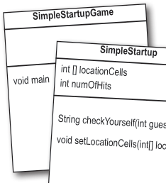
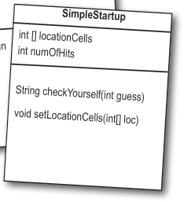
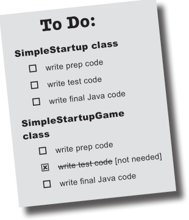
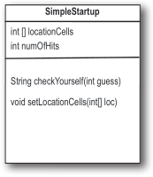
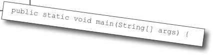

# ch05 Extra-Strength Methods

<!-- HF p.95 -->

#### Extra-Strength Methods

**Let’s put some muscle in our methods.** We dabbled with variables, played

with a few objects, and wrote a little code. But we were weak. We need more tools. Like

**operators**. We need more operators so we can do something a little more interesting than,

say, *bark*. And **loops**. We need loops, but what’s with the wimpy *while* loops? We need ***for***

loops if we’re really serious. Might be useful to **generate random numbers**. Better learn

that too. And why don’t we learn it all by *building* something real, to see what it’s like to write

(and test) a program from scratch. **Maybe a game**, like Battleships. That’s a heavy-lifting task,

so it’ll take *two* chapters to finish. We’ll build a simple version in this chapter and then build a

more powerful deluxe version in Chapter 6, *Using the Java Library*.


> *Figure/sidebar text on this page:* 5 writing a program / I can lift / heavy objects.

<!-- HF p.96 -->

### Let’s build a Battleship-style game: “Sink a Startup”

It’s you against the computer, but unlike the real Battleship game, in this one you don’t place any ships of your own. Instead, your job is to sink the computer’s ships in the fewest number of guesses.

Oh, and we aren’t sinking ships. We’re killing ill-advised, Silicon Valley Startups (thus establishing business relevancy so you can expense the cost of this book).

**Goal**: Sink all of the computer’s Startups in the fewest number of guesses. You’re given a rating or level, based on how well you perform.

**Setup**: When the game program is launched, the computer places three Startups on a **virtual 7 x 7 grid**. When that’s complete, the game asks for your first guess.

**How you play:** We haven’t learned to build a GUI yet, so this version works at the command line. The computer will prompt you to enter a guess (a cell) that you’ll type at the command line as “A3,” “C5,” etc.). In response to your guess, you’ll see a result at the command-line, either “hit,” “miss,” or “You sunk poniez” (or whatever the lucky Startup of the day is). When you’ve sent all three Startups to that big 404 in the sky, the game ends by printing out your rating.

**A**

**B**

**cabista**

**C**

**D**

**poniez**

**E**

**F**

**G**

**hacqi**

**0 1 2 3 4 5 6**

```text
%java StartupBust
Enter a guess  A3
miss
Enter a guess  B2
miss
Enter a guess  C4
miss
Enter a guess  D2
hit
Enter a guess  D3
hit
Enter a guess  D4
Ouch! You sunk poniez   : (
kill
Enter a guess  G3
hit
Enter a guess  G4
hit
Enter a guess  G5
Ouch! You sunk hacqi   : (
All Startups are dead! Your stock
is now worthless
Took you long enough. 62 guesses.
```

> *Figure/sidebar text on this page:* You’re going to build the / Sink a Startup game, with / a 7 x 7 grid and three / Startups. Each Startup / takes up three cells. / part of a game interaction / File Edit Window Help Sell / Each box / is a “cell” / 7 X 7 grid / starts at zero, like Java arrays

<!-- HF p.97 -->

### First, a high-level design

We know we’ll need classes and methods, but what should they be? To answer that, we need more information about what the game should do.

First, we need to figure out the general flow of the game. Here’s the basic idea:

```text
1
       A

       B


2
```

```text
A

B
```

```text
3
```

Now we have an idea of the kinds of things the program needs to do. The next step is figuring out what kind of **objects** we’ll need to do the work. Remember, think like Brad rather than Laura (who we met in Chapter 2, *A Trip to Objectville*); focus first on the ***things*** in the program rather than the ***procedures***.

```text
1
```

```text
                           A
                               B


2
                     A
```

```text
B
```

```text
3
```

> *Figure/sidebar text on this page:* A circle means / start or finish / A rectangle is / Start / used to represent / an action / User starts the game. / Game setup / Game creates three Startups / Game places the three Start­ / Get user / ups onto a virtual grid / guess / Game play begins. / miss / Check / hit / remove / Repeat the following until there are / guess / location cell / no more Startups: / A diamond / represents a / Prompt user for a guess / kill / (“A2,” “C0,” etc.) / decision point. / remove / Startup / Check the user guess against / all Startups to look for a hit, / miss, or kill. Take appropri­ / ate action: if a hit, delete cell / still some / (A2, D4, etc.). If a kill, delete / yes / Startups / Startup. / alive? / Game finishes. / no / Give the user a rating based on / display user / score/rating / the number of guesses. / game / over / Whoa. A real flow chart.

<!-- HF p.98 -->

### The “Simple Startup Game” a gentler introduction

It looks like we’re gonna need at least two classes, a Game class and a Startup class. But before we build the full-monty ***Sink a Startup*** game, we’ll start with a stripped-down, simplified version, ***Simple Startup Game.*** We’ll build the simple version in *this* chapter, followed by the deluxe version that we build in the *next* chapter.

Everything is simpler in this game. Instead of a 2-D grid, we hide the Startup in just a single *row.* And instead of *three* Startups, we use *one*.

The goal is the same, though, so the game still needs to make a Startup instance, assign it a location somewhere in the row, get user input, and when all of the Startup’s cells have been hit, the game is over. This simplified version of the game gives us a big head start on building the full game. If we can get this small one working, we can scale it up to the more complex one later.

In this simple version, the game class has no instance variables, and all the game code is in the main() method. In other words, when the program is launched and main() begins to run, it will make the one and only Startup instance, pick a location for it (three consecutive cells on the single virtual seven-cell row), ask the user for a guess, check the guess, and repeat until all three cells have been hit.

Keep in mind that the virtual row is...*virtual*. In other words, it doesn’t exist anywhere in the program. As long as both the game and the user know that the Startup is hidden in three consecutive cells out of a possible seven (starting at zero), the row itself doesn’t have to be represented in code. You might be tempted to build an array of seven ints and then assign the Startup to three of the seven elements in the array, but you don’t need to. All we need is an array that holds just the three cells the Startup occupies.

```text
1
```

**0 1 2 3 4 5 6**

```text
2
```

```text
3
```

```text
%java SimpleStartupGame
enter a number  2
hit
enter a number  3
hit
enter a number  4
miss
enter a number  1
kill
You took 4 guesses
```





> *Figure/sidebar text on this page:* Game starts and creates ONE Startup / and gives it a location on three cells in / the single row of seven cells. / Instead of “A2,” “C4,” and so on, the / locations are just integers (for example: / 1,2,3 are the cell locations in this / picture): / Game play begins. Prompt user for / a guess; then check to see if it hit / any of the Startup’s three cells. / If a hit, increment the numOfHits / variable. / SimpleStartupGame / Game finishes when all three cells have / been hit (the numOfHits variable val­ / ue is 3), and the user is told how many / SimpleStartup / guesses it took to sink the Startup. / int [] locationCells / void main / int numOfHits / A complete game interaction / File Edit Window Help Destroy / String checkYourself(int guess) / void setLocationCells(int[] loc)

<!-- HF p.99 -->

### Developing a Class

As a programmer, you probably have a methodology/ process/approach to writing code. Well, so do we. Our sequence is designed to help you see (and learn) what we’re thinking as we work through coding a class. It isn’t necessarily the way we (or *you)* write code in the Real World. In the Real World, of course, you’ll follow the approach your personal preferences, project, or employer dictate. We, however, can do pretty much whatever we want. And when we create a Java class as a “learning experience,” we usually do it like this:

o Figure out what the class is supposed to *do*.

o List the **instance variables and methods**.

o Write **prep code** for the methods. (You’ll see this in just a moment.)

o Write **test code** for the methods.

o **Implement** the class.

o **Test** the methods.

o **Debug** and **reimplement** as needed.

o Express gratitude that we don’t have to test our so-called *learning experience* app on actual live users.

?

*brain power*

**Flex those dendrites.**

**How would you decide which class or classes to build *first*****, when you’re writing a program? Assuming that all but the tiniest programs need more than one class (if you’re following good OO principles and not having *one* class do many different jobs), where do you start?**

**prep code test code real code**

This bar is displayed on the next set of pages to tell you which part you’re working on. For example, if you see this picture at the top of a page, it means you’re working on prep code for the SimpleStartup class.

**test code real code prep code prep code**



> *Figure/sidebar text on this page:* The three things we’ll write for / each class: / SimpleStartup class / prep code / A form of pseudocode, to help you focus on / the logic without stressing about syntax. / test code / A class or methods that will test the real code / and validate that it’s doing the right thing. / real code / The actual implementation of the class. This / is where we write real Java code. / To Do: / SimpleStartup class / o write prep code / o write test code / o write final Java code / SimpleStartupGame / class / o write prep code /  write test code [not needed] / o write final Java code

<!-- HF p.100 -->

**test code real code prep code prep code**

You’ll get the idea of how prep code (our version of pseudocode) works as you read through this example. It’s sort of halfway between real Java code and a plain English description of the class. Most prep code includes three parts: instance variable declarations, method declarations, method logic. The most important part of prep code is the method logic, because it defines *what* has to happen, which we later translate into *how* when we actually write the method code.

**DECLARE** an *int array* to hold the location cells. Call it *locationCells.*

**DECLARE** an *int* to hold the number of hits. Call it *numOfHits* and **SET** it to 0.

**DECLARE** a *checkYourself()* method that takes a *int* for the user’s guess (1, 3, etc.), checks it, and returns a result representing a “hit,” “miss,” or “kill.”

**DECLARE** a *setLocationCells()* setter method that takes an *int array* (which has the three cell locations as *ints* (2, 3, 4, etc.)).

**METHOD**: *String checkYourself(int userGuess)*

**GET** the user guess as an int parameter

**REPEAT** with each of the location cells in the *int* array

***// COMPARE*** the user guess to the location cell

**IF** the user guess matches

**INCREMENT** the number of hits

***// FIND OUT*** if it was the last location cell:

**IF** number of hits is 3, **RETURN** “kill” as the result

**ELSE** it was not a kill, so **RETURN** “hit”

END IF

**ELSE** the user guess did not match, so **RETURN** “miss”

END IF

END REPEAT

END METHOD

**METHOD**: *void setLocationCells(int[] cellLocations)*

**GET** the cell locations as an *int array* parameter

**ASSIGN** the cell locations parameter to the cell locations instance variable

END METHOD



> *Figure/sidebar text on this page:* SimpleStartup / int [] locationCells / int numOfHits / String checkYourself(int guess) / void setLocationCells(int[] loc)

<!-- HF p.101 -->

**prep code test code test code real code**

Before we start coding the methods, though, let’s back up and write some code to *test* the methods. That’s right, we’re writing the test code *before* there’s anything to test!

The concept of writing the test code first is one of the practices of Test-Driven Development (TDD), and it can make it easier (and faster) for you to write your code. We’re not necessarily saying you should use TDD, but we do like the part about writing tests first. And TDD just *sounds* cool.

#### Test-Driven Development (TDD)

Back in 1999, Extreme Programming (XP) was a newcomer to the software development methodology world. One of the central ideas in XP was to write test code before writing the actual code. Since then, the idea of writing test code first has spun off of XP and become the core of a newer, more popular subset of XP called TDD. (Yes, yes, we know we’ve just grossly oversimplified this, please cut us a little slack here.)

TDD is a LARGE topic, and we’re only going to scratch the surface in this book. But we hope that the way we’re going about developing the “Sink a Startup” game gives you some sense of TDD.

Check out *Test Driven Development: By Example* by Kent Beck if you want to learn more about how TDD works.

Here is a partial list of key ideas in TDD:

• Write the test code first.

• Develop in iteration cycles.

• Keep it (the code) simple.

• Refactor (improve the code) whenever and wherever you notice the opportunity.

• Don’t release anything until it passes all the tests.

• Don’t put in anything that’s not in the spec (no matter how tempted you are to put in functionality “for the future”).

• No killer schedules; work regular hours.


> *Figure/sidebar text on this page:* Writing the method / implementations / Oh my! For a minute / Let’s write the real / there I thought you / weren’t gonna write your / method code now and get / test code first. Whoo! / this puppy working. / Don’t scare me like that.

<!-- HF p.102 -->

**test code real code prep code test code**

We need to write test code that can make a SimpleStartup object and run its methods. For the SimpleStartup class, we really care about only the *checkYourself()* method, although we *will* have to implement the *setLocationCells()* method in order to get the *checkYourself()* method to run correctly.

Take a good look at the prep code below for the *checkYourself()* method (the *setLocationCells()* method is a no-brainer setter method, so we’re not worried about it, but in a “real” application we might want a more robust “setter” method, which we *would* want to test).

Then ask yourself, “If the checkYourself() method were implemented, what test code could I write that would prove to me the method is working correctly?”

**METHOD** *String checkYourself(int userGuess)*

**GET** the user guess as an int parameter

**REPEAT** with each of the location cells in the *int* array

// ***COMPARE*** the user guess to the location cell

**IF** the user guess matches

**INCREMENT** the number of hits

***// FIND OUT*** if it was the last location cell:

**IF** number of hits is 3, **RETURN** “Kill” as the result

**ELSE** it was not a kill, so **RETURN** “Hit”

END IF

**ELSE** the user guess did not match, so **RETURN** “Miss”

END IF

END REPEAT

END METHOD

> *Figure/sidebar text on this page:* Writing test code for the SimpleStartup class / Based on this prep code: / Here’s what we should test: / 1. / Instantiate a SimpleStartup object. / 2. Assign it a location (an array of 3 ints, like / {2, 3, 4}). / 3. Create an int to represent a user guess (2, / 0, etc.). / 4. / Invoke the checkYourself() method passing / it the fake user guess. / 5. Print out the result to see if it’s correct / (“passed” or “failed”).

<!-- HF p.103 -->

| prep code | tteesstt ccooddee | re | al code |
|---|---|---|---|
| there are no Dumb Questions Q: Maybe I’m missing some­ thing here, but how exactly do you run a test on something that doesn’t yet exist!? A: You don’t. We never said you start by running the test; you start by writing the test. At the time you write the test code, you won’t have anything to run it against, so you probably won’t be able to compile it until you write “stub” code that can com­ pile, but that will always cause the test to fail (like, return null). Q: Then I still don’t see the point. Why not wait until the code is written, and then whip out the test code? A: The act of thinking through (and writing) the test code helps clarify your thoughts about what the method itself needs to do. As soon as your implementation code is done, you already have test code just waiting to validate it. Besides, you know if you don’t do it now, you’ll never do it. There’s always something more interesting to do. Ideally, write a little test code, then write only the implementa­ tion code you need in order to pass that test. Then write a little more test code and write only the new implementation code needed to pass that new test. At each test iteration, you run all the previously written tests to prove that your latest code |  |  |  |

### Test code for the SimpleStartup class

```java
public class SimpleStartupTestDrive {
  public static void main(String[] args) {
    SimpleStartup dot = new SimpleStartup();
```

```java
int[] locations = {2, 3, 4};
dot.setLocationCells(locations);
```

```java
    int userGuess = 2;
    String result = dot.checkYourself(userGuess);


    String testResult = "failed";
    if (result.equals("hit")) {
      testResult = "passed";
    }


    System.out.println(testResult);
  }
}
```

#### Sharpen your pencil

In the next couple of pages we implement the SimpleStartup class, and then later we return to the test class. Looking at our test code above, what else should be added? What are we *not* testing in this code that we *should* be testing for? Write your ideas (or lines of code) below:

additions don’t break previously tested code.

> *Figure/sidebar text on this page:* Instantiate a / SimpleStartup / object. / Make an int array for / the location of the / Startup (3 consecutive / ints out of a possible 7). / Invoke the setter / method on the Startup. / Make a fake / user guess. / Invoke the checkYourself() / method on the Startup / object, and pass it the / fake guess. / If the fake guess (2) gives / back a “hit”, it’s working. / Print out the test result / (“passed” or “failed”). / Yours to solve.

<!-- HF p.104 -->

**test code real code real code prep code**

### The checkYourself() method

There isn’t a perfect mapping from prep code to Java code; you’ll see a few adjustments. The prep code gave us a much better idea of *what* the code needs to do, and now we have to figure out the Java code that can do the *how*.

In the back of your mind, be thinking about parts of this code you might want (or need) to improve. The numbers are for things (syntax and language features) you haven’t seen yet. They’re explained on the opposite page.

```java
public String checkYourself(int guess) {
```

**GET** the user guess

```java
String result = "miss";
```

**REPEAT** with

```java
for (int cell : locationCells) {
```

each cell in the *int* array

```java
if (guess == cell) {
```

**IF** the user guess matches

```java
result = "hit";
```

**INCREMENT**

```java
numOfHits++;
```

the number of hits

```java
    break;

  } // end if

} // end for
```

***// FIND OUT*** if it was the last cell

```java
if (numOfHits == locationCells.length) {
```

**IF** number of hits is 3,

```java
result = "kill";
```

**RETURN** “kill” as the result

```java
} // end if
```

**ELSE** it was not a kill, so

```java
System.out.println(result);
```

**RETURN**“hit”

**ELSE**

```java
return result;
```

**RETURN** “miss”

```java
} // end method
```

> *Figure/sidebar text on this page:* 1 / Make a variable to hold the result we’ll / return. put “miss” in as the default / (i.e., we assume a “miss”) / 1 / Repeat with each cell in the locationCells / array (each cell location of the object) / Compare the user guess to this / element (cell) in the array / We got a hit! / 2 / 3 / Get out of the loop, no need / to test the other cells / We’re out of the loop, but let’s see if we’re / now ‘dead’ (hit 3 times) and change the / result String to “Kill” / Display the result for the user (“miss”, / unless it was changed to “hit” or “kill”) / Return the result back to / the calling method

<!-- HF p.105 -->

**test code real code real code prep code**

The things we haven’t seen before are on this page. Stop worrying! There are more details later in the chapter. This is just enough to get you going.

```java
2
                  for (int cell : locationCells) {  }
```

```text
numOfHits++
```

```java
4
              break;
```

> *Figure/sidebar text on this page:* Just the new stuff / Read this for loop declaration as “repeat / The colon (:) means “in”, so the / for each element in the ‘locationCells’ / whole thing means “for each int / array: take the next element in the array / value IN locationCells...” / and assign it to the int variable ‘cell’.” / 1 / The for loop / The array to iterate over in the loop. / Declare a variable that will hold one element / Each time through the loop, the next / from the array. Each time through the loop, / element in the array will be assigned to / this variable (in this case an int variable named / the variable “cell”. (More on this at the / “cell”) will hold a different element from the / array, until there are no more elements (or the / end of this chapter.) / code does a “break”... see #4 below). / The ++ means add 1 to / whatever’s there (in other / The post-increment / words, increment by 1). / 2 / operator / numOfHits++ is the same (in / this case) as saying numOfHits = / numOfHits + 1, with less typing. / break statement / 3 / Gets you out of a loop. Immediately. Right here. / No iteration, no boolean test, just get out now!

<!-- HF p.106 -->

**test code real code real code prep code**

```java
public class SimpleStartupTestDrive {
```

there are no

Dumb Questions

```java
public static void main(String[] args) {
  SimpleStartup dot = new SimpleStartup();
```

Q: **In the beginning of the**

```java
int[] locations = {2, 3, 4};
dot.setLocationCells(locations);
```

```java
int userGuess = 2;
```

**book, there was an example of a**

***for* loop that was really different**

```java
String result = dot.checkYourself(userGuess);
```

**from this one—are there two**

```java
String testResult = "failed";
```

**different styles of *for* loops?**

```java
if (result.equals("hit")) {
  testResult = "passed";
```

A: Yes! From the first version of

```java
}
```

Java there has been a single kind

```java
System.out.println(testResult);
```

of *for* loop (explained later in this

```java
}
```

chapter) that looks like this:

```java
                             }
for (int i = 0; i < 10; i++)
{
                             class SimpleStartup {
    // do something 10 times
                               private int[] locationCells;
}
                               private int numOfHits = 0;
```

You can use this format for any kind of loop you need. But...

```java
public void setLocationCells(int[] locs) {
```

since Java 5, you can also use the *enhanced* for loop (that’s the

```java
locationCells = locs;
```

official description) when your

```java
}
```

loop needs to iterate over the elements in an array (or *another*

```java
public String checkYourself(int guess) {
```

kind of collection, as you’ll see in

```java
String result = "miss";
```

the *next* chapter). You can always

```java
for (int cell : locationCells) {
```

use the plain old for loop to iterate over an array, but the *enhanced* for

```java
if (guess == cell) {
```

loop makes it easier.

```java
result = "hit";
numOfHits++;
```

Q: **If you can add one to an int**

```java
  break;
} // end if
```

**by using ++, can you also subtract one in some way?**

```java
} // end for
if (numOfHits ==
```

A: Yep absolutely. Hopefully it’s

```java
  locationCells.length) {
result = "kill";
```

not too surprising to find out that

```java
} // end if
```

the syntax is -- (two minuses), like this:

```java
                                 System.out.println(result);
                                 return result;
countdown = i--;
                               } // end method
                             } // close class
```

**What should we see when we run this code?** The test code makes a SimpleStartup object and gives it a location at 2,3,4. Then it sends a fake user guess of “2” into the checkYouself() method. If the code is working correctly, we should see the result print out:

```text
% java SimpleStartupTestDrive
hit
passed
```

> *Figure/sidebar text on this page:* Final code for SimpleStartup and SimpleStartupTestDrive / There’s a little bug lurking here. It compiles and / runs, but...don’t worry about it for now, but we will / have to face it a little later.

<!-- HF p.107 -->

**test code real code prep code prep code**

#### Sharpen your pencil

We built the test class and the SimpleStartup class. But we still haven’t made the actual *game.* Given the code on the opposite page and the spec for the actual game, write in your ideas for prep code for the game class. We’ve given you a few lines here and there to get you started. The actual game code is on the next page, so ***don’t turn the page until you do this exercise!***

You should have somewhere between 12 and 18 lines (including the ones we wrote, but *not* including lines that have only a curly brace).

**METHOD *public static void main (String [] args)***

**DECLARE** an int variable to hold the number of user guesses, named *numOfGuesses*

**COMPUTE** a random number between 0 and 4 that will be the starting location cell position

**WHILE** the Startup is still alive:

**GET** user input from the command line

**The SimpleStartupGame needs to do this:**

1. Make the single SimpleStartup object.
2. Make a location for it (three consecutive cells on a single row of seven virtual cells).
3. Ask the user for a guess.
4. Check the guess.
5. Repeat until the Startup is sunk.
6. Tell the user how many guesses it took.

```text
%java SimpleStartupGame
enter a number  2
hit
enter a number  3
hit
enter a number  4
miss
enter a number  1
kill
You took 4 guesses
```

> *Figure/sidebar text on this page:* A complete game interaction / File Edit Window Help Runaway / Yours to solve.

<!-- HF p.108 -->

**prep code prep code test code real code**

There are some things you’ll have to take on faith. For example, we have one line of prep code that says “GET user input from command line.” Let me tell you, that’s a little more than we want to implement from scratch right now. But happily, we’re using OO. And that means you get to ask some *other* class/object to do something for you, without worrying about ***how*** it does it. When you write prep code, you should assume that *somehow* you’ll be able to do whatever you need to do, so you can put all your brainpower into working out the logic.

***public static void main (String [] args)***

**DECLARE** an int variable to hold the number of user guesses, named *numOfGuesses,* and set it to 0

**MAKE** a new SimpleStartup instance

**COMPUTE** a random number between 0 and 4 that will be the starting location cell position

**MAKE** an int array with 3 ints using the randomly generated number, that number incremented by 1, and that number incremented by 2 (example: 3,4,5)

**INVOKE** the *setLocationCells()* method on the SimpleStartup instance

**DECLARE** a boolean variable representing the state of the game, named *isAlive.* **SET** it to true

**WHILE** the Startup is still alive (isAlive == true):

**GET** user input from the command line

***// CHECK*** the user guess

**INVOKE** the *checkYourself()* method on the SimpleStartup instance

**INCREMENT** *numOfGuesses* variable

***// CHECK*** for Startup death

**IF** result is “kill”

**SET** *isAlive* to false (which means we won’t enter the loop again)

**PRINT** the number of user guesses

END IF

END WHILE

END METHOD

**metacognitive tip**


> *Figure/sidebar text on this page:* Prep code for the SimpleStartupGame class / Everything happens in main() / Don’t work one part of the brain for too long a stretch at one time. / Working just the left side of the brain for more than 30 minutes / is like working just your left arm for 30 minutes. Give each side / of your brain a break by switching sides at regular intervals. / When you shift to one side, the other side gets to rest and / recover. Left-brain activities include things like step-by-step / sequences, logical problem-solving, and analysis, while the / right-brain kicks in for metaphors, creative problem-solving, / pattern-matching, and visualizing.

<!-- HF p.109 -->

�

�

�

�

�

�

�

�

�

�

�


> *Figure/sidebar text on this page:* BULLET POINTS / Write test code before you implement the / Your Java program should start with a high- / methods. / level design. / Typically you’ll write three things when you / Choose for loops over while loops when you / create a new class: / know how many times you want to repeat the / ▪ prep code / loop code. / ▪ test code / The enhanced for loop is an easy way to loop / over an array or collection. / ▪ real (Java) code / Use the increment operator to add 1 to a / Prep code should describe what to do, not / variable (x++;). / how to do it. Implementation comes later. / Use the decrement operator to subtract 1 from / Use the prep code to help design the test / a variable (x--;). / code. / Use break to leave a loop early (i.e., even if / A class can have one superclass only. / the boolean test condition is still true). / How many / hits did you get / last month? / Including / repeat visitors? / 3. / Yes... / Howdy from Ghost Town

<!-- HF p.110 -->

**test code real code real code prep code**

### The game’s main() method

Just as you did with the SimpleStartup class, be thinking about parts of this code you might want (or need) to improve. The numbered things are for stuff we want to point out. They’re explained on the opposite page. Oh, if you’re wondering why we skipped the test code phase for this class, we don’t need a test class for the game. It has only one method, so what would you do in your test code? Make a separate class that would call main() on this class? We didn’t bother, we’ll just run this to test it.

```java
public static void main(String[] args) {

  int numOfGuesses = 0;
```

**DECLARE** a variable to hold user guess count, and set

```java
GameHelper helper = new GameHelper();
```

it to 0

**MAKE** a Simple

```java
SimpleStartup theStartup = new SimpleStartup();
```

Startup object

**COMPUTE** a

```java
int randomNum = (int) (Math.random() * 5);
```

random number between 0 and 4

**MAKE** an int array with the 3 cell loca

```java
int[] locations = {randomNum, randomNum + 1, randomNum + 2};
```

tions, and

**INVOKE** setLo

```java
theStartup.setLocationCells(locations);
```

cationCells on the Startup object

```java
boolean isAlive = true;
```

**DECLARE** a boolean isAlive

**WHILE** the

```java
while (isAlive) {
```

Startup is still alive

```java
int guess = helper.getUserInput("enter a number");
```

**GET** user input

***// CHECK*** it

```java
String result = theStartup.checkYourself(guess);
```

**INVOKE** checkYourself() on Startup

```java
numOfGuesses++;
```

**INCREMENT** numOfGuesses

```java
if (result.equals("kill")) {
```

**IF** result is “kill”

```java
isAlive = false;
```

**SET** isAlive to false

**PRINT** the number

```java
System.out.println("You took " + numOfGuesses + " guesses");
```

of user guesses

```java
  } // close if

} // close while
```

> *Figure/sidebar text on this page:* 1 / Make a variable to track how / many guesses the user makes. / This is a special class we wrote that has / the method for getting user input. For / now, pretend it’s part of Java. / Make the Startup object. / 1 / Make a random number for the / first cell, and use it to make / the cell locations array. / Give the Startup its locations / (the array). / Make a boolean variable to track whether the / game is still alive, to use in the while loop test. / repeat while game is still alive. / Get user guess. / 2 / Ask the Startup to check the / Increment guess / guess; save the returned result. / count by one. / Was it a “kill”? if so, set isAlive to false (so we won’t / re-enter the loop) and print user guess count.

<!-- HF p.111 -->

**test code real code real code prep code**

Two things that need a bit more explaining are on this page. This is just a quick look to keep you going; more details on the GameHelper class are at the end of this chapter.

```java
2

    int randomNum = (int) (Math.random() * 5)
```

```java
1


int guess = helper.getUserInput("enter a number");
```

> *Figure/sidebar text on this page:* random() and getUserInput() / This is a ‘cast’, and it forces the thing / immediately after it to become the / type of the cast (i.e., the type in the / The Math.random method re­ / brackets). Math.random returns a / turns a number from zero to just / double, so we have to cast it to an int / less than one. So this formula / (we want a nice whole number between / (with the cast) returns a number / 0 and 4). In this case, the cast chops / from 0 to 4 (i.e., 0 - 4.999.., / off the fractional part of the double. / cast to an int). / 1 / Make a random / number / We declare an int variable to hold / A class that comes / A static method of / the random number we get back. / with Java. / the Math class. / Math.random() has been around forever, so you’ll see code / like this in the Real World. These days you can use / java.util.Random's nextInt() method instead, which is more / convenient (you don’t have to cast the result to an int). / The Random class is in a different package. Since we / haven’t covered importing packages yet (it’s in the next / This method takes a String / argument that it uses to prompt / chapter), we’ve used Math.random() instead. / the user at the command line. / Whatever you pass in here gets / An instance we made earlier / displayed in the terminal just / of a class that we built to / before the method starts looking / help with the game. It’s called / for user input. / Getting user input / GameHelper and you haven’t / 2 / using the GameHelper / seen it yet (you will). / class / We declare an int variable to / A method of the GameHelper class / that asks the user for command- / hold the user input we get back / line input, reads it in after the / (3, 5, etc.). / user hits RETURN, and gives back / the result as an int.

<!-- HF p.112 -->

**prep code test code real code real code**

### One last class: GameHelper

**We made the *Startup* class.**

**We made the *game* class.**

**All that’s left is the *helper* class**—the one with the getUserInput() method. The code to get command-line input is more than we want to explain right now. It opens up topics best left for later. (Later, as in Chapter 16, *Saving Objects*.)

Ready-Bake Code

```java
import java.util.Scanner;

public class GameHelper {
  public int getUserInput(String prompt) {
    System.out.print(prompt + ": ");
    Scanner scanner = new Scanner(System.in);
    return scanner.nextInt();
  }
}
```

Just copy* the code below and compile it into a class named GameHelper. Drop all three class files (SimpleStartup, SimpleStartupGame, GameHelper) into the same directory, and make it your working directory.

Code available on *https://oreil.ly/hfJava_3e_examples*.


> *Figure/sidebar text on this page:* GameHelper class (Ready-bake) / Whenever you see this logo, / Yes, we WILL / you’re seeing code that you / take a little more / have to type as-is and take / on faith. Trust it. You’ll learn / of your delicious / how that code works later. / Ready-Bake Code, / thank you very much! / *We know how much you enjoy typing, but for those rare moments / when you’d rather do something else, we’ve made the Ready-Bake

<!-- HF p.113 -->

### Let’s play

(your mileage may vary)

```text
%java SimpleStartupGame
enter a number  1
miss
enter a number  2
miss
enter a number  3
miss
enter a number  4
hit
enter a number  5
hit
enter a number  6
kill
You took 6 guesses
```

### What’s this? A bug?

(yikes)

```text
%java SimpleStartupGame
enter a number  1
hit
enter a number  1
hit
enter a number  1
kill
You took 3 guesses
```

#### Sharpen your pencil

**It’s a cliff-hanger!**

Will we ***find*** the bug? Will we ***fix*** the bug?

Stay tuned for the next chapter, where we answer these questions and more...

And in the meantime, see if you can come up with ideas for what went wrong and how to fix it.


> *Figure/sidebar text on this page:* Gasp! / Here’s what happens when we / Here’s what happens when we / run it and enter the numbers / enter 1,1,1. / 1,2,3,4,5,6. Lookin’ good. / A complete game interaction / A different game interaction / File Edit Window Help Smile / File Edit Window Help Faint / Yours to solve.

<!-- HF p.114 -->

### More about for loops

We’ve covered all the game code for *this* chapter (but we’ll pick it up again to finish the deluxe version of the game in the next chapter). We didn’t want to interrupt your work with some of the details and background info, so we put it back here. We’ll start with the details of for loops, and if you’ve seen this kind of syntax in another programming language, just skim these last few pages...

### Regular (non-enhanced) for loops

```java
for(int i = 0; i < 100; i++){ }
```

**What it means in plain English:** “Repeat 100 times.”

**How the compiler sees it:**

- create a variable *i* and set it to 0.
- repeat while *i* is less than 100.
- at the end of each loop iteration, add 1 to *i*.

**Part One: *initialization***

Use this part to declare and initialize a variable to use within the loop body. You’ll most often use this variable as a counter. You can actually initialize more than one variable here, but it’s much more common to use a single variable.

**Part Two: *boolean test***

This is where the conditional test goes. Whatever’s in there, it *must* resolve to a boolean value (you know, ***true*** or ***false***). You can have a test, like (x >= 4), or you can even invoke a method that returns a boolean.

**Part Three: *iteration expression***

In this part, put one or more things you want to happen with each trip through the loop. Keep in mind that this stuff happens at the *end* of each loop.


> *Figure/sidebar text on this page:* the code to / repeat goes here / (the body) / post-increment operator / repeat for 100 reps: / boolean test / initialization / iteration expression

<!-- HF p.115 -->

### Trips through a loop

```java
for (int i = 0; i < 8; i++) {
                                        %java Test
   System.out.println(i);
                                        0
                                        1
}
                                        2
System.out.println("done");
                                        3
                                        4
                                        5
                                        6
                                        7
                                        done
```

**Pre and Post Increment/Decrement Operator**

The shortcut for adding or subtracting 1 from a variable:

```java
x++;
```

is the same as:

```java
x = x + 1;
```

They both mean the same thing in this context:

“add 1 to the current value of x” or “***increment*** x by 1”

And:

```java
x--;
```

A *while* loop has only the boolean test; it doesn’t have is the same as: a built-in initialization or iteration expression. A *while*

```java
x = x - 1;
```

loop is good when you don’t know how many times to loop and just want to keep going while some condiOf course that’s never the whole story. The placement of the tion is true. But if you *know* how many times to loop operator (either before or after the variable) can affect the re(e.g., the length of an array, 7 times, etc.), a *for* loop is sult. Putting the operator *before* the variable (for example, ++x), cleaner. Here’s the loop above rewritten using *while:* means, “*first*, increment x by 1, and *then* use this new value of x.” This only matters when the ++x is part of some larger expression rather than just a single statement.

```java
int i = 0;
                                             int x = 0;     int z = ++x;
while (i < 8) {
```

produces: x is 1, z is 1

```java
System.out.println(i);
```

But putting the ++ *after* the x gives you a different result:

```java
   i++;
                                         int x = 0;     int z = x++;
}
```

Once this code has run, x is 1, but ***z is 0***! z gets the value of x,

```java
System.out.println("done");
```

and *then* x is incremented.

```text
++  --
```

> *Figure/sidebar text on this page:* output: / File Edit Window Help Repeat / declare int i / set i to 0 / is i < 8? / true / enter loop / (the boolean / body / test) / false / print the value / of i / print “done” / (jump below loop) / increment i / (the iteration / expression) / Difference between for and while / we have to declare and / initialize the counter / we have to increment / the counter

<!-- HF p.116 -->

### The enhanced for loop

The Java language added a second kind of *for* loop called the *enhanced for* back in Java

5. This makes it easier to iterate over all the elements in an array or other kinds of collections (you’ll learn about *other* collections in the next chapter). That’s really all that the enhanced for gives you—a simpler way to walk through all the elements in the collection. We’ll see the enhanced for loop in the next chapter too, when we talk about collections that *aren’t* arrays.

```java
for (String name : nameArray) {  }
```

**What it means in plain English:** “For each element in nameArray, assign the element to the ‘name’ variable, and run the body of the loop.”

**How the compiler sees it:**

- Create a String variable called *name* and set it to null.
- Assign the first value in *nameArray* to name.
- Run the body of the loop (the code block bounded by curly braces).
- Assign the next value in *nameArray* to name.
- Repeat while *there are still elements in the array.*

**Part One: *iteration variable declaration***

Use this part to declare and initialize a variable to use within the loop body. With each iteration of the loop, this variable will hold a different element from the collection. The type of this variable must be compatible with the elements in the array! For example, you can’t declare an *int* iteration variable to use with a *String[]* array.

**Part Two: *the actual collection***

This must be a reference to an array or other collection. Again, don’t worry about the *other* non-array kinds of collections yet—you’ll see them in the next chapter.

> *Figure/sidebar text on this page:* The code to / Declare an iteration / variable that will hold a / The colon (:) / repeat goes here / single element in the array. / means “IN”. / (the body). / The collection of elements that you want to iterate over. / The elements in the / With each iteration, a / different element in the / Imagine that somewhere earlier, the code said: / array MUST be / array will be assigned to / compatible with the / String[] nameArray = {“Fred”, “Mary”, “Bob”}; / declared variable type. / the variable “name”. / With the first iteration, the name variable has the value of / “Fred”, and with the second iteration, a value of “Mary”, etc. / Note: depending on the / programming language they’ve / used in the past, some people / refer to the enhanced for as the / “for each” or the “for in” loop, / because that’s how it reads: “for / EACH thing IN the collection...”

<!-- HF p.117 -->

### Casting primitives

Before we finish the chapter, we want to tie up a loose end. When we used Math.random(), we had to *cast* the result to an int. Casting one numeric type to another can change the value itself. It's important to understand the rules so you’re not surprised by this.

In Chapter 3, *Know Your Variables*, we talked about the sizes of the various primitives and how you can’t shove a big thing directly into a small thing:

```java
long y = 42;
int x = y;       // won't compile
```

A long is bigger than an int, and the compiler can’t be sure where that long has been. It might have been out partying with the other longs, and taking on really big values. To force the compiler to jam the value of a bigger primitive variable into a smaller one, you can use the cast operator. It looks like this:

```java
long y = 42;     // so far so good
int x = (int) y; // x = 42 cool!
```

Putting in the cast tells the compiler to take the value of y, chop it down to int size, and set x equal to whatever is left. If the value of y was bigger than the maximum value of x, then what’s left will be a weird (but calculable*) number:

```java
long y = 40002;       // 40002 exceeds the 16-bit limit of a short
short x = (short) y;  // x now equals -25534!
```

Still, the point is that the compiler lets you do it. And let’s say you have a floating-point number and you just want to get at the whole number (int) part of it:

```java
float f = 3.14f;
int x = (int) f;   //  x will equal 3
```

And don’t even think about casting anything to a boolean or vice versa—just walk away.

**It involves sign bits, binary, “two’s complement,” and other geekery.*


> *Figure/sidebar text on this page:* long / short / can be cast to / Bits on the left / side were cut off / 01011101 / 1101 / but you might / lose something

<!-- HF p.118 -->

**BE the JVM**

Exercise

```java
class Output {
  public static void main(String[] args) {
    Output output = new Output();
    output.go();
  }

  void go() {
    int value = 7;
    for (int i = 1; i < 8; i++) {
      value++;
      if (i > 4) {
        System.out.print(++value + " ");
      }
      if (value > 14) {
        System.out.println(" i = " + i);
        break;
      }
    }
  }
}
```

```text
% java Output
12 14
```

```text
% java Output
12 14 x = 6
```

```text
% java TestArrays
% java Output
island = Fiji
13 15 x = 6
island = Cozumel
island = Bermuda
island = Azores
```


> *Figure/sidebar text on this page:* The Java file on this page / represents a complete source / file. Your job is to play JVM / and determine what would be / the output when the / program runs. / File Edit Window Help OM / -or- / File Edit Window Help Incense / -or- / File Edit Window Help Sleep / File Edit Window Help Believe / Answers on page 122.

<!-- HF p.119 -->

Code Magnets

A working Java program is all scrambled up on the fridge. Can you

Exercise

reconstruct the code snippets to make a working Java program that produces the output listed below? Some of the curly braces fell on the floor and they were too small to pick up, so feel free to add as many of those as you need!

```text
% java MultiFor
0 4
0 3
1 4
1 3
3 4
3 3
```

```java
i++;


  if (i == 1) {
```

```java
     System.out.println(i + " " + j);

class MultiFor {
```

```java
for(int  j = 4; j > 2; j--) {
```

```java
for(int i = 0; i < 4; i++) {
```



> *Figure/sidebar text on this page:* public static void main(String[] args) { / File Edit Window Help Raid / Answers on page 122.

<!-- HF p.120 -->

6. For’s iteration ______
26. Math method
7. 32 bits
7. Establish first value
28. Iterate over me
10. Method’s answer
8. While or For
29. Leave early
11. Prep code-esque
9. Update an instance variable
13. Change
12. Toward blastoff
15. The big toolkit
14. A cycle
17. An array unit
16. Talkative package
18. Instance or local
19. Method messenger (abbrev.)

|  |  |  |  |  |  |  |  |  |  |  |  |  |  |  |
|---|---|---|---|---|---|---|---|---|---|---|---|---|---|---|
|  | 1 | 2 |  |  |  |  |  |  |  |  |  | 3 4 5 |  |  |
| 6 |  |  |  |  |  |  |  |  |  | 7 8 9 10 JavaCross |  |  |  |  |
| 11 |  | 12 13 How does a crossword puzzle 14 15 16 help you learn Java ? Well, all 17 18 19 of the words are Java related. In addition, the clues provide metaphors, puns, and the like. 20 21 These mental twists and turns burn alternate routes to Java knowledge right into your 22 23 24 brain! 25 |  |  |  |  |  |  |  |  |  |  |  |  |
| 26 |  | 27 28 29 |  |  |  |  |  |  |  |  |  |  |  |  |
| Across |  |  |  |  |  |  |  |  | Down |  |  |  |  |  |
| 1. | Fancy computer word |  | 20. Automatic toolkit |  |  |  |  |  | 2. Increment type |  |  |  | 21. As if |  |
| for build 22. Looks like a primi­ 3. Class’s workhorse 23. Add after |  |  |  |  |  |  |  |  |  |  |  |  |  |  |
| 4. | Multipart loop |  | tive, but.. 5. Pre is a type of _____ 24. Pi house |  |  |  |  |  |  |  |  |  |  |  |
| 6. Test first |  |  | 25. Un-castable |  |  |  |  |  |  |  |  |  |  |  |

26. Compile it and ____
27. ++ quantity

> *Figure/sidebar text on this page:* Answers on page 123.

<!-- HF p.121 -->

A short Java program is listed below. One block of the program is missing. Your challenge is to **match the candidate block of code** (on the left) **with the output** that you’d see if the block were inserted. Not all the lines of output will be used, and some

Mixed

of the lines of output might be used more than once. Draw lines

Messages

connecting the candidate blocks of code with their matching command-line output.

```java
public static void main(String[] args) {
  int x = 0;
  int y = 30;
  for (int outer = 0; outer < 3; outer++) {
    for (int inner = 4; inner > 1; inner--) {
```

```java
      y = y - 2;
      if (x == 6) {
        break;
      }
      x = x + 3;
    }
    y = y - 2;
  }
  System.out.println(x + " " + y);
}
```

**Candidates:**

```java
x = x + 3;

x = x + 6;

x = x + 2;

x++;

x--;

x = x + 0;
```

**Possible output:**

```text
45 6

36 6

54 6

60 10

18 6

6 14

12 14
```

> *Figure/sidebar text on this page:* Answers on page 123. / Candidate code / goes here / Match each / candidate with / one of the possible / outputs

<!-- HF p.122 -->

Exercise Solutions

**Be the JVM (from page 118)**

```java
class Output {

  public static void main(String[] args) {
    Output output = new Output();
    output.go();
  }

  void go() {
    int value = 7;
    for (int i = 1; i < 8; i++) {
      value++;
      if (i > 4) {
        System.out.print(++value + " ");
      }
      if (value > 14) {
        System.out.println(" i = " + i);
        break;
      }
    }
  }
}
```

```text
% java Output
% java TestArrays
13 15 x = 6
island = Fiji
island = Cozumel
island = Bermuda
island = Azores
```

Code Magnets **(from page 119)**

```java
class MultiFor {

  public static void main(String[] args) {
    for (int i = 0; i < 4; i++) {

      for (int j = 4; j > 2; j--) {
        System.out.println(i + " " + j);
      }

      if (i == 1) {
        i++;
      }
    }
  }
}
```

```text
% java MultiFor
0 4
0 3
1 4
1 3
3 4
3 3
```

> *Figure/sidebar text on this page:* What would happen if / this code block came / before the ‘j’ for loop? / File Edit Window Help Monopole / Did you remember to factor in / the break statement? How did / that affect the output? / File Edit Window Help MotorcycleMaintenance / File Edit Window Help Sleep

<!-- HF p.123 -->

**Puzzle Solutions**

| 1 I M |  | 1 I | M | 2 P | L | E | M | E | N | T |  |  |  |  |  |  |  | 3 M |
|---|---|---|---|---|---|---|---|---|---|---|---|---|---|---|---|---|---|---|
|  |  |  |  | R |  |  |  |  |  |  | 4 F | 5 O | R |  |  |  |  | E |
| 6 E | X | T | R | E | M | E |  |  |  |  |  | P |  |  |  | 7 I | N | T |
| X |  |  |  |  |  |  | 8 L |  | 9 S |  | 10 R | E | T | U | R | N | H O D E 2M4 | H |
| 11 P | S | E | U | 12 D | O | C | O | D | E |  |  | R | S T |  |  | I |  | O |
| R |  |  |  | E |  |  | O |  | T |  | 13 C | A | S | T |  | T |  | D |
| E |  | 14 I |  | C |  | 15 A | P | I |  | 16 J |  | T |  |  |  | I |  |  |
| S |  | T |  | R |  |  |  |  |  | A |  | O |  |  |  | A |  |  |
| S |  | 17 E | L | E | M | E | N | T |  | 18 V | A | R | I | 19 A | B | L | E |  |
| I |  | R |  | M |  |  |  |  |  | A |  |  |  | R |  | I |  |  |
| O |  | A |  | E |  | 20J | A | 2V1 | A | . | L | A | N | G |  | Z |  |  |
| N |  | T |  | N |  |  |  | I |  | I |  |  |  |  |  | E |  |  |
|  |  | 2 2I | N | T | E | G | E | R |  | O |  |  |  | 2 3P |  |  | 2M4 |  |
|  |  | O |  |  |  |  |  | T |  |  |  | 2B5 | O | O | L | E | A | N |
| 26R | A | N | D | 27O | M |  |  | U |  |  |  |  |  | S |  |  | T |  |
| U | 2 9B R |  |  | N |  |  |  | 2A8 | R | R | A | Y |  | T |  |  | H |  |
| N |  | 2 9B | R | E | A | K |  | L |  |  |  |  |  |  |  |  |  |  |

Mixed Messages **(from page 121)**

**Candidates:**

```java
x = x + 3;

x = x + 6;

x = x + 2;

x++;

x--;

x = x + 0;
```

**(from page 120)**

**Possible output:**

```text
45 6

36 6

54 6

60 10

18 6

6 14

12 14
```

> *Figure/sidebar text on this page:* JavaCross
