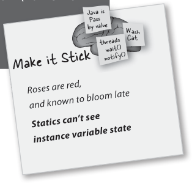
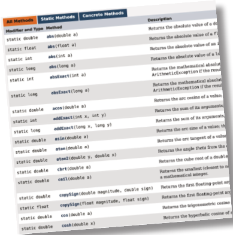
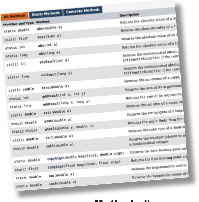

# ch10 Numbers Matter

<!-- HF p.275 -->

#### Numbers Matter

**Do the Math.** But there’s more to working with numbers than just doing primitive

arithmetic. You might want to get the absolute value of a number, or round a number, or find

the larger of two numbers. You might want your numbers to print with exactly two decimal

places, or you might want to put commas into your large numbers to make them easier to read.

And what about parsing a String into a number? Or turning a number into a String? Someday

you’re gonna want to put a bunch of numbers into a collection like ArrayList that takes only

objects. You’re in luck. Java and the Java API are full of handy number-tweaking capabilities and

methods, ready and easy to use. But most of them are **static**, so we’ll start by learning what

it means for a variable or method to be static, including constants in Java, also known as static

*final* variables.


> *Figure/sidebar text on this page:* 10 numbers and statics

<!-- HF p.276 -->

### MATH methods: as close as you’ll ever get to a global method

Except there’s no global *anything* in Java. But think about this: what if you have a method whose behavior doesn’t depend on an instance variable value. Take the round() method in the Math class, for example. It does the same thing every time— rounds a floating-point number (the argument to the method) to the nearest integer. Every time. If you had 10,000 instances of class Math, and ran the round(42.2) method, you’d get an integer value of 42. Every time. In other words, the method acts on the argument but is never affected by an instance variable state. The only value that changes the way the round() method runs is the argument passed to the method!

Doesn’t it seem like a waste of perfectly good heap space to make an instance of class Math simply to run the round() method? And what about *other* Math methods like min(), which takes two numerical primitives and returns the smaller of the two? Or max(). Or abs(), which returns the absolute value of a number. ***These methods never use instance variable values***. In fact, the Math class doesn’t *have* any instance variables. So there’s nothing to be gained by making an instance of class Math. So guess what? You don’t have to. As a matter of fact, you can’t.

```java
Math mathObject = new Math();
```

```java
%javac TestMath
TestMath.java:3: Math() has private
access in java.lang.Math
     Math mathObject = new Math();
                       ^
1 error
```

```java
long x = Math.round(42.2);
int y = Math.min(56, 12);
int z = Math.abs(-343);
```

> *Figure/sidebar text on this page:* Methods in the Math class / don’t use any instance / variable values. And because / the methods are “static,” / you don’t need to have an / instance of Math. All you / need is the Math class. / These methods never use / instance variables, so their / behavior doesn’t need to / know about a specific object. / If you try to make an instance of / class Math: / You’ll get this error: / File Edit Window Help IwasToldThereWouldBeNoMaths / This error shows that the Math / constructor is marked private! That / means you can NEVER say ‘new’ on the / Math class to make a new Math object.

<!-- HF p.277 -->

### The difference between regular (non-static) and static methods

Java is object-oriented, but once in a while you have a special case, typically a utility method (like the Math methods), where there is no need to have an instance of the class. The keyword `static` lets a method run ***without any instance of the class***. A static method means “behavior not dependent on an instance variable, so no instance/object is required. Just the class.”

#### regular (non-static) method

```java
public class Song {
  String title;

  public Song(String t) {
    title = t;
  }

  public void play() {
    SoundPlayer player = new SoundPlayer();
    player.playSound(title);
  }
}
```

```java
                s3.play();
s2.play();
```

#### static method

```java
public static int min(int a, int b) {
  //returns the smallest of a and b
}
```

```java
Math.min(42,36);
```

> *Figure/sidebar text on this page:* Instance variable value affects the / behavior of the play() method. / Math / No instance variables. The / method behavior doesn’t / The current value of the ‘title’ / min() / change with instance / instance variable is the song that / max() / variable state. / plays when you call play(). / abs() / Song / ... / My Way / title / Sex Pistols / play() / Politik / c / t / b / j / e / n / g / o / Coldplay / S / o / two instances / t / e / c / o / b / j / of class Song / S / o / n / g / Use the Class name, rather / than a reference variable / s3 / name. / s2 / Song / Song / NO OBJECTS!! / Calling play() on this / reference will cause / Absolutely NO OBJECTS / “Politik” to play. / Calling play() on this / anywhere in this picture! / reference will cause “My / Way” to play.

<!-- HF p.278 -->

#### Call a static method using a class name

```java
Math.min(88,86);
```

#### Call a non-static method using a reference variable name

```java
Song t2 = new Song();
t2.play();
```

### What it means to have a class with static methods

Often (although not always), a class with static methods is not meant to be instantiated. In Chapter 8, *Serious Polymorphism*, we talked about abstract classes, and how marking a class with the `abstract` modifier makes it impossible for anyone to say “new” on that class type. In other words, ***it’s impossible to instantiate an abstract class.***

But you can restrict other code from instantiating a *non*-abstract class by marking the constructor `private`. Remember, a *method* marked private means that only code from within the class can invoke the method. A *constructor* marked private means essentially the same thing—only code from within the class can invoke the constructor. Nobody can say “new” from *outside* the class. That’s how it works with the Math class, for example. The constructor is private; you cannot make a new instance of Math. The compiler knows that your code doesn’t have access to that private constructor.

This does *not* mean that a class with one or more static methods should never be instantiated. In fact, every class you put a main() method in is a class with a static method in it!

Typically, you make a main() method so that you can launch or test another class, nearly always by instantiating a class in main and then invoking a method on that new instance.

So you’re free to combine static and non-static methods in a class, although even a single non-static method means there must be *some* way to make an instance of the class. The only ways to get a new object are through “new” or deserialization (or something called the Java Reflection API that we don’t go into). No other way. But exactly *who* says new can be an interesting question, and one we’ll look at a little later in this chapter.

> *Figure/sidebar text on this page:* Math / min() / max() / abs() / ... / t2

<!-- HF p.279 -->

### Static methods can’t use non-static (instance) variables!

Static methods run without knowing about any particular instance of the static method’s class. And as you saw on the previous pages, there might not even *be* any instances of that class. Since a static method is called using the *class* (***Math***.random()) as opposed to an *instance reference* (***t2***.play()), a static method can’t refer to any instance variables of the class. The static method doesn’t know *which* instance’s variable value to use.

#### If you try to compile this code:

```java
public class Duck {
  private int size;

  public static void main(String[] args) {
    System.out.println("Size of duck is " + size);
  }

  public void setSize(int s) {
    size = s;
  }

  public int getSize() {
    return size;
  }
}
```

#### You’ll get this error:

```java
% javac Duck.java
Duck.java:6: non-static variable
size cannot be referenced from a
static context
      System.out.println("Size
of duck is " + size);
               ^
```


> *Figure/sidebar text on this page:* If you try to use an / instance variable from / inside a static method, / the compiler thinks, / “I don’t know which / object’s instance / variable you’re talking / If there’s a Duck on / Which Duck? / about!” If you have ten / the heap somewhere, we / Whose size? / don’t know about it. / Duck objects on the / heap, a static method / doesn’t know about / Static context. Everything / any of them. / else in the class is NOT static. / I’m sure they’re / No, I’m pretty sure / talking about MY / they’re talking about / size variable. / MY size variable. / File Edit Window Help Quack

<!-- HF p.280 -->

### Static methods can’t use non-static methods, either!

What do non-static methods do? ***They usually use instance variable state to affect the behavior of the method.*** A getName() method returns the value of the name variable. Whose name? The object used to invoke the getName() method.

#### This won’t compile:

```java
public class Duck {
  private int size;

  public static void main(String[] args) {
    System.out.println("Size is " + getSize());
  }

  public void setSize(int s) {
    size = s;
  }

  public int getSize() {
    return size;
  }
}
```

```java
% javac Duck.java
Duck.java:5: error: non-static
method getSize() cannot be refer­
enced from a static context
    System.out.println("Size is " +
getSize());

^
1 error
```

there are no

Dumb Questions

Q: **What if you try to call a non-static**

**method from a static method, but the non-static method doesn’t use any in stance variables. Will the compiler allow that?**

A: No. The compiler knows that

whether you do or do not use instance variables in a non-static method, you *can*. And think about the implications...if you were allowed to compile a scenario like that, then what happens if in the future you want to change the implementation of that non-static method so that one day it *does* use an instance variable? Or worse, what happens if a subclass *overrides* the method and uses an instance variable in the overriding version? Q: **I could swear I’ve seen code that**

**calls a static method using a reference variable instead of the class name.**

A: You *can* do that, but as your mother

always told you, “Just because it’s legal doesn’t mean it’s good.” Although it *works* to call a static method using any instance of the class, it makes for misleading (less-readable) code. You *can* say,

```java
Duck d = new Duck();
String[] s = {};
d.main(s);
```

This code is legal, but the compiler just resolves it back to the real class anyway (“OK, *d* is of type Duck, and main() is static, so I’ll call the static main() in class Duck”). In other words, using *d* to invoke main() doesn’t imply that main() will have any special knowledge of the object that *d* is referencing. It’s just an alternate *way* to invoke a static method, but the method is still static!



> *Figure/sidebar text on this page:* Calling getSize() just postpones / the inevitable—getSize() uses / the size instance variable. / Back to the same problem... / whose size? / File Edit Window Help Jack-in / Make it Stick / DateFormat.getDateTimeInstance(); / DateFormat.getTimeInstance(); / NumberFormat.getPercentInstance(); / Roses are red, / and known to bloom late / Statics can’t see / instance variable state

<!-- HF p.281 -->

### Static variable: value is the same for ALL instances of the class

Imagine you wanted to count how many Duck instances are being created while your program is running. How would you do it? Maybe an instance variable that you increment in the constructor?

```java
class Duck {
  int duckCount = 0;
  public Duck() {
    duckCount++;
  }
}
```

No, that wouldn’t work because duckCount is an instance variable, and starts at 0 for each Duck. You could try calling a method in some other class, but that’s kludgey. You need a class that’s got only a single copy of the variable, and all instances share that one copy.

That’s what a static variable gives you: a value shared by all instances of a class. In other words, one value per *class*, instead of one value per *instance*.

```java
public class Duck {
  private int size;
  private static int duckCount = 0;

  public Duck() {
    duckCount++;
  }
```

```java
  public void setSize(int s) {
    size = s;
  }

  public int getSize() {
    return size;
  }
}
```

> *Figure/sidebar text on this page:* The static duckCount / variable is initialized ONLY / when the class is first / loaded, NOT each time a / new instance is made. / Now it will keep / incrementing each time / the Duck constructor runs, / because duckCount is static / and won’t be reset to 0. / this would always set / duckCount to 1 each time / a Duck was made / A Duck object doesn’t keep its own copy / Because duckCount is static, Duck objects / of duckCount. / all share a single copy of it. You can think / of a static variable as a variable that lives / in a CLASS instead of in an object. / Duck / size: 20 / size / static duckCount / size: 22 / duckCount: 4 / duckCount: 4 / D / u / ec / t / getSize() / c / k / o / b / j / D / ec / t / setSize() / u / c / k / b / j / o / size: 8 / Each Duck object has its own / duckCount: 4 / size: 12 / size variable, but there’s only / one copy of the duckCount / duckCount: 4 / D / u / ec / t / variable—the one in the class. / c / k / o / b / j / t / D / u / ec / c / k / o / b / j

<!-- HF p.282 -->

Static variables are shared.

All instances of the same class share a single copy of the static variables.

Brain Barbell

brain barbell

Earlier in this chapter, we saw that a private constructor means that the class can’t be instantiated from code running outside the class. In other words, only code from within the class can make a new instance of a class with a private constructor. (There’s a kind of chicken-and-egg problem here. )

What if you want to write a class in such a way that only ONE instance of it can be created, and anyone who wants to use an instance of the class will always use that one, single instance?


> *Figure/sidebar text on this page:* static variable: / kid instance two / kid instance one / iceCream / instance variables: 1 per instance / static variables: 1 per class

<!-- HF p.283 -->

### Initializing a static variable

Static variables are initialized when a *class is loaded*. A class is loaded because the JVM decides it’s time to load it. Typically, the JVM loads a class because somebody’s trying to make a new instance of the class, for the first time, or use a static method or variable of the class. As a programmer, you also have the option of telling the JVM to load a class, but you’re not likely to need to do that. In nearly all cases, you’re better off letting the JVM decide when to *load* the class.

And there are two guarantees about static initialization:

• Static variables in a class are initialized before any *object* of that class can be created.

Static variables in a class are initialized before any *static method* • of the class runs.

```java
class Player {
  static int playerCount = 0;
  private String name;
  public Player(String n) {
    name = n;
    playerCount++;
  }
}

public class PlayerTestDrive {
  public static void main(String[] args) {
    System.out.println(Player.playerCount);
    Player one = new Player("Tiger Woods");
    System.out.println(Player.playerCount);
  }
}
```

If you don’t explicitly initialize a static variable (by assigning it a value at the time you declare it), it gets a default value, so int variables are initialized to zero, which means we didn’t need to explicitly say playerCount = 0. Declaring, but not initializing, a static variable means the static variable will get the default value for that variable type, in exactly the same way that instance variables are given default values when declared.

#### All static variables in a class are initialized before any object of that class can be created.

```text
% java PlayerTestDrive
```

> *Figure/sidebar text on this page:* The playerCount is initialized when the class is loaded. / We explicitly initialized it to 0, but we don’t need to / since 0 is the default value for ints. Static variables / get default values just like instance variables. / Default values for declared but uninitialized / static and instance variables are the same: / primitive integers (long, short, etc.): 0 / primitive floating points (float, double): 0.0 / boolean: false / object references: null / Access a static variable just like a static / method—with the class name. / File Edit Window Help What? / Before any instances are made / After an object is created

<!-- HF p.284 -->

### static final variables are constants

A variable marked `final` means that—once initialized—it can never change. In other words, the value of the static final variable will stay the same as long as the class is loaded. Look up Math.PI in the API, and you’ll find:

```java
public static final double PI = 3.141592653589793;
```

The variable is marked `public` so that any code can access it.

The variable is marked `static` so that you don’t need an instance of class Math (which, remember, you’re not allowed to create). The variable is marked `final` because PI doesn’t change (as far as Java is concerned).

There is no other way to designate a variable as a constant, but there is a naming convention that helps you to recognize one. ***Constant***

***variable names are usually in all caps!***

```java
public class ConstantInit2 {
   public static final int X_VALUE = 25;
}
```

```java
public class ConstantInit3 {
  public static final double VAL;

  static {
    VAL = Math.random();
  }
}
```

```java
class ConstantInit1 {
    final static int X;
    static {
      X = 42;
    }
}
```

```java
public class ConstantInit3 {
  public static final double VAL;
}
```

```java
% javac ConstantInit3.java
ConstantInit3.java:2: error: vari­
able VAL not initialized in the
default constructor
  public static final double VAL;
                             ^
1 error
```

> *Figure/sidebar text on this page:* A static initializer is a block / of code that runs when a / class is loaded, before any / other code can use the / class, so it’s a great place / to initialize a static final / variable. / Initialize a final static variable: / 1 / At the time you declare it: / If you don’t give a value to a final variable / in one of those two places: / Notice the naming convention—static / final variables are constants, so the / no initialization! / name should be all uppercase, with an / underscore separating the words. / OR / The compiler will catch it: / 2 / In a static initializer: / File Edit Window Help Init? / This code runs as soon as the class / is loaded, before any static method / is called and even before any static / variable can be used.

<!-- HF p.285 -->

### final isn’t just for static variables...

You can use the keyword `final` to modify non-static variables too, including instance variables, local variables, and even method parameters. In each case, it means the same thing: the value can’t be changed. But you can also use final to stop someone from overriding a method or making a subclass.

```java
class Foof {
  final int size = 3;
  final int whuffie;

  Foof() {
    whuffie = 42;
  }

  void doStuff(final int x) {
    // you can't change x
  }

  void doMore() {
    final int z = 7;
    // you can't change z
  }
}
```

#### final method

```java
class Poof {
  final void calcWhuffie() {
    // important things
    // that must never be overridden
  }
}
```

```java
final class MyMostPerfectClass {
  // cannot be extended
}
```

A final variable means you can’t change its value.

A final method means you can’t override the method.

A final class means you can’t extend the class (i.e., you can’t make a subclass).


> *Figure/sidebar text on this page:* non-static final variables / now you can’t change size / now you can’t change whuffie / It’s all so...so final. / I mean, if I’d known / I wouldn’t be able to / change things... / final class

<!-- HF p.286 -->

there are no

Dumb Questions

Q: **A static method can’t access a**

**non-static variable. But can a non-static method access a static variable?**

A: Of course. A non-static method in a

class can always call a static method in the class or access a static variable of the class.

Q: **Why would I want to make a class**

**final? Doesn’t that defeat the whole purpose of OO?**

A: Yes and no. A typical reason for

making a class final is for security. You can’t, for example, make a subclass of the String class. Imagine the havoc if someone extended the String class and substituted their own String subclass objects, polymorphically, where String objects are expected. If you need to count on a particular implementation of the methods in a class, make the class final.

Q: **Isn’t it redundant to have to mark**

**the methods final if the class is final?**

A: If the class is final, you don’t need to

mark the methods final. Think about it—if a class is final, it can never be subclassed, so none of the methods can ever be overridden.

On the other hand, if you *do* want to allow others to extend your class and you want them to be able to override some, but not all, of the methods, then don’t mark the class final, but go in and selectively mark specific methods as final. A final method means that a subclass can’t override that particular method.

�

�

�

�

�

�

�

� �

�

```java
static {
   DOG_CODE = 420;
}
```

�

�

�

� �

> *Figure/sidebar text on this page:* BULLET POINTS / A static method should be called using the class / name rather than an object reference variable: / Math.random() versus myFoo.go() / A static method can be invoked without any instances / of the method’s class on the heap. / A static method is good for a utility method that does / not (and will never) depend on a particular instance / variable value. / A static method is not associated with a particular / instance—only the class—so it cannot access any / instance variable values of its class. It wouldn’t know / which instance’s values to use. / A static method cannot access a non-static method, / since non-static methods are usually associated with / instance variable state. / If you have a class with only static methods and you / do not want the class to be instantiated, you can mark / the constructor private. / A static variable is a variable shared by all members / of a given class. There is only one copy of a static / variable in a class, rather than one copy per each / object for instance variables. / A static method can access a static variable. / To make a constant in Java, mark a variable as both / static and final. / A final static variable must be assigned a value either / at the time it is declared or in a static initializer: / The naming convention for constants (final static / variables) is to make the name all uppercase and use / underscores (_) to separate the words. / A final variable value cannot be changed once it has / been assigned. / Assigning a value to a final instance variable must be / either at the time it is declared or in the constructor. / A final method cannot be overridden. / A final class cannot be extended (subclassed).

<!-- HF p.287 -->

#### Sharpen your pencil

#### What’s Legal?

Given everything you’ve just learned about static and final, which of these would compile?

```java
public class Foo {
  static int x;

  public void go() {
    System.out.println(x);
  }
}
```

```java
public class Foo2 {
  int x;

  public static void go() {
    System.out.println(x);
  }
}
```

```java
public class Foo3 {
  final int x;

  public void go() {
    System.out.println(x);
  }
}
```

```java
public class Foo4 {
  static final int x = 12;

  public void go() {
    System.out.println(x);
  }
}
```

```java
public class Foo5 {
  static final int x = 12;

  public void go(final int x) {
    System.out.println(x);
  }
}
```

```java
public class Foo6 {
  int x = 12;

  public static void go(final int x) {
    System.out.println(x);
  }
}
```

> *Figure/sidebar text on this page:* 1 / 4 / 2 / 5 / 3 / 6 / Answers on page 308.

<!-- HF p.288 -->

### Math methods

Now that we know how static methods work, let’s look at some static methods in class Math. This isn’t all of them, just the highlights. Check your API for the rest including cos(), sin(), tan(), ceil(), floor(), and asin().

Returns a double that is the absolute value of the argument. The method is overloaded, so if you pass it an int, it returns an int. Pass it a double, it returns a double.

```java
int x = Math.abs(-240);       // returns 240
double d = Math.abs(240.45);  // returns 240.45
```

Returns a double between (and including) 0.0 through (but not including) 1.0.

```java
double r1 = Math.random();
int r2 = (int) (Math.random() * 5);
```





> *Figure/sidebar text on this page:* Math.abs() / Math.random() / We've been using this / method so far, but there's / also java.util.Random, which / is a bit nicer to use.

<!-- HF p.289 -->

Returns an int or a long (depending on whether the argument is a float or a double) rounded to the nearest integer value.

```java
int x = Math.round(-24.8f);  // returns -25
int y = Math.round(24.45f);  // returns 24

long z = Math.round(24.45);  // returns 24L
```

Returns a value that is the minimum of the two arguments. The method is overloaded to take ints, longs, floats, or doubles.

```java
int x = Math.min(24,240);               // returns 24
double y = Math.min(90876.5, 90876.49); // returns 90876.49
```

Returns a value that is the maximum of the two arguments. The method is overloaded to take ints, longs, floats, or doubles.

```java
int x = Math.max(24,240);               // returns 240
double y = Math.max(90876.5, 90876.49); // returns 90876.5
```

Returns the positive square root of the argument. The method takes a double, but of course you can pass in anything that fits in a double.

```java
double x = Math.sqrt(9);    //return 3
double y = Math.sqrt(42.0); // returns 6.48074069840786
```

> *Figure/sidebar text on this page:* Math.round() / Remember, floating-point literals are assumed / to be doubles unless you add the ‘f.’ / This is a double. / Math.min() / Math.max() / Math.sqrt()

<!-- HF p.290 -->

### Wrapping a primitive

Sometimes you want to treat a primitive like an object. For example, collections like ArrayList only work with Objects:

```java
ArrayList<???> list;
```

There’s a wrapper class for every primitive type, and since the wrapper classes are in the java.lang package, you don’t need to import them. You can recognize wrapper classes because each one is named after the primitive type it wraps, but with the first letter capitalized to follow the class naming convention.

Oh yeah, for reasons absolutely nobody on the planet is certain of, the API designers decided not to map the names *exactly* from primitive type to class type. You’ll see what we mean:

```java
int i = 288;
Integer iWrap = new Integer(i);
```

```java
int unWrapped = iWrap.intValue();
```

object

primitive

When you need to treat a primitive like an object, wrap it.


> *Figure/sidebar text on this page:* Can we create an / ArrayList for ints? / Boolean / Character / Watch out! The names aren’t / Byte / mapped exactly to the primitive / Short / types. The class names are fully / int primitive / Integer / spelled out. / Long / Integer object / Float / Give the primitive to the wrap­ / Double / per constructor. That’s it. / ct / int / e / I / n / o / b / j / wrapping a value / t / e / g / e / r / All the wrappers work / like this. Boolean has a / booleanValue(), Character / has a charValue(), etc. / unwrapping a value / Note: the picture at the top is a chocolate in a foil wrapper. Get / it? Wrapper? Some people think it looks like a baked potato, but / that works too.

<!-- HF p.291 -->

### Java will Autobox primitives for you

In The Olden Days (pre–Java 5), we did have to do all this ourselves, manually wrapping and unwrapping primitives. Fortunately, now it’s all done for us *automatically*.

Let’s see what happens when we want to make an ArrayList to hold ints.

```java
public void autoboxing() {
  int x = 32;
  ArrayList<Integer> list = new ArrayList<Integer>();
  list.add(x);

  int num = list.get(0);
}
```

there are no

Dumb Questions

Q: **Why not declare an ArrayList<int> if you want to hold ints?**

A: Because...*you can’t.* At least, not in the versions of Java this book covers (the language

is constantly evolving and things may change!). Remember, the rule for generic types is that you can specify only class or interface types, *not primitives*. So ArrayList<int> will not compile. But as you can see from the code above, it doesn’t really matter, since the compiler lets you put ints into the ArrayList<Integer>. In fact, there’s really no way to *prevent* you from putting primitives into an ArrayList where the type of the list is the type of that primitive’s wrapper, since autoboxing will happen automatically. So, you can put boolean primitives in an ArrayList<Boolean> and chars into an ArrayList<Character>.

> *Figure/sidebar text on this page:* This is stupid. You mean I can’t / just make an ArrayList of ints??? I / have to wrap every single frickin’ one in a new / Integer object and then unwrap it when I / try to access that value in the ArrayList? / That’s a waste of time and an error / waiting to happen... / An ArrayList of primitive ints / Make an ArrayList of type Integer. / Just add it! / Although there is NOT a method in ArrayList / for add(int), the compiler does all the wrapping / (boxing) for you. In other words, there really IS / an Integer object stored in the ArrayList, but / you get to “pretend” that the ArrayList takes / And the compiler automatically unwraps (unboxes) / the Integer object so you can assign the int value / ints. (You can add both ints and Integers to an / directly to a primitive without having to call the / ArrayList<Integer>.) / intValue() method on the Integer object.

<!-- HF p.292 -->

### Autoboxing works almost everywhere

Autoboxing lets you do more than just the obvious wrapping and unwrapping to use primitives in a collection...it also lets you use either a primitive or its wrapper type virtually anywhere one or the other is expected. Think about that!

```java
void takeNumber(Integer i) { }
```

```text
              3
3
```

```java
int giveNumber() {
  return x;
}

                3
      3
```

```text
             true

true
```

```java
if (bool) {
   System.out.println("true");
}
```

> *Figure/sidebar text on this page:* Fun with autoboxing / Method arguments / If a method takes a wrapper type, you / can pass a reference to a wrapper or / ct / a primitive of the matching type. And / I / n / e / int / t / e / g / e / r / o / b / j / of course the reverse is true—if a / method takes a primitive, you can / pass in either a compatible primitive / or a reference to a wrapper of that / primitive type. / Return values / If a method declares a primitive / return type, you can return either a / compatible primitive or a reference / to the wrapper of that primitive type. / And if a method declares a wrapper / return type, you can return either a / ct / I / reference to the wrapper type or a / n / t / e / o / b / j / e / primitive of the matching type. / g / e / r / int / Boolean expressions / Any place a boolean value is expected, / you can use either an expression / t / that evaluates to a boolean (4 > 2), a / B / o / e / c / o / l / e / a / n / o / b / j / boolean / primitive boolean, or a reference to a / Boolean wrapper.

<!-- HF p.293 -->

```java
Integer intVal = x;
```

#### Sharpen your pencil

```java
public class TestBox {
  private Integer i;
  private int j;

  public static void main(String[] args) {
    TestBox t = new TestBox();
    t.go();
  }

  public void go() {
    j = i;
    System.out.println(j);
    System.out.println(i);
  }
}
```

```text
             3
3
```

```java
i++;
```

```text
             3
3
```

> *Figure/sidebar text on this page:* Operations on numbers / This is probably the strangest one­—yes, / you can use a wrapper type as an operand / in operations where the primitive type is / expected. That means you can apply, say, / the increment operator against a reference / ct / I / n / e / to an Integer object! / t / e / g / e / r / o / b / j / int / But don’t worry—this is just a compiler trick. / The language wasn’t modified to make the / operators work on objects; the compiler / simply converts the object to its primitive / type before the operation. It sure looks / weird, though. / Integer i = new Integer(42); / i++; / And that means you can also do things like: / Integer j = new Integer(5); / Integer k = j + 3; / Assignments / You can assign either a wrapper or primitive / ct / to a variable declared as a matching wrapper / I / n / e / t / e / g / e / r / o / b / j / or primitive. For example, a primitive int / int / variable can be assigned to an Integer / reference variable, and vice versa—a / reference to an Integer object can be / assigned to a variable declared as an int / primitive. / Will this code compile? Will it run? If it runs, / what will it do? / Take your time and think about this one; it / brings up an implication of autoboxing that / we didn’t talk about. / You’ll have to go to your compiler to find / the answers. (Yes, we’re forcing you to / experiment, for your own good, of course.) / Yours to solve.

<!-- HF p.294 -->

### But wait! There’s more! Wrappers have static utility methods too!

Besides acting like a normal class, the wrappers have a bunch of really useful static methods.

For example, the *parse* methods take a String and give you back a primitive value.

```text
Integer.parseInt("3")
```

```java
String s = "2";
int x = Integer.parseInt(s);
double d = Double.parseDouble("420.24");

boolean b = Boolean.parseBoolean("True");
```

```java
String t = "two";
int y = Integer.parseInt(t);
```

```text
% java Wrappers
Exception in thread "main" java.lang.NumberFormatException:
For input string: "two"
   at java.base/java.lang.NumberFormatException.forInputStri
ng(NumberFormatException.java:65)
   at java.base/java.lang.Integer.parseInt(Integer.java:652)
   at java.base/java.lang.Integer.parseInt(Integer.java:770)
   at Snippets.badParse(Snippets.java:48)
   at Snippets.main(Snippets.java:54)
```

Chapter 13, *Risky Behavior*.)

> *Figure/sidebar text on this page:* Method in the Integer / class that knows how to / Integer wrapper / “parse” a String into the / int it represents. / Takes a String / class / Converting a String to a / No problem to parse / “2” into 2. / primitive value is easy: / The parseBoolean() / method ignores the cases / of the characters in the / String argument. / But if you try to do this: / Uh-oh. This compiles just fine, but / at runtime it blows up. Anything / that can’t be parsed as a number / will cause a NumberFormatException. / You’ll get a runtime exception: / File Edit Window Help Clue / Every method or / constructor that parses / a String can throw a / NumberFormatException. / It’s a runtime exception, / so you don’t have to / handle or declare it. / But you might want to. / (We’ll talk about exceptions in

<!-- HF p.295 -->

### And now in reverse...turning a primitive number into a String

You may want to turn a number into a String, for example when you want to show this number to a user or put it into a message. There are several ways to turn a number into a String. The easiest is to simply concatenate the number to an existing String.

```java
double d = 42.5;
String doubleString = "" + d;

double d = 42.5;
String doubleString = Double.toString(d);

double d = 42.5;
String doubleString = String.valueOf(d);
```


> *Figure/sidebar text on this page:* Remember the ‘+’ operator is overloaded in / Java (the only overloaded operator) as a / String concatenator. Anything added to a / String becomes Stringified. / Another way to do it using a static / method in class Double. / There's also an overloaded a static method / “valueOf" on String that will get the / String value of pretty much anything. / Yeah, / but how do I make / it look like money? With a / Where’s my printf / dollar sign and two decimal / like I have in C? Is / places like $56.87 or what if I / want commas like 45,687,890 / number formatting part of / the I/O classes? / or what if I want it in...

<!-- HF p.296 -->

### Number formatting

In Java, formatting numbers and dates doesn’t have to be coupled with I/O. Think about it. One of the most typical ways to display numbers to a user is through a GUI. You put Strings into a scrolling text area, or maybe a table. If formatting was built only into print statements, you’d never be able to format a number into a nice String to display in a GUI.

The Java API provides powerful and flexible formatting using the Formatter class in java.util. But often you don’t need to create and call methods on the Formatter class yourself, because the Java API has convenience methods in some of the I/O classes (including printf()) and the String class. So it can be a simple matter of calling a static String.format() method and passing it the thing you want formatted along with formatting instructions.

Of course, you do have to know how to supply the formatting instructions, and that takes a little effort unless you’re familiar with the ***printf()*** function in C/C++. Fortunately, even if you *don’t* know printf(), you can simply follow recipes for the most basic things (that we’re showing in this chapter). But you *will* want to learn how to format if you want to mix and match to get *anything* you want.

We’ll start here with a basic example and then look at how it works. (Note: we’ll revisit formatting again in Chapter 16, *Saving Objects*.)

Before we get into formatting numbers, let’s take a small, useful detour. Sometimes you’ll want to declare variables with large initial values. Let’s look at three declarations that assign the same large value, a billion, to long primitives:

```java
long hardToRead = 1000000000;
long easierToRead = 1_000_000_000;
long legalButSilly = 10_0000_0000;
```

```java
public class TestFormats {
  public static void main(String[] args) {
    long myBillion = 1_000_000_000;
    String s = String.format("%,d", myBillion);
    System.out.println(s);
  }
}


       1,000,000,000
```

> *Figure/sidebar text on this page:* Making big numbers more readable with underscores, a quick detour / When you’re assigning large values, properly located / underscores will make your life easier! / Formatting a number to use commas / The number to format (we / want it to have commas). / The formatting instructions for how to format / the second argument (which in this case is an int / value). Remember, there are only two arguments / to this method here—the first comma is INSIDE / the String literal, so it isn’t separating arguments / to the format method. / Now we get commas inserted into the number.

<!-- HF p.297 -->

### Formatting deconstructed...

At the most basic level, formatting consists of two main parts (there is more, but we’ll start with this to keep it cleaner):

```java
format("%,d", 1_000_000_000);
```

“Take the second argument to this method, and format it as a **d**ecimal integer and insert **commas**.”

On the next page we’ll look in more detail at what the syntax “%,d” actually means, but for starters, any time you see the percent sign (%) in a format String (which is always the first argument to a format() method), think of it as representing a variable, and the variable is the other argument to the method. The rest of the characters after the percent sign describe the formatting instructions for the argument.

> *Figure/sidebar text on this page:* 1 / Formatting instructions / You use special format specifiers that describe how / the argument should be formatted. / Note: if you already know printf() / from c/C++, you can probably just / skim the next few pages. Otherwise, / 2 / The argument to be formatted. / read carefully! / Although there can be more than one argument, we’ll / start with just one. The argument type can’t be just / anything...it has to be something that can be formatted / using the format specifiers in the formatting instructions. / For example, if your formatting instructions specify a / floating-point number, you can’t pass in a Dog or even / a String that looks like a floating-point number. / Do this... / to this. / 1 / 2 / Use these instructions...on this argument. / What do these instructions actually say? / How do they say that?

<!-- HF p.298 -->

### The percent (%) says, “insert argument here” (and format it using these instructions)

The first argument to a format() method is called the format String, and it can actually include characters that you just want printed as-is, without extra formatting. When you see the % sign, though, think of the percent sign as a variable that represents the other argument to the method.

```java
String.format("I have %.2f, bugs to fix.", 476578.09876);
```

```text
I have 476578.10 bugs to fix.
```

The “%” sign tells the formatter to insert the other method argument (the second argument to format(), the number) here, AND format it using the “.2f ” characters after the percent sign. Then the rest of the format String, “bugs to fix,” is added to the final output.

```java
String.format("I have %,.2f bugs to fix.", 476578.09876);

               I have 476,578.10 bugs to fix.
```

> *Figure/sidebar text on this page:* More characters to / Format specifiers for the / include in the String after / Characters to include in / second argument to the / the second argument is / the final String returned / method (the number). / formatted and inserted. / Argument to be / from format(). / formatted. / Output / Notice we lost some of the numbers af­ / ter the decimal point. Can you guess what / the “.2f” means? / Adding a comma / By changing the format instructions / from “%.2f” to %,.2f”, we got a / comma in the formatted number.

<!-- HF p.299 -->

### The format String uses its own little language syntax

You obviously can’t put just *anything* after the “%” sign. The syntax for what goes after the percent sign follows very specific rules, and describes how to format the argument that gets inserted at that point in the result (formatted) String.

You’ve already seen some examples:

**%,d** means “insert commas and format the number as a decimal integer.”

and

**%.2f** means “format the number as a floating point with a precision of two decimal places.”

and

**%,.2f** means “insert commas and format the number as a floating point with a precision of two decimal places.”

Really the question is: “How do I know what to put after the percent sign to get it to do what I want?” And that includes knowing the symbols (like “d” for decimal and “f ” for floating point) as well as the order in which the instructions must be placed following the percent sign. For example, if you put the comma after the “d” like “%d,” instead of “%,d” it won’t work!

Or will it? What do you think this will do:

```java
String.format("I have %.2f, bugs to fix.", 476578.09876);
```

(We’ll answer that on the next page.)

> *Figure/sidebar text on this page:* But how does it even KNOW / where the instructions end and the / rest of the characters begin? How come it / doesn’t print out the “f” in “%.2f”? Or the / “2”? How does it know that the .2f was / part of the instructions and NOT / part of the String?

<!-- HF p.300 -->

### The format specifier

Everything after the percent sign up to and including the type indicator (like “d” or “f ”) is part of the formatting instructions. After the type indicator, the formatter assumes the next set of characters is meant to be part of the output String, until or unless it hits another percent (%) sign. Hmmmm...is that even possible? Can you have more than one formatted argument variable? Put that thought on hold for right now; we’ll come back to it in a few minutes. For now, let’s look at the syntax for the format specifiers—the things that go after the percent (%) sign and describe how the argument should be formatted.

```text
%[argument number][flags][width][.precision]type
```

```text
%[argument number][flags][width][.precision]type
```

```java
format("%,6.1f", 42.000);
```

> *Figure/sidebar text on this page:* A format specifier can have up to five different parts (not / including the “%”). Everything in brackets [ ] below is optional, so / only the percent (%) and the type are required. But the order is / also mandatory, so any parts you DO use must go in this order. / We’ll get to this later... / You already know / Type is mandatory / This defines the MINI­ / it lets you say WHICH / These are for special / this one...it defines / (see the next page) / MUM number of char­ / argument if there’s more / formatting options / acters that will be used. / the precision. In / and will usually be / than one. (Don’t worry / like inserting commas, / That’s *minimum* not / other words, it / “d” for a decimal / about it just yet.) / putting negative / integer or “f” for / TOTAL. If the number / sets the number / numbers in paren­ / of decimal places. / a floating-point / is longer than the width, / theses, or making / Don’t forget to / it’ll still be used in full, / number. / the numbers left / include the “.” in / but if it’s less than the / justified. / width, it’ll be padded / there. / with zeros. / The value we / There’s no “argument number” / want to format. / specified in this format String, / Quite important. / but all the other pieces are there.

<!-- HF p.301 -->

### The only required specifier is for TYPE

Although type is the only required specifier, remember that if you *do* put in anything else, type must always come last! There are more than a dozen different type modifiers (not including dates and times; they have their own set), but most of the time you’ll probably use %d (decimal) or %f (floating point). And typically you’ll combine %f with a precision indicator to set the number of decimal places you want in your output.

```java
format("%d", 42);

 42
```

The argument must be compatible with an int, so that means only byte, short, int, and char (or their wrapper types).

```text
format("%.3f", 42.000000)

 42.000
```

The argument must be of a floating-point type, so that means only a float or double (primitive or wrapper) as well as something called BigDecimal (which we don’t look at in this book).

```text
format("%x", 42)

 2a
```

The argument must be a byte, short, int, long (including both primitive and wrapper types), and BigInteger.

```text
format("%c", 42)

 *
```

The argument must be a byte, short, char, or int (including both primitive and wrapper types).

You must include a type in your format instructions, and if you specify things besides type, the type must always come last. Most of the time, you’ll probably format numbers using either “d” for decimal or “f” for f loating point.

> *Figure/sidebar text on this page:* The TYPE is mandatory, everything else is optional. / A 42.25 would not work! It / %d / decimal / would be the same as trying to / directly assign a double to an / int variable. / Here we combined the “f” / %f / floating point / with a precision indicator / “.3” so we ended up with / three zeros. / %x / hexadecimal / %c / character / The number 42 represents / the char “*”.

<!-- HF p.302 -->

### What happens if I have more than one argument?

Imagine you want a String that looks like this: “The rank is ***20,456,654*** out of ***100,567,890.24***.”

But the numbers are coming from variables. What do you do? You simply add *two* arguments after the format String (first argument), so that means your call to format() will have three arguments instead of two. And inside that first argument (the format String), you’ll have two different format specifiers (two things that start with “%”). The first format specifier will insert the second argument to the method, and the second format specifier will insert the third argument to the method. In other words, the variable insertions in the format String use the order in which the other arguments are passed into the format() method.

```java
int one = 20456654;
double two = 100567890.248907;
String s = String.format("The rank is %,d out of %,.2f", one, two);
```

```text
The rank is 20,456,654 out of 100,567,890.25
```

As you’ll see when we get to date formatting, you might actually want to apply different formatting specifiers to the same argument. That’s probably hard to imagine until you see how *date* formatting (as opposed to the *number* formatting we’ve been doing) works. Just know that in a minute, you’ll see how to be more specific about which format specifiers are applied to which arguments.

there are no

Dumb Questions

Q: **Um, there’s something REALLY strange going on here. Just how many arguments *can* I**

**pass? I mean, how many overloaded format() methods are IN the String class? So, what happens if I want to pass, say, ten different arguments to be formatted for a single output String?**

A: Good catch. Yes, there *is* something strange going on, and no there are *not* a bunch of

overloaded format() methods to take a different number of possible arguments. In order to support this formatting (printf-like) API in Java, the language needed another feature—*variable argument lists* (called *varargs* for short). We’ll talk about varargs more in Appendix B.

> *Figure/sidebar text on this page:* When you have more than one / argument, they’re inserted / using the order in which you / pass them to the format() / We added commas to both variables and / restricted the floating-point number (the / method. / second variable) to two decimal places.

<!-- HF p.303 -->

### Just one more thing...static imports

Static imports are a real mixed blessing. Some people love this idea, some people hate it. Static imports exist to make your code a little shorter. If you hate to type or hate long lines of code, you might just like this feature. The downside to static imports is that—if you’re not careful—using them can make your code a lot harder to read.

The basic idea is that whenever you’re using a static class, a static variable, or an enum (more on those later), you can import them and save yourself some typing.

```java
class NoStatic {

  public static void main(String[] args) {
    System.out.println("sqrt " + Math.sqrt(2.0));

    System.out.println("tan " + Math.tan(60));

  }

}


import static java.lang.Math.*;

import static java.lang.System.out;

class WithStatic {

  public static void main(String[] args) {
    out.println("sqrt " + sqrt(2.0));

    out.println("tan " + tan(60));

  }

}
```

Use carefully: Static imports can make your code confusing to read. Always re-read your code after using a static import and think: "Will I understand this in six months time?”

�

�

�

> *Figure/sidebar text on this page:* Without static imports: / The syntax to use when / declaring static imports. / Same code, with static imports: / Caveats & Gotchas / Using a static import removes the information / about which class the static came from. We’d / advise using static imports only when the static / method or variable still means something / when it’s not prefixed with the class name. / Static imports in / A big issue with static imports is that / action. / it’s easy to create naming conflicts. For / example, if you have two different classes / This might be a BAD place to / You might want to use / static imports for these / with an “add()” method, how will you and / use a static import. Removing the / “System" class makes it unclear what / methods. It makes the / the compiler know which one to use? So / this is and where it came from. Also / code shorter, and you / it’s best not to use a static import if it’s / it may lead to naming conflicts; you / don't need the “Math." / possible to create a conflict. / can't create any other variables / prefix to understand / Notice that you can use wildcards (.*), in / what these operations are. / your static import declaration. / called “out" now.

<!-- HF p.304 -->

```text
Instance Variable
```

I don’t even know why we’re doing this. Everyone knows static variables are just used for constants. And how many of those are there? I think the whole API must have, what, four? And it’s not like anybody ever uses them.

Full of it. Yeah, you can say that again. OK, so there are a few in the Swing library, but everybody knows Swing is just a special case.

Ok, but besides a few GUI things, give me an example of just one static variable that anyone would actually use. In the real world.

Well, that’s another special case. And nobody uses that except for debugging anyway.

```text
Tonight's Talk: An instance variable
takes cheap shots at a static variable
```

```text
Static Variable
```

You really should check your facts. When was the last time you looked at the API? It’s frickin’ loaded with statics! It even has entire classes dedicated to holding constant values. There’s a class called SwingConstants, for example, that’s just full of them.

It might be a special case, but it’s a really important one! And what about the Color class? What a pain if you had to remember the RGB values to make the standard colors! But the color class already has constants defined for blue, purple, white, red, etc. Very handy.

How’s System.out for starters? The out in System. out is a static variable of the System class. You personally don’t make a new instance of the System; you just ask the System class for its out variable.

Oh, like debugging isn’t important?

And here’s something that probably never crossed your narrow mind—let’s face it, static variables are more efficient. One per class instead of one per instance. The memory savings might be huge!


<!-- HF p.305 -->

```text
Instance Variable
                                         Static Variable
```

Um, aren’t you forgetting something?

What?

Static variables are about as un-OO as it gets!! Gee, why not just go take a giant backward step and do some procedural programming while we’re at it. What do you mean *un-*OO?

You’re like a global variable, and any programmer worth their sticker-covered laptop knows that’s usually a Bad Thing.

I am NOT a global variable. There’s no such thing. I live in a class! That’s pretty OO you know, a CLASS. I’m not just sitting out there in space somewhere; I’m a natural part of the state of an object; the only difference is that I’m shared by all instances of a class. Very efficient.

Yeah, you live in a class, but they don’t call it *Class*-Oriented programming. That’s just stupid. You’re a relic. Something to help the old-timers Alright just stop right there. THAT is definitely make the leap to Java. not true. Some static variables are absolutely crucial to a system. And even the ones that aren’t crucial sure are handy.

Well, OK, every once in a while sure, it makes sense to use a static, but let me tell you, abuse of static variables (and methods) is the mark of an immature OO programmer. A designer should be Why do you say that? And what’s wrong with thinking about *object* state, not *class* state. static methods?

Static methods are the worst things of all, because it usually means the programmer is thinking procedurally instead of about objects doing things based on their unique object state. Sure, I know that objects should be the focus of an OO design, but just because there are some clueless programmers out there...don’t throw the baby out with the bytecode. There’s a time and place for statics, and when you need one, nothing else beats it. Riiiiiight. Whatever you need to tell yourself.

<!-- HF p.306 -->

**BE the Compiler**

Exercise

```java
class StaticSuper {
  static {
    System.out.println("super static block");
  }

  StaticSuper () {
    System.out.println("super constructor");
  }
}

public class StaticTests extends StaticSuper {
  static int rand;

  static {
    rand = (int) (Math.random() * 6);
    System.out.println("static block " + rand);
  }

  StaticTests() {
    System.out.println("constructor");
  }

  public static void main(String[] args) {
    System.out.println("in main");
    StaticTests st = new StaticTests();
  }
}
```

Which of these is the output?

**Possible Output**

```text
%java StaticTests
static block 4
in main
super static block
super constructor
constructor
```

**Possible Output**

```text
%java StaticTests
super static block
static block 3
in main
super constructor
constructor
```


> *Figure/sidebar text on this page:* The Java file on this page represents a / complete program. Your job is to play / compiler and determine whether this / file will compile. If it won’t compile, / how would you fix it? When / it runs, what would be its / output? / File Edit Window Help Cling / File Edit Window Help Electricity / Answers on page 308.

<!-- HF p.307 -->

Exercise

This chapter explored the wonderful, static world of Java. Your job is to decide whether each of the following statements is true or false.

C**True or False**D

1. To use the Math class, the first step is to make an instance of it.
2. You can mark a constructor with the `static` keyword.
3. Static methods don’t have access to instance variable state of the “this” object.
4. It is good practice to call a static method using a reference variable.
5. Static variables could be used to count the instances of a class.
6. Constructors are called before static variables are initialized.
7. MAX_SIZE would be a good name for a static final variable.
8. A static initializer block runs before a class’s constructor runs.
9. If a class is marked final, all of its methods must be marked final.
10. A final method can be overridden only if its class is extended.
11. There is no wrapper class for boolean primitives.
12. A wrapper is used when you want to treat a primitive like an object.
13. The parseXxx methods always return a String.
14. Formatting classes (which are decoupled from I/O) are in the java.format package.

> *Figure/sidebar text on this page:* Answers on page 308.

<!-- HF p.308 -->

Exercise Solutions

**True or False (from page 307)**

1. To use the Math class, the first step is to make

an instance of it.

#### Sharpen your pencil

**(from page 287)**

2. You can mark a constructor with the keyword

“static.”

3. Static methods don’t have access to an object’s

instance variables.

4. It is good practice to call a static method using a

reference variable.

5. Static variables could be used to count the in

**BE the Compiler**

stances of a class.

6. Constructors are called before static variables

**(from page 306)**

are initialized.

7. MAX_SIZE would be a good name for a static

```java
System.out.println(
```

final variable.

```java
    "super constructor");
}
```

8. A static initializer block runs before a class’s

constructor runs.

9. If a class is marked final, all of its methods must

be marked final.

10. A final method can be overridden only if its

class is extended.

11. There is no wrapper class for boolean primi

tives.

**Output**

12. A wrapper is used when you want to treat a

```text
%java StaticTests
```

primitive like an object.

```text
super static block
```

13. The parseXxx methods always return a String.

```text
static block 3
in main
```

14. Formatting classes (which are decoupled from

```text
super constructor
```

I/O) are in the java.format package.

```text
constructor
```

> *Figure/sidebar text on this page:* False / False / 1, 4, 5, and 6 are legal. / True / 2 doesn't compile because the static / method references a non-static instance / variable. / False / 3 doesn't compile because the instance / variable is final but hasn't been initialized. / True / False / StaticSuper () { / True / True / StaticSuper is a constructor and must / False / have ( ) in its signature. Notice that as / the output below demonstrates, the static / blocks for both classes run before either / False / of the constructors run. / Note that this will be a ran­ / domly generated number from / False / 0 to 5 inclusive. / True / File Edit Window Help Cling / False / False
