# ch16 Saving Objects (and Text)

<!-- HF p.539 -->

#### Saving Objects (and Text)

the *class*, but *state* lives within each individual *object*. So what happens when it’s time to *save* the state of an

object? If you’re writing a game, you’re gonna need a Save/Restore Game feature. If you’re writing an app

that creates charts, you’re gonna need a Save/Open File feature. If your program needs to save state, *you can*

*do it the hard way*, interrogating each object, then painstakingly writing the value of each instance variable

to a file, in a format you create. Or, **you can do it the easy OO way**—you simply freeze-dry/flatten/persist/

dehydrate the object itself, and reconstitute/inflate/restore/rehydrate it to get it back. But you’ll still have to

do it the hard way *sometimes*, especially when the file your app saves has to be read by some other non-Java

application, so we’ll look at both in this chapter. And since all I/O operations are risky, we’ll take a look at how

to do even better exceptions handling.


> *Figure/sidebar text on this page:* 16 serialization and file I/O / If I have to read / one more file full / of data, I think I’ll have to kill him. / He knows I can save whole objects, but / does he let me? NO, that would be / too easy. Well, we’ll just see how / he feels after I... / Objects can be flattened and inflated. Objects have state and behavior. Behavior lives in

<!-- HF p.540 -->

### Capture the beat

You’ve *made* the perfect pattern. You want to *save* the pattern. You could grab a piece of paper and start scribbling it down, but instead you hit the ***Save*** button (or choose Save from the File menu). Then you give it a name, pick a directory, and exhale knowing that your masterpiece won’t go out the window during a random computer crash.

You have lots of options for how to save the state of your Java program, and what you choose will probably depend on how you plan to *use* the saved state. Here are the options we’ll be looking at in this chapter.

These aren’t the only options, but if we had to pick only two approaches to doing I/O in Java, we’d probably pick these. Of course, you can save data in any format you choose. Instead of writing characters, for example, you can write your data as bytes. Or you can write out any kind of Java primitive *as* a Java primitive—there are methods to write ints, longs, booleans, etc. But regardless of the method you use, the fundamental I/O techniques are pretty much the same: write some data to *something*, and usually that something is either a file on disk or a stream coming from a network connection. Reading the data is the same process in reverse: read some data from either a file on disk or a network connection. Everything we talk about in this part is for times when you aren’t using an actual database.


> *Figure/sidebar text on this page:* If your data will be used by only the / Java program that generated it: / Use serialization / 1 / Write a file that holds flattened (serialized) objects. / Then have your program read the serialized objects / from the file and inflate them back into living, / breathing, heap-inhabiting objects. / If your data will be used by other programs: / 2 / Write a plain-text file / Write a file, with delimiters that other programs can parse. / For example, a tab-delimited file that a spreadsheet or / database application can use.

<!-- HF p.541 -->

### Saving state

Imagine you have a program, say, a fantasy adventure game, that takes more than one session to complete. As the game progresses, characters in the game become stronger, weaker, smarter, etc., and gather and use (and lose) weapons. You don’t want to start from scratch each time you launch the game—it took you forever to get your characters in top shape for a spectacular battle. So, you need a way to save the state of the characters, and a way to restore the state when you resume the game. And since you’re also the game programmer, you want the whole save and restore thing to be as easy (and foolproof) as possible.

```java
 ̈ÌsrGameCharacter ̈
%gê8MÛIpowerLjava/lang/
String;[weaponst[Ljava/lang/
String;xp2tlfur[Ljava.lang.String;≠"VÁ
È{Gxptbowtswordtdustsq~»tTrolluq~tb
are handstbig axsq~xtMagicianuq~tspe
llstinvisibility
```

```text
50,Elf,bow, sword,dust
200,Troll,bare hands,big ax
120,Magician,spells,invisibility
```

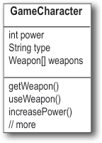

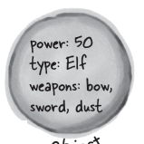


> *Figure/sidebar text on this page:* Imagine you / have three game / characters to save... / GameCharacter / int power / String type / Weapon[] weapons / getWeapon() / useWeapon() / power: 50 / Option one / increasePower() / type: Elf / 1 / // more / weapons: bow, / Write the three serialized / sword, dust / character objects to a file / o / b / e / c / t / Create a file and write three serialized / j / power: 200 / character objects. The file won’t make / type: Troll / sense if you try to read it as text: / weapons: bare / hands, big ax / o / t / b / j / e / c / power: 120 / type: Magician / weapons: spells, / invisibility / t / 2 / Option two / o / b / j / e / c / The serialized file is much harder for humans to read, / Write a plain-text file / but it’s much easier (and safer) for your program to / restore the three objects from serialization than from / reading in the object’s variable values that were saved to / Create a file and write three lines of text, / a text file. For example, imagine all the ways in which / one per character, separating the pieces / you could accidentally read back the values in the wrong / of state with commas: / order! The type might become “dust” instead of “Elf,” / while the Elf becomes a weapon...

<!-- HF p.542 -->

### Writing a serialized object to a file

Here are the steps for serializing (saving) an object. Don’t bother memorizing all this; we’ll go into more detail later in this chapter.

```java
1
    FileOutputStream fileStream = new FileOutputStream("MyGame.ser");
```

```java
2
    ObjectOutputStream os = new ObjectOutputStream(fileStream);
```

```java
3
    os.writeObject(characterOne);
    os.writeObject(characterTwo);
    os.writeObject(characterThree);
```

```java
4
    os.close();
```

> *Figure/sidebar text on this page:* If the file “MyGame.ser” doesn’t / exist, it will be created automatically. / Make a FileOutputStream / Make a FileOutputStream object. FileOutputStream / knows how to connect to (and create) a file. / Make an ObjectOutputStream / ObjectOutputStream lets you write objects, / but it can’t directly connect to a file. It needs / to be fed a “helper.” This is actually called / “chaining” one stream to another. / Serializes the objects referenced by characterOne, / Write the object / characterTwo, and characterThree, and writes / them in this order to the file “MyGame.ser.” / Close the ObjectOutputStream / Closing the stream at the top closes the ones / underneath, so the FileOutputStream (and the / file) will close automatically.

<!-- HF p.543 -->

### Data moves in streams from one place to another

Destination

The Java I/O API has ***connection*** streams, which represent connections to destinations and sources such as files or network sockets, and ***chain*** streams that work only if chained to other streams.

Often, it takes at least two streams hooked together to do something useful—*one* to represent the connection and *another* to call methods on. Why two? Because *connection* streams are usually too low-level. FileOutputStream (a connection stream), for example, has methods for writing *bytes*. But we don’t want to write *bytes*! We want to write *objects*, so we need a higher-level *chain* stream.

OK, then why not have just a single stream that does *exactly* what you want? One that lets you write objects but underneath converts them to bytes? Think good OO. Each class does *one* thing well. FileOutputStreams write bytes to a file. ObjectOutputStreams turn objects into data that can be written to a stream. So we make a FileOutputStream (a connection stream) that lets us write to a file, and we hook an ObjectOutputStream (a chain stream) on the end of it. When we call writeObject() on the ObjectOutputStream, the object gets pumped into the stream and then moves to the FileOutputStream where it ultimately gets written as bytes to a file.

The ability to mix and match different combinations of connection and chain streams gives you tremendous flexibility! If you were forced to use only a *single* stream class, you’d be at the mercy of the API designers, hoping they’d thought of *everything* you might ever want to do. But with chaining, you can patch together your own *custom* chains.


> *Figure/sidebar text on this page:* Connection / streams represent / a connection to a / source or destination / (file, network socket, / etc.), while chain / streams can’t connect / on their own and / Source / must be chained to a / connection stream. / Destination / 01101001 / Object is flattened (serialized) / Object is written as bytes to / 01101110 / 011010010110111001 / 01 / is written to / is chained to / Object / ObjectOutputStream / FileOutputStream / File / (a chain stream) / (a connection stream)

<!-- HF p.544 -->

### What really happens to an object when it’s serialized?

```text
1
```

```java
                            FileOutputStream fs = new FileOutputStream("foo.ser");
                            ObjectOutputStream os = new ObjectOutputStream(fs);
                            os.writeObject(myFoo);

Foo myFoo = new Foo();
myFoo.setWidth(37);
myFoo.setHeight(70);
```

```text
2
```


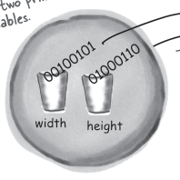

> *Figure/sidebar text on this page:* Object on the heap / Object serialized / Objects on the heap have state— / Serialized objects save the values / the value of the object’s instance / of the instance variables so that / variables. These values make one / an identical instance (object) can be / instance of a class different from / brought back to life on the heap. / another instance of the same class. / Object with two primitive / 00100101 / The instance variable values / instance variables. / for width and height are / The values are sucked / 01000110 / saved to the file “foo.ser,” / along with a little more info / 00100101 / 01000110 / out and pumped into / the JVM needs to restore / the stream. / the object (like what its / class type is). / foo.ser / width / height / Make a FileOutputStream that connects / to the file “foo.ser”; then chain an / ObjectOutputStream to it and tell the / ObjectOutputStream to write the object.

<!-- HF p.545 -->

### But what exactly IS an object’s state? What needs to be saved?

Now it starts to get interesting. Easy enough to save the *primitive* values 37 and 70. But what if an object has an instance variable that’s an object *reference*? What about an object that has five instance variables that are object references? What if those object instance variables themselves have instance variables?

Think about it. What part of an object is potentially unique? Imagine what needs to be restored in order to get an object that’s identical to the one that was saved. It will have a different memory location, of course, but we don’t care about that. All we care about is that out there on the heap, we’ll get an object that has the same state the object had when it was saved.

Brain Barbell

brain barbell

What has to happen for the Car object to be saved in such a way that it can be restored to its original state?

Think of what—and how—you might need to save the Car.

And what happens if an Engine object has a reference to a Carburetor? And what’s inside the Tire[] array object?

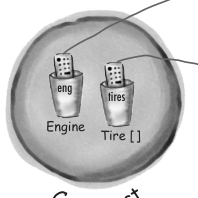

> *Figure/sidebar text on this page:* The Car object has two / instance variables that / reference two other / objects. / E / c / t / n / g / i / b / j / e / n / e / o / eng / tires / Engine / Tire [] / t / T / i / c / r / e / b / j / e / [ / ] / a / r / r / a / y o / ct / C / a / r / e / o / b / j / What does it take to / save a Car object?

<!-- HF p.546 -->

|  | S ct t r i n g o b j e name |
|---|---|
| ogs og [ ] name String c Co l o b j e c t ht o r e st ot o b e r e D o g o b j k t o t is dog1 dog2 Dog Dog t | name |

Serialization saves the entire object graph— all objects referenced by instance variables, starting with the object being serialized.

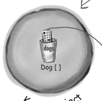

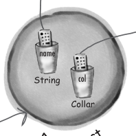

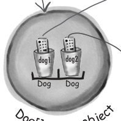

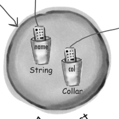

> *Figure/sidebar text on this page:* When an object is serialized, all the objects / it refers to from instance variables are also / serialized. And all the objects those objects / refer to are serialized. And all the objects those / objects refer to are serialized...and the best part / is, it happens automatically! / This Kennel object has a reference to a Dog[] array object. The / Dog[] holds references to two Dog objects. Each Dog object holds / a reference to a String and a Collar object. The String objects / have a collection of characters, and the Collar objects have an int. / When you save the Kennel, all of this is saved! / “Fido” / size / int / t / o / l / l / j / e / c / a / r / o / b / K / e / n / n / Everything has to be / saved in order to restore / the Kennel back to this / “Spike” / state. / t / e / c / n / g / o / bj / size / D / o / j / e / g / [ / ] / y / ob / int / a / r / r / a / name / C / t / o / l / l / j / e / c / a / r / o / b / String / col / Collar / t / D / e / c / o / g / o / b / j

<!-- HF p.547 -->

### If you want your class to be serializable, implement Serializable

The Serializable interface is known as a *marker* or *tag* interface, because the interface doesn’t have any methods to implement. Its sole purpose is to announce that the class implementing it is, well, *serializable*. In other words, objects of that type are saveable through the serialization mechanism. If any superclass of a class is serializable, the subclass is automatically serializable even if the subclass doesn’t explicitly declare “implements Serializable.” (This is how interfaces always work. If your superclass “IS-A” Serializable, you are too.)

```java
objectOutputStream.writeObject(mySquare);
```

```java
import java.io.*;

public class Square implements Serializable {


  private int width;
  private int height;

  public Square(int width, int height) {
    this.width = width;
    this.height = height;
  }

  public static void main(String[] args) {
    Square mySquare = new Square(50, 20);


    try {
      FileOutputStream fs = new FileOutputStream("foo.ser");
      ObjectOutputStream os = new ObjectOutputStream(fs);
      os.writeObject(mySquare);
      os.close();
    } catch (Exception ex) {
      ex.printStackTrace();
    }
  }
}
```

> *Figure/sidebar text on this page:* Whatever goes here MUST implement / Serializable or it will fail at runtime. / Serializable is in the java.io package, so / you need the import. / No methods to implement, but when you say / “implements Serializable,” it says to the JVM, / “it’s OK to serialize objects of this type.” / These two values will be saved. / Connect to a file named “foo.ser” / if it exists. If it doesn’t, make a / new file named “foo.ser.” / I/O operations can throw exceptions. / Make an ObjectOutputStream / chained to the connection stream. / Tell it to write the object.

<!-- HF p.548 -->

#### Serialization is all or nothing.

```java
import java.io.*;

public class Pond implements Serializable {

  private Duck duck = new Duck();

  public static void main(String[] args) {
    Pond myPond = new Pond();
    try {
      FileOutputStream fs = new FileOutputStream("Pond.ser");
      ObjectOutputStream os = new ObjectOutputStream(fs);

      os.writeObject(myPond);
      os.close();
    } catch (Exception ex) {
      ex.printStackTrace();
    }
  }
}
```

```java
public class Duck {
  // duck code here
}
```


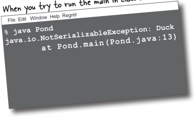

> *Figure/sidebar text on this page:* Can you imagine what would / happen if some of the object’s / state didn’t save correctly? / Eeewww! That / creeps me out just thinking / about it! Like, what if a Dog comes / back with no weight. Or no ears. Or / the collar comes back size 3 instead / of 30. That just can’t be allowed! / Either the entire / object graph is / serialized correctly / or serialization fails. / You can’t serialize / a Pond object if / its Duck instance / Pond objects can be serialized. / variable refuses to / Class Pond has one instance / be serialized (by / variable, a Duck. / not implementing / Serializable). / When you serialize myPond (a Pond / object), its Duck instance variable / automatically gets serialized. / When you try to run the main in class Pond: / File Edit Window Help Regret / % java Pond / java.io.NotSerializableException: Duck / at Pond.main(Pond.java:13) / Argh!! Duck is not serializable! / It doesn’t implement Serializable, / so when you try to serialize a / Pond object, it fails because the / Pond’s Duck instance variable / can’t be saved.

<!-- HF p.549 -->

If you want an instance variable to be skipped by the serialization process, mark the variable with the `transient` keyword.

If you have an instance variable that can’t be saved because it isn’t serializable, you can mark that variable with the transient keyword and the serialization process will skip right over it.

So why would a variable not be serializable? It could be that the class designer simply *forgot* to make the class implement Serializable. Or it might be because the object relies on runtime-specific information that simply can’t be saved. Although most things in the Java class libraries are serializable, you can’t save things like network connections, threads, or file objects. They’re all dependent on (and specific to) a particular runtime “experience.” In other words, they’re instantiated in a way that’s unique to a particular run of your program, on a particular platform, in a particular JVM. Once the program shuts down, there’s no way to bring those things back to life in any meaningful way; they have to be created from scratch each time.

```java
import java.net.*;
class Chat implements Serializable {
  transient String currentID;

  String userName;

  // more code
}
```


> *Figure/sidebar text on this page:* It’s hopeless, / then? I’m completely / screwed if the idiot who wrote the / class for my instance variable forgot / to make it Serializable? / Mark an instance variable as transient / if it can’t (or shouldn’t) be saved. / transient says, “don’t / save this variable during / serialization; just skip it.” / The userName variable / will be saved as part / of the object’s state / during serialization.

<!-- HF p.550 -->

there are no

Dumb Questions

Q: **If serialization is so important,** A: Yes! If the class itself is

**why isn’t it the default for all classes?** extendable (i.e., not final), you can **Why doesn’t class Object implement** make a serializable subclass and just **Serializable, and then all subclasses** substitute the subclass everywhere **will be automatically Serializable?** your code is expecting the superclass type. (Remember, polymorphism A: Even though most classes will, allows this.) That brings up another interesting issue: what does it *mean* if the superclass is not serializable? and should, implement Serializable, you always have a choice. And you Q: **You brought it up: what *does* it** must make a conscious decision on a class-by-class basis, for each class **mean to have a serializable subclass** you design, to “enable” serialization **of a non-serializable superclass?** by implementing Serializable. First of all, if serialization were the A: First we have to look at what default, how would you turn it off? Interfaces indicate functionality, not happens when a class is deserialized, a *lack* of functionality, so the model (we’ll talk about that on the next few of polymorphism wouldn’t work pages). In a nutshell, when an object correctly if you had to say, “implements is deserialized and its superclass is *not* NonSerializable” to tell the world that serializable, the superclass constructor you cannot be saved. will run just as though a new object of that type were being created. If there’s Q: **Why would I ever write a class** no decent reason for a class to not be serializable, making a serializable **that *wasn’t* serializable?** subclass might be a good solution.

Q: **Whoa! I just realized** A: There are very few reasons, but

you might, for example, have a security **something big...if you make a** issue where you don’t want a password **variable “transient,” this means** object stored. Or you might have an **the variable’s value is skipped over** object that makes no sense to save, **during serialization. Then what** because its key instance variables are **happens to it? We solve the problem** themselves not serializable, so there’s **of having a non-serializable instance** no useful way for you to make *your* **variable by making the instance** class serializable. **variable transient, but don’t we NEED that variable when the object is brought back to life? In other words,** Q: **If a class I’m using isn’t isn’t the whole point of serialization to preserve an object’s state? serializable but there’s no good** A: Yes, this is an issue, but **reason, can I subclass the “bad” class and make the *subclass* serializable?** fortunately there’s a solution. If you serialize an object, a transient

reference instance variable will be brought back as *null*, regardless of the value it had at the time it was saved. That means the entire object graph connected to that particular instance variable won’t be saved. This could be bad, obviously, because you probably need a non-null value for that variable.

You have two options:

1. When the object is brought back, reinitialize that null instance variable back to some default state. This works if your deserialized object isn’t dependent on a particular value for that transient variable. In other words, it might be important that the Dog have a Collar, but perhaps all Collar objects are the same, so it doesn’t matter if you give the resurrected Dog a brand new Collar; nobody will know the difference.
2. If the value of the transient variable *does* matter (say, if the color and design of the transient Collar are unique for each Dog), then you need to save the key values of the Collar and use them when the Dog is brought back to essentially re-create a brand new Collar that’s identical to the original.

Q: **What happens if two objects in**

**the object graph are the same object? Like, if you have two different Cat objects in the Kennel, but both Cats have a reference to the same Owner object. Does the Owner get saved twice? I’m hoping not.**

A: Excellent question! Serialization

is smart enough to know when two objects in the graph are the same. In that case, only *one* of the objects is saved, and during deserialization, any references to that single object are restored.

<!-- HF p.551 -->

### Deserialization: restoring an object

The whole point of serializing an object is so that you can restore it to its original state at some later date, in a different “run” of the JVM (which might not even be the same JVM that was running at the time the object was serialized). Deserialization is a lot like serialization in reverse.

```java
1
    FileInputStream fileStream = new FileInputStream("MyGame.ser");
```

```java
2
    ObjectInputStream os = new ObjectInputStream(fileStream);
```

```java
3
    Object one = os.readObject();
    Object two = os.readObject();
    Object three = os.readObject();


4
    GameCharacter elf = (GameCharacter) one;
    GameCharacter troll = (GameCharacter) two;
    GameCharacter magician = (GameCharacter) three;


5
    os.close();
```

> *Figure/sidebar text on this page:* deserialized / serialized / If the file “MyGame.ser” doesn’t / exist, you’ll get an exception. / Make a FileInputStream / Make a FileInputStream object. The FileInputStream / knows how to connect to an existing file. / Make an ObjectInputStream / ObjectInputStream lets you read objects, / but it can’t directly connect to a file. / It needs to be chained to a connection / stream, in this case a FileInputStream. / Read the objects / Each time you say readObject(), you get the next / object in the stream. So you’ll read them back in / the same order in which they were written. You’ll / get a big fat exception if you try to read more / objects than you wrote. / Cast the objects / The return value of / readObject() is type Object / (just like with ArrayList), so / you have to cast it back to / the type you know it really is. / Close the ObjectInputStream / Closing the stream at the top closes the ones / underneath, so the FileInputStream (and the / file) will close automatically.

<!-- HF p.552 -->

### What happens during deserialization?

When an object is deserialized, the JVM attempts to bring the object back to life by making a new object on the heap that has the same state the serialized object had at the time it was serialized. Well, except for the transient variables, which come back either null (for object references) or as default primitive values.

```text

```

```text
3
```

```text
4
```

> *Figure/sidebar text on this page:* This step will throw an exception if the JVM / can’t find or load the class! / Class is found and loaded, saved / 01101001 / Object is read as bytes / instance variables reassigned / 01101110 / 011010010110111001 / is read by / is chained to / 01 / Object / FileInputStream / ObjectInputStream / (a connection stream) / (a chain stream) / File / The object is read from the stream. / The JVM determines (through info stored with / the serialized object) the object’s class type. / The JVM attempts to find and load the ob­ / ject’s class. If the JVM can’t find and/or load / the class, the JVM throws an exception and / the deserialization fails. / A new object is given space on the heap, but / the serialized object’s constructor does NOT / run! Obviously, if the constructor ran, it would / restore the state of the object to its original / “new” state, and that’s not what we want. We / want the object to be restored to the state / it had when it was serialized, not when it was / first created.

<!-- HF p.553 -->

```text
5
```

```text
6
```

there are no

Dumb Questions

Q: **Why doesn’t the class get saved as part of the**

**object? That way you don’t have the problem with whether the class can be found.**

A: Sure, they could have made serialization work that

way. But what a tremendous waste and overhead. And while it might not be such a hardship when you’re using serialization to write objects to a file on a local hard drive, serialization is also used to send objects over a network connection. If a class was bundled with each serialized (shippable) object, bandwidth would become a much larger problem than it already is.

For objects serialized to ship over a network, though, there actually *is* a mechanism where the serialized object can be “stamped” with a URL for where its class can be found. This is used in Java’s Remote Method Invocation (RMI) so that

you can send a serialized object as part of, say, a method argument, and if the JVM receiving the call doesn’t have the class, it can use the URL to fetch the class from the network and load it, all automatically. You may see RMI used in the wild, although you may also see objects serialized to XML or JSON (or other human-readable formats) to send over a network.

Q: **What about static variables? Are they serialized?**

A: Nope. Remember, static means “one per class” not

“one per object.” Static variables are not saved, and when an object is deserialized, it will have whatever static variable its class *currently* has. The moral: don’t make serializable objects dependent on a dynamically changing static variable! It might not be the same when the object comes back.

> *Figure/sidebar text on this page:* If the object has a non-serializable class / somewhere up its inheritance tree, the / constructor for that non-serializable class / will run along with any constructors above / that (even if they’re serializable). Once the / constructor chaining begins, you can’t stop it, / which means all superclasses, beginning with / the first non-serializable one, will reinitialize / their state. / The object’s instance variables are given the / values from the serialized state. Transient / variables are given a value of null for object / references and defaults (0, false, etc.) for / primitives.

<!-- HF p.554 -->

### Saving and restoring the game characters

```java
import java.io.*;

public class GameSaverTest {
  public static void main(String[] args) {
    GameCharacter one = new GameCharacter(50, "Elf",
                                          new String[]{"bow", "sword", "dust"});
    GameCharacter two = new GameCharacter(200, "Troll",
                                          new String[]{"bare hands", "big ax"});
    GameCharacter three = new GameCharacter(120, "Magician",
                                            new String[]{"spells", "invisibility"});

    // imagine code that does things with the characters that changes their state values

    try {
      ObjectOutputStream os = new ObjectOutputStream(new FileOutputStream("Game.ser"));
      os.writeObject(one);
      os.writeObject(two);
      os.writeObject(three);
      os.close();
    } catch (IOException ex) {
      ex.printStackTrace();
    }

    try {
      ObjectInputStream is = new ObjectInputStream(new FileInputStream("Game.ser"));
      GameCharacter oneRestore = (GameCharacter) is.readObject();
      GameCharacter twoRestore = (GameCharacter) is.readObject();
      GameCharacter threeRestore = (GameCharacter) is.readObject();

      System.out.println("One's type: " + oneRestore.getType());
      System.out.println("Two's type: " + twoRestore.getType());
      System.out.println("Three's type: " + threeRestore.getType());
    } catch (Exception ex) {
      ex.printStackTrace();
    }
  }
}
```

```text
% java GameSaverTest
One's type: Elf
Two's type: Troll

Three's type: Magician
```

> *Figure/sidebar text on this page:* Make some characters... / Serialize the characters. / Now read them back in from the file... / Restore the characters. / Check to see if it worked. / power: 50 / type: Elf / weapons: bow, / File Edit Window Help Resuscitate / sword, dust / power: 200 / type: Troll / o / b / j / e / c / t / weapons: bare / hands, big ax / power: 120 / type: Magician / o / b / j / e / c / t / weapons: spells, / invisibility / o / c / t / b / j / e

<!-- HF p.555 -->

```java
import java.io.*;
import java.util.Arrays;

public class GameCharacter implements Serializable {
  private final int power;
  private final String type;
  private final String[] weapons;

  public GameCharacter(int power, String type, String[] weapons) {
    this.power = power;
    this.type = type;
    this.weapons = weapons;
  }

  public int getPower() {
    return power;
  }

  public String getType() {
    return type;
  }

  public String getWeapons() {
    return Arrays.toString(weapons);
  }
}
```

> *Figure/sidebar text on this page:* The GameCharacter class / This is a basic class just for testing / the Serialization code on the last / page. We don’t have an actual game, / but we’ll leave that to you to / experiment.

<!-- HF p.556 -->

### Version ID: A big serialization gotcha

Now you’ve seen that I/O in Java is actually pretty simple, especially if you stick to the most common connection/chain combinations. But there’s one issue you might *really* care about.

If you serialize an object, you must have the class in order to deserialize and use the object. OK, that’s obvious. But it might be less obvious what happens if you ***change the class*** in the meantime. Yikes. Imagine trying to bring back a Dog object when one of its instance variables (non-transient) has changed from a double to a String. That violates Java’s type-safe sensibilities in a Big Way. But that’s not the only change that might hurt compatibility. Think about the following:

• Deleting an instance variable

• Changing the declared type of an instance variable

• Changing a non-transient instance variable to transient

• Moving a class up or down the inheritance hierarchy

• Changing a class (anywhere in the object graph) from Serializable to not Serializable (by removing ‘implements Serializable’ from a class declaration)

• Changing an instance variable to static

• Adding new instance variables to the class (existing objects will deserialize with default values for the instance variables they didn’t have when they were serialized)

• Adding classes to the inheritance tree

• Removing classes from the inheritance tree

• Changing the access level (public, private, etc.) of an instance variable has no effect on the ability of deserialization to assign a value to the variable

• Changing an instance variable from transient to non-transient (previously serialized objects will simply have a default value for the previously transient variables)

```text
101101
101101
10101000010
1010 10 0
01010  1
1010101
10101010
1001010101
```

```text
101101
101101
101000010
1010 10 0
01010  1
100001 1010
0 00110101
1 0 1 10 10
```

```text
101101
101101
101000010
1010 10 0
01010  1
100001 1010
0 00110101
1 0 1 10 10
```

> *Figure/sidebar text on this page:* 1 / You write a Dog class. / class version ID / #343 / Version Control is crucial! / Dog.class / You serialize a Dog object / 2 / using that class. / Do / g o / bj / e / c / t / D / o / j / e / c / t / Object is / g / o / b / stamped with / Changes to a class that can hurt deserialization: / version #343 / 3 / You change the Dog class. / class version ID / #728 / Dog.class / You deserialize a Dog object / 4 / using the changed class. / Changes to a class that are usually OK: / Do / g o / bj / e / c / t / Object is / stamped with / Dog.class / version #343 / class version is / #728 / 5 / Serialization fails!! / The JVM says, “you can’t / teach an old Dog new code.”

<!-- HF p.557 -->

### Using the serialVersionUID

Each time an object is serialized, the object (including every object in its graph) is “stamped” with a version ID number for the object’s class. The ID is called the serialVersionUID, and it’s computed based on information about the class structure. As an object is being deserialized, if the class has changed since the object was serialized, the class could have a different serialVersionUID, and deserialization will fail! But you can control this.

When Java tries to deserialize an object, it compares the serialized object’s serialVersionUID with that of the class the JVM is using for deserializing the object. For example, if a Dog instance was serialized with an ID of, say 23 (in reality a serialVersionUID is much longer), when the JVM deserializes the Dog object, it will first compare the Dog object serialVersionUID with the Dog class serialVersionUID. If the two numbers don’t match, the JVM assumes the class is not compatible with the previously serialized object, and you’ll get an exception during deserialization.

So, the solution is to put a serialVersionUID in your class, and then as the class evolves, the serialVersionUID will remain the same and the JVM will say, “OK, cool, the class is compatible with this serialized object,” even though the class has actually changed.

This works *only* if you’re careful with your class changes! In other words, *you* are taking responsibility for any issues that come up when an older object is brought back to life with a newer class.

To get a serialVersionUID for a class, use the serialver tool that ships with your Java development kit.

```java
% serialver Dog
Dog: static final long
serialVersionUID =
-5849794470654667210L;
```

```java
% serialver Dog
Dog: static final long
serialVersionUID =
-5849794470654667210L;
```

```java
public class Dog {

   static final long serialVersionUID =
                -5849794470654667210L;

   private String name;
   private int size;

   // method code here
}
```

> *Figure/sidebar text on this page:* When you think your class / might evolve after someone has / serialized objects from it... / If you think there is ANY possibility that / 1 / Use the serialver command-line tool / to get the version ID for your class. / your class might evolve, put a serial version / ID in your class. / File Edit Window Help serialKiller / Based on the version of / Java you’re using, this value / might be different. / 2 / Paste the output into your class. / 3 / Be sure that when you make changes to / the class, you take responsibility in your / code for the consequences of the changes / you made to the class! For example, be / sure that your new Dog class can deal with / File Edit Window Help serialKiller / an old Dog being deserialized with default / values for instance variables added to the / class after the Dog was serialized.

<!-- HF p.558 -->

Object Serialization

> *Figure/sidebar text on this page:* BULLET POINTS / ▪ / You can save an object’s state by serializing the object. / ▪ / To serialize an object, you need an ObjectOutputStream (from the java.io / package). / ▪ / Streams are either connection streams or chain streams. / ▪ / Connection streams can represent a connection to a source or / destination, typically a file, network socket connection, or the console. / ▪ / Chain streams cannot connect to a source or destination and must be / chained to a connection (or other) stream. / ▪ / To serialize an object to a file, make a FileOutputStream and chain it into / an ObjectOutputStream. / ▪ / To serialize an object, call writeObject(theObject) on the / ObjectOutputStream. You do not need to call methods on the / FileOutputStream. / ▪ / To be serialized, an object must implement the Serializable interface. / If a superclass of the class implements Serializable, the subclass will / automatically be serializable even if it does not specifically declare / implements Serializable. / ▪ / When an object is serialized, its entire object graph is serialized. That / means any objects referenced by the serialized object’s instance / variables are serialized, and any objects referenced by those objects... / and so on. / ▪ / If any object in the graph is not serializable, an exception will be thrown at / runtime, unless the instance variable referring to the object is skipped. / ▪ / Mark an instance variable with the transient keyword if you want / serialization to skip that variable. The variable will be restored as null (for / object references) or default values (for primitives). / ▪ / During deserialization, the class of all objects in the graph must be / available to the JVM. / ▪ / You read objects in (using readObject()) in the order in which they were / originally written. / ▪ / The return type of readObject() is type Object, so deserialized objects / must be cast to their real type. / ▪ / Static variables are not serialized! It doesn’t make sense to save a static / variable value as part of a specific object’s state, since all objects of that / type share only a single value—the one in the class. / ▪ / If a class that implements Serializable might change over time, put a / static final long serialVersionUID on that class. This version ID should be / changed when the serialized variables in that class change.

<!-- HF p.559 -->

### Writing a String to a Text File

Saving objects, through serialization, is the easiest way to save and restore data between runnings of a Java program. But sometimes you need to save data to a plain old text file. Imagine your Java program has to write data to a simple text file that some other (perhaps non-Java) program needs to read. You might, for example, have a servlet (Java code running within your web server) that takes form data the user typed into a browser and writes it to a text file that somebody else loads into a spreadsheet for analysis.

Writing text data (a String, actually) is similar to writing an object, except you write a String instead of an object, and you use something like a FileWriter instead of a FileOutputStream (and you don’t chain it to an ObjectOutputStream).

```java
objectOutputStream.writeObject(someObject);
```

```java
fileWriter.write("My first String to save");
```

```java
import java.io.*;

class WriteAFile {
  public static void main(String[] args) {
    try {
      FileWriter writer = new FileWriter("Foo.txt");

      writer.write("hello foo!");

      writer.close();
    } catch (IOException ex) {
      ex.printStackTrace();
    }
  }
}
```


> *Figure/sidebar text on this page:* What the game character data / might look like if you wrote it / out as a human-readable text file. / 50,Elf,bow,sword,dust / 200,Troll,bare hands,big ax / 120,Magician,spells,invisibility / To write a serialized object: / To write a String: / We need the java.io package for FileWriter. / If the file “Foo.txt” does not / exist, FileWriter will create it. / ALL the I/O stuff / must be in a try/catch. / The write() method takes / Everything can throw an / a String. / IOException!! / Close it when you’re done!

<!-- HF p.560 -->

### Text file example: e-Flashcards

Remember those flashcards you used in school? Where you had a question on one side and the answer on the back? They aren’t much help when you’re trying to understand something, but nothing beats ’em for raw drill-and-practice and rote memorization. *When you have to burn in a fact.* And they’re also great for trivia games.

**We’re going to make an electronic version that has three classes:**

1. ***QuizCardBuilder***, a simple authoring tool for creating and saving a set of e-Flashcards.
2. ***QuizCardPlayer***, a playback engine that can load a flashcard set and play it for the user.
3. ***QuizCard***, a simple class representing card data. We’ll walk through the code for the builder and the player, and have you make the QuizCard class yourself, using this:


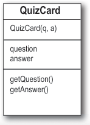

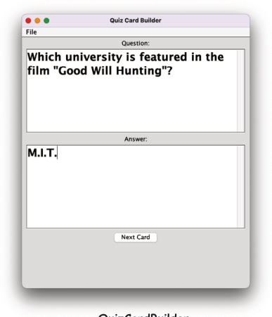


> *Figure/sidebar text on this page:* Old-fashioned 3 x 5 / Front / index flashcards / What’s the first / foreign country due / south of Detroit / Back / Michigan? / Canada (Ontario) / QuizCard / QuizCard(q, a) / question / answer / getQuestion() / getAnswer() / QuizCardBuilder / QuizCardPlayer / Has a File menu with a “Save” option for saving / Has a File menu with a “Load” option for loading a / the current set of cards to a text file. / set of cards from a text file.

<!-- HF p.561 -->

### Quiz Card Builder (code outline)

```java
public class QuizCardBuilder {
  public void go() {
    // build and display gui
  }

  private void nextCard() {
    // add the current card to the list
    // and clear the text areas
  }

  private void saveCard() {
    // bring up a file dialog box
    // let the user name and save the set
  }

  private void clearCard() {
    // clear out the text areas
  }

  private void saveFile(File file) {
    // iterate through the list of cards and write
    // each one out to a text file in a parseable way
    // (in other words, with clear separations between parts)
  }
}
```

The Java API has included I/O features since day one, you know, back in the last millennium. In 2002, Java 1.4 was released, and it included a new approach to I/O called “NIO,” short for non-blocking I/O. In 2011, Java 7 was released, and it included big enhancements to NIO. This yet again newer approach to I/O was dubbed “NIO.2.” Why should you care? When you’re writing new I/O, you should use the latest and greatest features. But you’re almost certainly going to encounter older code that uses the NIO approach. We want you to be covered for both situations, so in this chapter:

• We’ll use original I/O for a while.

• Then we’ll show some NIO.2.

You'll see more I/O, NIO, and NIO.2 features in Chapter 17, *Make a Connection*, when we look at network connections.

> *Figure/sidebar text on this page:* Builds and displays the GUI, including / making and registering event listeners. / Call when user hits ‘Next Card’ button; / means the user wants to store that card in / the list and start a new card. / Call when user chooses ‘Save’ from the File menu; / means the user wants to save all the cards in the / current list as a ‘set’ (like, Quantum Mechanics Set, / Hollywood Trivia, Java Rules, etc.). / Will need to clear the screen when the user / chooses ‘New’ from the File menu or moves / to the next card. / Called by the SaveMenuListener; / does the actual file writing. / Java I/O to NIO to NIO.2

<!-- HF p.562 -->

```java
import javax.swing.*;
import java.awt.*;
import java.io.*;
import java.util.ArrayList;

public class QuizCardBuilder {
  private ArrayList<QuizCard> cardList = new ArrayList<>();
  private JTextArea question;
  private JTextArea answer;
  private JFrame frame;

  public static void main(String[] args) {
    new QuizCardBuilder().go();
  }

  public void go() {
    frame = new JFrame("Quiz Card Builder");
    JPanel mainPanel = new JPanel();
    Font bigFont = new Font("sanserif", Font.BOLD, 24);

    question = createTextArea(bigFont);
    JScrollPane qScroller = createScroller(question);
    answer = createTextArea(bigFont);
    JScrollPane aScroller = createScroller(answer);

    mainPanel.add(new JLabel("Question:"));
    mainPanel.add(qScroller);
    mainPanel.add(new JLabel("Answer:"));
    mainPanel.add(aScroller);

    JButton nextButton = new JButton("Next Card");
    nextButton.addActionListener(e -> nextCard());
    mainPanel.add(nextButton);

    JMenuBar menuBar = new JMenuBar();
    JMenu fileMenu = new JMenu("File");

    JMenuItem newMenuItem = new JMenuItem("New");
    newMenuItem.addActionListener(e -> clearAll());

    JMenuItem saveMenuItem = new JMenuItem("Save");
    saveMenuItem.addActionListener(e -> saveCard());

    fileMenu.add(newMenuItem);
    fileMenu.add(saveMenuItem);
    menuBar.add(fileMenu);
    frame.setJMenuBar(menuBar);

    frame.getContentPane().add(BorderLayout.CENTER, mainPanel);
    frame.setSize(500, 600);
    frame.setVisible(true);
  }
```

> *Figure/sidebar text on this page:* Reminder: For the next eight / pages or so we’ll be using / older-style I/O code! / This is all GUI code here. Nothing / special, although you might want / to look at the code for the new / GUI components MenuBar, Menu, / and MenuItems. / Next Card button calls the / nextCard method when it's pressed. / When the user clicks “New" on / the menu, the clearAll method / is called. / When the user clicks “Save" on / the menu, the saveCard method / is called. / We make a menu bar, make a File / menu, then put ‘New’ and ‘Save’ / menu items into the File menu. We / add the menu to the menu bar, / and then tell the frame to use / this menu bar. Menu items can fire / an ActionEvent.

<!-- HF p.563 -->

```java
  private JScrollPane createScroller(JTextArea textArea) {
    JScrollPane scroller = new JScrollPane(textArea);
    scroller.setVerticalScrollBarPolicy(ScrollPaneConstants.VERTICAL_SCROLLBAR_ALWAYS);
    scroller.setHorizontalScrollBarPolicy(ScrollPaneConstants.HORIZONTAL_SCROLLBAR_NEVER);
    return scroller;
  }

  private JTextArea createTextArea(Font font) {
    JTextArea textArea = new JTextArea(6, 20);
    textArea.setLineWrap(true);
    textArea.setWrapStyleWord(true);
    textArea.setFont(font);
    return textArea;
  }

  private void nextCard() {
    QuizCard card = new QuizCard(question.getText(), answer.getText());
    cardList.add(card);
    clearCard();
  }

  private void saveCard() {
    QuizCard card = new QuizCard(question.getText(), answer.getText());
    cardList.add(card);

    JFileChooser fileSave = new JFileChooser();
    fileSave.showSaveDialog(frame);
    saveFile(fileSave.getSelectedFile());
  }

  private void clearAll() {
    cardList.clear();
    clearCard();
  }

  private void clearCard() {
    question.setText("");
    answer.setText("");
    question.requestFocus();
  }

  private void saveFile(File file) {
    try {
      BufferedWriter writer = new BufferedWriter(new FileWriter(file));
      for (QuizCard card : cardList) {
        writer.write(card.getQuestion() + "/");
        writer.write(card.getAnswer() + "\n");
      }
      writer.close();
    } catch (IOException e) {
      System.out.println("Couldn't write the cardList out: " + e.getMessage());
    }
  }
}
```

> *Figure/sidebar text on this page:* Creating a scroll pane or a text area needs a / lot of similar-looking code. We've put the code / into a couple of helper methods that we can call / when we need a text area or scroll pane. / Brings up a file dialog box and waits on this / line until the user chooses ‘Save’ from the / dialog box. All the file dialog navigation and / selecting a file, etc., is done for you by the / JFileChooser! It really is this easy. / When we want a new set of / cards, we need to clear out the / card list AND the text areas. / The method that does the actual file writing / (called by the SaveMenuListener’s event handler). / The argument is the ‘File’ object the user is saving. / We’ll look at the File class on the next page. / We chain a BufferedWriter on to a new / FileWriter to make writing more efficient. / (We’ll talk about that in a few pages.) / Walk through the ArrayList of cards and / write them out, one card per line, with the / question and answer separated by a “/”, and / then add a newline character (“\n”).

<!-- HF p.564 -->

### The java.io.File class

The `java.io.File` class is another example of an older class in the Java API. It’s been “replaced” by two classes in the newer `java.nio.file` package, but you’ll undoubtedly encounter code that uses the `File` class. **For new code, we recommend using the** `java.nio.file` **package instead of the** `java.io.File` **class.** In a few pages, we’ll take a look at a few of the most important capabilities in the `java.nio.file` package. With that said...

The `java.io.File` class *represents* a file on disk but doesn’t actually represent the *contents* of the file. What? Think of a File object as something more like a *path name* of a file (or even a *directory*) rather than The Actual File Itself. The File class does not, for example, have methods for reading and writing. One VERY useful thing about a File object is that it offers a much safer way to represent a file than just using a String filename. For example, most classes that take a String filename in their constructor (like FileWriter or FileInputStream) can take a File object instead. You can construct a File object, verify that you’ve got a valid path, etc., and then give that File object to the FileWriter or FileInputStream.

```java
File f = new File("MyCode.txt");
```

```java
File dir = new File("Chapter7");
dir.mkdir();
```

```java
if (dir.isDirectory()) {
  String[] dirContents = dir.list();
  for (String dirContent : dirContents) {
    System.out.println(dirContent);
  }
}
```

```java
boolean isDeleted = f.delete();
```

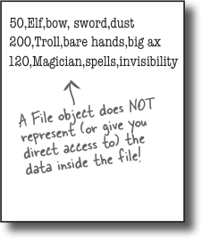

> *Figure/sidebar text on this page:* A File object represents the / name and path of a file or / directory on disk, for example: / /Users/Kathy/Data/Game.txt / But it does NOT represent, or / give you access to, the data in / the file! / An address is NOT the / same as the actual / house! A File object is / like a street address... / it represents the name / Some things you can do with a File object: / and location of a / particular file, but it / 1 / Make a File object representing an / isn’t the file itself. / existing file / A File object represents the / filename “GameFile.txt.” / 2 / Make a new directory / GameFile.txt / 50,Elf,bow, sword,dust / 200,Troll,bare hands,big ax / 3 / List the contents of a directory / 120,Magician,spells,invisibility / A File object does NOT / represent (or give you / direct access to) the / data inside the file! / Delete a file or directory (returns true if / 4 / successful)

<!-- HF p.565 -->

#### The beauty of buffers

```text
                 "Boulder"
                    "Denver""Aspen"
"Boulder"
```

```java
BufferedWriter writer = new BufferedWriter(new FileWriter(aFile));
```

Using buffers is *much* more efficient than working without them. You can write to a file using FileWriter alone, by calling write(someString), but FileWriter writes each and every thing you pass to the file each and every time. That’s overhead you don’t want or need, since every trip to the disk is a Big Deal compared to manipulating data in memory. By chaining a BufferedWriter onto a FileWriter, the BufferedWriter will hold all the stuff you write to it until it’s full. *Only when the buffer is full will the FileWriter actually be told to write to the file on disk.*

If you do want to send data *before* the buffer is full, you do have control. ***Just Flush It***. Calls to writer.flush() say, “send whatever’s in the buffer, ***now***!”


> *Figure/sidebar text on this page:* If there were no buffers, it would be like / shopping without a cart. You’d have to / carry each thing out to your car, one soup / can or toilet paper roll at a time. / Buffers give you a temporary holding / place to group things until the holder / (like the cart) is full. You get to make / far fewer trips when you use a buffer. / destination / String is put into a buffer / When the buffer is full, the / Aspen / with other Strings / Strings are all written to / Denver / “Aspen Denver Boulder” / Boulder / is written to / is chained to / String / BufferedWriter / FileWriter / File / (a chain stream that / (a connection stream / works with characters) / that writes characters / as opposed to bytes) / Notice that we don’t even / need to keep a reference to / the FileWriter object. The / only thing we care about is the / BufferedWriter, because that’s / the object we’ll call methods / on, and when we close the / BufferedWriter, it will take / care of the rest of the chain.

<!-- HF p.566 -->

### Reading from a text file

Reading text from a file is simple, but this time we’ll use a File object to represent the file, a FileReader to do the actual reading, and a BufferedReader to make the reading more efficient.

The read happens by reading lines in a *while* loop, ending the loop when the result of a readLine() is null. That’s the most common style for reading data (pretty much anything that’s not a Serialized object): read stuff in a while loop (actually a while loop *test*), terminating when there’s nothing left to read (which we know because the result of whatever read method we’re using is null).

```java
import java.io.*;

class ReadAFile {
  public static void main(String[] args) {
    try {
      File myFile = new File("MyText.txt");
      FileReader fileReader = new FileReader(myFile);

      BufferedReader reader = new BufferedReader(fileReader);
```

```java
      String line;
      while ((line = reader.readLine()) != null) {
        System.out.println(line);
      }
      reader.close();

    } catch (IOException e) {
      e.printStackTrace();
    }
  }
}
```

If you’re using Java 8 and you feel comfortable using the Streams API, you can replace all the code inside the try block with the following:

```java
Files.lines(Path.of("MyText.txt"))
     .forEach(line -> System.out.println(line));
```

We’ll see the Files and Path classes later in this chapter.

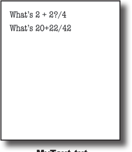

> *Figure/sidebar text on this page:* A file with two lines of text. / What’s 2 + 2?/4 / What’s 20+22/42 / Don’t forget the import. / MyText.txt / A FileReader is a connection stream for / characters that connects to a text file. / Chain the FileReader to a / Make a String variable to hold / BufferedReader for more / efficient reading. It’ll go back / each line as the line is read / to the file to read only when the / buffer is empty (because the / program has read everything in it). / This says, “Read a line of text, and assign it to the / String variable “line.” While that variable is not null / (because there WAS something to read), print out the / line that was just read.” / Or another way of saying it, “While there are still lines / to read, read them and print them.” / Java 8 Streams and I/O

<!-- HF p.567 -->

### Quiz Card Player (code outline)

```java
public class QuizCardPlayer {

  public void go() {
    // build and display gui
  }

  private void nextCard() {
    // if this is a question, show the answer, otherwise show
    // next question set a flag for whether we're viewing a
    // question or answer
  }

  private void open() {
    // bring up a file dialog box
    // let the user navigate to and choose a card set to open
  }

  private void loadFile(File file) {
    // must build an ArrayList of cards, by reading them from
    // a text file called from the OpenMenuListener event handler,
    // reads the file one line at a time and tells the makeCard()
    // method to make a new card out of the line (one line in the
    // file holds both the question and answer, separated by a "/")
  }

  private void makeCard(String lineToParse) {
    // called by the loadFile method, takes a line from the text file
    // and parses into two pieces—question and answer—and creates a
    // new QuizCard and adds it to the ArrayList called CardList
  }
}
import javax.swing.*;
import java.awt.*;
import java.io.*;
import java.util.ArrayList;

public class QuizCardPlayer {
  private ArrayList<QuizCard> cardList;
  private int currentCardIndex;
  private QuizCard currentCard;
  private JTextArea display;
  private JFrame frame;
  private JButton nextButton;
  private boolean isShowAnswer;

  public static void main(String[] args) {
    QuizCardPlayer reader = new QuizCardPlayer();
    reader.go();
  }

  public void go() {
    frame = new JFrame("Quiz Card Player");
    JPanel mainPanel = new JPanel();
    Font bigFont = new Font("sanserif", Font.BOLD, 24);

    display = new JTextArea(10, 20);
    display.setFont(bigFont);
    display.setLineWrap(true);
    display.setEditable(false);

    JScrollPane scroller = new JScrollPane(display);
    scroller.setVerticalScrollBarPolicy(ScrollPaneConstants.VERTICAL_SCROLLBAR_ALWAYS);
    scroller.setHorizontalScrollBarPolicy(ScrollPaneConstants.HORIZONTAL_SCROLLBAR_NEVER);
    mainPanel.add(scroller);

    nextButton = new JButton("Show Question");
    nextButton.addActionListener(e -> nextCard());
    mainPanel.add(nextButton);

    JMenuBar menuBar = new JMenuBar();
    JMenu fileMenu = new JMenu("File");
    JMenuItem loadMenuItem = new JMenuItem("Load card set");
    loadMenuItem.addActionListener(e -> open());
    fileMenu.add(loadMenuItem);
    menuBar.add(fileMenu);
    frame.setJMenuBar(menuBar);

    frame.getContentPane().add(BorderLayout.CENTER, mainPanel);
    frame.setSize(500, 400);
    frame.setVisible(true);
  }
```

<!-- HF p.568 -->

> *Figure/sidebar text on this page:* Just GUI code on this page; / nothing special.

<!-- HF p.569 -->

```java
  private void nextCard() {
    if (isShowAnswer) {
      // show the answer because they've seen the question
      display.setText(currentCard.getAnswer());
      nextButton.setText("Next Card");
      isShowAnswer = false;
    } else { // show the next question
      if (currentCardIndex < cardList.size()) {
        showNextCard();
      } else {
        // there are no more cards!
        display.setText("That was last card");
        nextButton.setEnabled(false);
      }
    }
  }

  private void open() {
    JFileChooser fileOpen = new JFileChooser();
    fileOpen.showOpenDialog(frame);
    loadFile(fileOpen.getSelectedFile());
  }

  private void loadFile(File file) {
    cardList = new ArrayList<>();
    currentCardIndex = 0;
    try {
      BufferedReader reader = new BufferedReader(new FileReader(file));
      String line;
      while ((line = reader.readLine()) != null) {
        makeCard(line);
      }
      reader.close();
    } catch (IOException e) {
      System.out.println("Couldn't write the cardList out: " + e.getMessage());
    }
    showNextCard();
  }

  private void makeCard(String lineToParse) {
    String[] result = lineToParse.split("/");
    QuizCard card = new QuizCard(result[0], result[1]);
    cardList.add(card);
    System.out.println("made a card");
  }

  private void showNextCard() {
    currentCard = cardList.get(currentCardIndex);
    currentCardIndex++;
    display.setText(currentCard.getQuestion());
    nextButton.setText("Show Answer");
    isShowAnswer = true;
  }
}
```

> *Figure/sidebar text on this page:* Check the isShowAnswer boolean flag to / see if they’re currently viewing a question / or an answer, and do the appropriate / thing depending on the answer. / Bring up the file dialog box and let them / navigate to and choose the file to open. / Make a BufferedReader chained / to a new FileReader, giving the / FileReader the File object the user / chose from the open file dialog. / Read a line at a time, passing the line to / the makeCard() method that parses it / and turns it into a real QuizCard and / adds it to the ArrayList. / Now time to start, / show the first card. / Each line of text corresponds to a single / flashcard, but we have to parse out the / question and answer as separate pieces. We / use the String split() method to break the / line into two tokens (one for the question / and one for the answer). We’ll look at the / split() method on the next page.

<!-- HF p.570 -->

### Parsing with String split()

```java
String toTest = "What is blue + yellow?/green";

String[] result = toTest.split("/");

for (String token : result) {

  System.out.println(token);

}
```

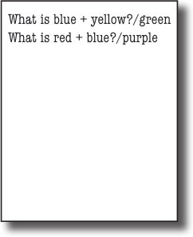

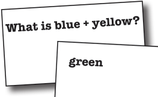


> *Figure/sidebar text on this page:* Saved in a question file like this: / Imagine you have a flashcard like this: / Question / What is blue + yellow?/green / What is red + blue?/purple / What is blue + yellow? / Answer / green / How do you separate the question and answer? / When you read the file, the question and answer are smooshed / together in one line, separated by a forward slash “/” (because / that’s how we wrote the file in the QuizCardBuilder code). / String split() lets you break a String into pieces. / The split() method says, “give me a separator, and I’ll break out all / the pieces of this String for you and put them in a String array.” / token 1 / separator / token 2 / In the QuizCardPlayer app, this is / what a single line looks like when / it’s read in from the file. / The split() method takes the “/” and uses it to / break apart the String into (in this case) two / pieces, token 1 and token 2. (Note: split() is FAR / more powerful than what we’re using it for here. / It can do extremely complex parsing with filters, / Loop through the array and print each token / wildcards, etc.) / (piece). In this example, there are only two / tokens: “What is blue + yellow?” and “green.”

<!-- HF p.571 -->

there are no

Dumb Questions

Q: **OK, I look in the API and there are about five**

**million classes in the java.io package. How the heck do you know which ones to use?**

A: The I/O API uses the modular “chaining” concept so

that you can hook together connection streams and chain streams (also called “filter” streams) in a wide range of combinations to get just about anything you could want.

The chains don’t have to stop at two levels; you can hook multiple chain streams to one another to get just the right amount of processing you need.

Most of the time, though, you’ll use the same small handful of classes. If you’re writing text files, BufferedReader and BufferedWriter (chained to FileReader and FileWriter) are probably all you need. If you’re writing serialized objects, you can use ObjectOutputStream and ObjectInputStream (chained to FileInputStream and FileOutputStream).

In other words, 90% of what you might typically do with Java I/O can use what we’ve already covered.

Q: **You just said we’ve already learned 90% of what**

**we’ll probably use, but we haven’t seen the fabled NIO.2 stuff yet. What gives?**

A: NIO.2 is coming up on the very next page! But

for reading and writing text files, BufferedReaders and BufferedWriters are still usually the way to go. So we’ll be looking at how NIO.2 makes using them easier.

Q: **My brain is a little tired, and I’ve heard NIO.2 is**

**pretty complicated.**

A: We’re going to focus on a few key concepts in the

java.nio.file package.

�

�

�

�

�

�

�

�

�

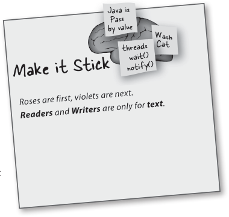

> *Figure/sidebar text on this page:* Make it Stick / Roses are first, violets are next. / Readers and Writers are only for text. / BULLET POINTS / To write a text file, start with a FileWriter / connection stream. / Chain the FileWriter to a BufferedWriter for / efficiency. / A File object represents a file at a particular / path, but does not represent the actual / contents of the file. / With a File object you can create, traverse, / and delete directories. / Most streams that can use a String filename / can use a File object as well, and a File object / can be safer to use. / To read a text file, start with a FileReader / connection stream. / Chain the FileReader to a BufferedReader for / efficiency. / To parse a text file, you need to be sure the / file is written with some way to recognize the / different elements. A common approach is to / use some kind of character to separate the / individual pieces. / Use the String split() method to split a String / up into individual tokens. A String with one / separator will have two tokens, one on each / side of the separator. The separator doesn’t / count as a token.

<!-- HF p.572 -->

### NIO.2 and the java.nio.file package

Java NIO.2 is usually taken to mean two packages added in Java 7:

```text
 java.nio.file
java.nio.file.attribute
```

The `java.nio.file.attribute` package lets you manipulate the *metadata* associated with a computer’s files and directories. For example, you would use the classes in this package if you wanted to read or change a file’s permissions settings. We WON’T be discussing this package further. (phew)

The `java.nio.file` package is all you need to do common text file reading and writing, and it also provides you with the ability to manipulate a computer’s directories and directory structure. Most of the time you’ll use three types in java.nio.file:

� The Path interface: You’ll always need a Path object to locate the directories or files you want to work with.

� The Paths class: You’ll use the Paths.get() method to make the Path object you’ll need when you use methods in the Files class.

� The Files class: This is the class whose (static) methods do all the work you’ll want to do: making new Readers and Writers, and creating, modifying, and searching through directories and files on file systems.

```java
import java.nio.file.*;
```

```java
Path myPath = Paths.get("MyFile.txt");
```

```java
Path myPath = Paths.get("/myApp", "files", "MyFile.txt");
```

```java
BufferedWriter writer = Files.newBufferedWriter(myPath);
```

> *Figure/sidebar text on this page:* A Path object represents / the location (name and / path) of a file or directory / on disk, for example: / /Users/Kathy/Data/Game.txt / But it does NOT represent, / or give you access to, the / data in the file! / An advanced but / useful capability / in the Files class / allows you to “walk / thru” (search) / directory trees. / A mini-tutorial, creating a BufferedWriter with NIO.2 / 1 / Import Path, Paths, and Files: / A Path object is used to locate a file on a computer / (i.e., in the file system). A path can be used to locate / 2 / Make a Path object using the Paths / files in the current directory or in other directories. / class: / The “/” in “/myApp” is called the / name-separator. Depending on which / Or, if the file is in a subdirectory like: / OS you’re using, your name-separator / /myApp/files/MyFile.txt : / might be different; for example, it / might be “\”. / Somewhere—under the covers—some / 3 / Make a new BufferedWriter using a Path and / method is saying: / the Files class: / BufferedWriter writer = / new BufferedWriter(..)

<!-- HF p.573 -->

### Path, Paths, and Files (messing with directories)

In Appendix B, we’ll be discussing how to split your Java app into packages. This includes creating the proper directory structure for all of your app’s files. In most cases you’ll make and move directories and files by hand, using the command line or utilities like the Finder or Windows Explorer. But you can also do it from within your Java code.

**Warning!** Goofing around with directories in a Java program is a real “can of worms” topic. To do it correctly you need to learn about paths, absolute paths, relative paths, OS permissions, file attributes, and on and on. Below is a greatly simplified example of messing around with directories, just to give you a feel for what’s possible.

Suppose you wanted to make an installer program to install your killer app. You start with the directory and files on the left, and want to end up with the directory structure and files on the right.

```java
                                                              Lorper
           101101
                                    101101
           101101
                                    101101
                                                              iure eugue
           10101000010
                                    10101000010
                                                              tat vero
           1010 10 0
                                    1010 10 0
                                                             conse
           01010  1
                                    01010  1
                                                              eugueroLore
           1010101
                                    1010101
                                                              do eliquis
           10101010
                                    10101010
                                                              do del dip
           1001010101
                                    1001010101


import java.nio.file.*;
 public class Install {
   public static void main(String[] args) {
     try {
       Path myPath = Paths.get("MyApp");
       Path myPath2 = Paths.get("MyApp", "media");
       Path myPath3 = Paths.get("MyApp", "source");
       Path mySource = Paths.get("MyApp.class");
       Path myMedia = Paths.get("MyMedia.jpeg");

       Files.createDirectory(myPath);
       Files.createDirectory(myPath2);
       Files.createDirectory(myPath3);
       Files.move(mySource, myPath3.resolve(mySource.getFileName()));
       Files.move(myMedia, myPath2.resolve(myMedia.getFileName()));
     } catch (Exception e) {
       System.out.println("Got an NIO Exception" + e.getMessage());
     }
   }
}
```

```text
                                               Lorper
101101
101101
                                              iure eugue
                                              tat vero
10101000010
                                              conse
1010 10 0
                                              eugueroLore
01010  1
                                              do eliquis
1010101
10101010
                                              do del dip
1001010101
```

> *Figure/sidebar text on this page:* Run the Install / class from here. / Installer / MyApp / Media for the / Compiled code / app lands here. / lands here. / source / media / Install.class / MyApp.class / MyMedia.jpeg / MyApp.class / MyMedia.jpeg / Create all the / Path locations. / Create the three / new directories. / Move the two / files into their / new directories.

<!-- HF p.574 -->

### Finally, a closer look at finally

Several chapters ago we looked at how try-catch-finally worked. Kind of. All we said about finally was that it was a good place to put your “cleanup code.” That’s true, but let’s get more specific. Most of the time, when we talk about “cleanup code,” we mean closing resources we borrowed from the operating system. When we open a file or a socket, the OS is giving us some of its resources. When we’re done with them, we need to give them back. Below is a snippet of code from the QuizCardBuilder class. We highlighted a call to a constructor and three separate method calls...

**That’s FOUR places an exception can be thrown!**

```java
private void saveFile(File file) {
  try {
    BufferedWriter writer = new BufferedWriter(new FileWriter(file));
    for (QuizCard card : cardList) {
      writer.write(card.getQuestion() + "/");
      writer.write(card.getAnswer() + "\n");
    }
    writer.close();
  } catch (IOException e) {
    System.out.println("Couldn't write the cardList out: " + e.getMessage());
  }
}
```

If the call to make a new FileWriter fails, if ANY of the many write() invocations fail, or the close() itself fails, an exception will be thrown, the JVM will jump to the catch block, and the writer will never be closed. Yikes!

### Remember, finally ALWAYS runs!!

Since we REALLY want to make sure we close the writer file, let’s put the close() invocation in a finally block.

#### Sharpen your pencil

What changes will we have to make to the code above to move the close() to a finally block? There might be more than you first imagine.

> *Figure/sidebar text on this page:* All the places an exception / could be thrown! / Coding the new finally block / Yours to solve.

<!-- HF p.575 -->

### Finally, a closer look at finally, cont.

The amount of code required to put the close() in the finally block might surprise you; let’s take a look.

```java
private void saveFile(File file) {
  BufferedWriter writer = null;
  try {
    writer = new BufferedWriter(new FileWriter(file));
    for (QuizCard card : cardList) {
      writer.write(card.getQuestion() + "/");
      writer.write(card.getAnswer() + "\n");
    }
    writer.close();
  } catch (IOException e) {
    System.out.println("Couldn't write the cardList out: " + e.getMessage());
  } finally {
    try {
      writer.close();
    } catch (Exception e) {
      System.out.println("Couldn't close writer: " + e.getMessage());
    }
  }
```

### There IS a better way!

In the early days of Java, this is how you had to make sure you were really closing a file. You are very likely to encounter finally blocks that look like this when you’re looking at existing code. But for new code, there is a better way:

**Try-With-Resources**

We’ll look at that next.

> *Figure/sidebar text on this page:* We had to declare the writer / reference outside of the try / block so that it’s visible in / the finally block. / Yup, we had to put the close() in / yet another try-catch block! / Are you kidding me right now? / I have to write all of this code / every time I want to do a little / I/O? Verbose much?

<!-- HF p.576 -->

### The try-with-resources (TWR), statement

If you’re using Java 7 or later (and we sure hope you are!), you can use the try-with-resources version of try statements to make doing I/O easier. Let’s compare the try code we’ve been looking at with try-with-resources code that does the same thing:

```java
private void saveFile(File file) {
  BufferedWriter writer = null;
  try {
    writer = new BufferedWriter(new FileWriter(file));

    for (QuizCard card : cardList) {
      writer.write(card.getQuestion() + "/");
      writer.write(card.getAnswer() + "\n");
    }

  } catch (IOException e) {
    System.out.println("Couldn't write the cardList out: " + e.getMessage());
  } finally {
    try {
      writer.close();
    } catch (Exception e) {
      System.out.println("Couldn't close writer: " + e.getMessage());
    }
  }
}
private void saveFile(File file) {
  try (BufferedWriter writer =
         new BufferedWriter(new FileWriter(file))) {

    for (QuizCard card : cardList) {
      writer.write(card.getQuestion() + "/");
      writer.write(card.getAnswer() + "\n");
    }

  } catch (IOException e) {
    System.out.println("Couldn't write the cardList out: " + e.getMessage());
  }
}
```

there are no

Dumb Questions

Q: **Wait, what? You told us that a try statement needs a catch**

**and/or a finally?**

A: Nice catch! It turns out that when you use try-with-resources,

the compiler makes a finally block for you. You can’t see it, but it’s there.

> *Figure/sidebar text on this page:* Old style, / try-catch-finally / code / Modern, / try-with-resources / code

<!-- HF p.577 -->

### Autocloseable, the very small catch

On the last page we saw a different kind of try statement, the try-with-resources statement (TWR). Let’s take a look at how to write and use TWR statements by first, deconstructing the following:

```java
try (BufferedWriter writer =
       new BufferedWriter(new FileWriter(file))) {
```

```java
try ( ... ) {
```

```java
try (BufferedWriter writer =
       new BufferedWriter(new FileWriter(file))) {
```

```java
writer.write(card.getQuestion() + "/");
writer.write(card.getAnswer() + "\n");
```

### Autocloseable, it’s everywhere you do I/O

Autocloseable is an interface that was added to java.lang in Java 7. Almost all of the I/O you’re ever going to do uses classes that implement Autocloseable. You mostly won’t have to think about it.

There are a few more things worth knowing about TWR statements:

� You can declare and use more than one I/O resource in a single TWR block:

```java
try (BufferedWriter writer =
       new BufferedWriter(new FileWriter(file));
     BufferedReader reader =
       new BufferedReader(new FileReader(file))) {
```

� If you declare more than one resource, they will be closed in the order OPPOSITE to which they were declared; i.e., first declared is last closed.

� If you add catch or finally blocks, the system will handle multiple close() invocations gracefully.

> *Figure/sidebar text on this page:* ONLY classes / that implement / Autocloseable can / be used in TWR / Writing a try-with-resources statement / statements! / 1 / Add a set of parentheses between “try” and “{“: / Inside the parentheses, declare an object / Like all of the I/O classes / 2 / we’ve been using this chapter, / whose type implements Autocloseable: / BufferedWriter implements / Autocloseable. / 3 / Use the object you declared inside the try block / (just like you always did): / Separate the resources / using semicolons, “;”.

<!-- HF p.578 -->

Code Kitchen

restore our favorite pattern.

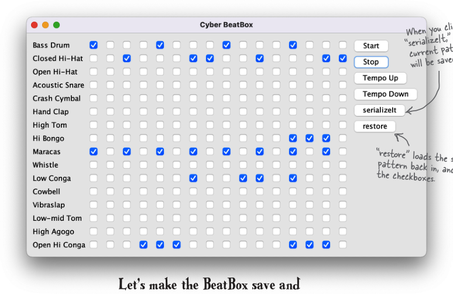

> *Figure/sidebar text on this page:* When you click / “serializeIt,” the / current pattern / will be saved. / “restore” loads the saved / pattern back in, and resets / the checkboxes. / Let’s make the BeatBox save and

<!-- HF p.579 -->

### Saving a BeatBox pattern

Remember, in the BeatBox, a drum pattern is nothing more than a bunch of checkboxes. When it’s time to play the sequence, the code walks through the checkboxes to figure out which drums sounds are playing at each of the 16 beats. So to save a pattern, all we need to do is save the state of the checkboxes.

We can make a simple boolean array, holding the state of each of the 256 checkboxes. An array object is serializable as long as the things *in* the array are serializable, so we’ll have no trouble saving an array of booleans.

To load a pattern back in, we read the single boolean array object (deserialize it) and restore the checkboxes. Most of the code you’ve already seen, in the Code Kitchen where we built the BeatBox GUI, so in this chapter, we look at only the save and restore code.

This CodeKitchen gets us ready for the next chapter, where instead of writing the pattern to a *file*, we send it over the *network* to the server. And instead of loading a pattern *in* from a file, we get patterns from the *server*, each time a participant sends one to the server.

```java
private void writeFile() {

  boolean[] checkboxState = new boolean[256];

  for (int i = 0; i < 256; i++) {
    JCheckBox check = checkboxList.get(i);
    if (check.isSelected()) {
      checkboxState[i] = true;
    }
  }

  try (ObjectOutputStream os =
         new ObjectOutputStream(new FileOutputStream("Checkbox.ser"))) {
    os.writeObject(checkboxState);
  } catch (IOException e) {
    e.printStackTrace();
  }
}
```

> *Figure/sidebar text on this page:* Serializing a pattern / This is a method in the BeatBox code. We can / call this from a lambda expression when we add an / ActionListener to the serializeIt button, or create an / ActionListener inner class that calls this. / Make a boolean array to hold the / state of each checkbox. / Walk through the checkboxList / (ArrayList of checkboxes), get / the state of each one, and add it / to the boolean array. / Try-with-resources / This part’s a piece of cake. Just / write/serialize the one boolean array!

<!-- HF p.580 -->

### Restoring a BeatBox pattern

This is pretty much the save in reverse...read the boolean array and use it to restore the state of the GUI checkboxes. It all happens when the user hits the “restore” button.

```java
private void readFile() {
  boolean[] checkboxState = null;
  try (ObjectInputStream is =
         new ObjectInputStream(new FileInputStream("Checkbox.ser"))) {
    checkboxState = (boolean[]) is.readObject();
  } catch (Exception e) {
    e.printStackTrace();
  }

  for (int i = 0; i < 256; i++) {
    JCheckBox check = checkboxList.get(i);
    check.setSelected(checkboxState[i]);
  }

  sequencer.stop();
  buildTrackAndStart();
}
```

|  | Sharpen your pencil | Yours to solve. |
|---|---|---|
| This version has a huge limitation! When you hit the “serializeIt” button, it serializes automatically, to a file named “Checkbox.ser” (which gets created if it doesn’t exist). But each time you save, you overwrite the previously saved file. Improve the save and restore feature by incorporating a JFileChooser so that you can name and save as many different patterns as you like, and load/restore from any of your previously saved pattern files. | This version h serializes aut |  |

> *Figure/sidebar text on this page:* Restoring a pattern / This is another method in the / BeatBox class. / Try-with-resources / Read the single object in the file (the / boolean array) and cast it back to a / boolean array (remember, readObject() / returns a reference of type Object). / Now restore the state of each of the / checkboxes in the ArrayList of actual / JCheckBox objects (checkboxList). / Now stop whatever is currently playing, / and rebuild the sequence using the new / state of the checkboxes in the ArrayList.

<!-- HF p.581 -->

#### Sharpen your pencil

Which of these do you think are, or should be, serializable? If not, why not? Not meaningful? Security risk? Only works for the current execution of the JVM? Make your best guess, without looking it up in the API.

What’s Legal?

```java
FileReader fileReader = new FileReader();
BufferedReader reader = new BufferedReader(fileReader);

FileOutputStream f = new FileOutputStream("Foo.ser");
ObjectOutputStream os = new ObjectOutputStream(f);


BufferedReader reader = new BufferedReader(new FileReader(file));
String line;
while ((line = reader.readLine()) != null) {
  makeCard(line);
}

FileOutputStream f = new FileOutputStream("Game.ser");
ObjectInputStream is = new ObjectInputStream(f);
GameCharacter oneAgain = (GameCharacter) is.readObject();
```

> *Figure/sidebar text on this page:* Can they be saved? / Yours to solve. / Object type Serializable? / If not, why not? / Object Yes / No / ______________________________________ / String Yes / No / ______________________________________ / File / Yes / No / ______________________________________ / Date / Yes / No / ______________________________________ / OutputStream Yes / No / ______________________________________ / JFrame Yes / No / ______________________________________ / Integer Yes / No / ______________________________________ / System Yes / No / ______________________________________ / Circle the code fragments / that would compile (assuming / they’re within a legal class). / Yours to solve.

<!-- HF p.582 -->

This chapter explored the wonderful world of Java I/O. Your job is to decide whether each of the following I/O-related statements is true or false.

Exercise

C**True or False**D

1. Serialization is appropriate when saving data for non-Java programs to use.
2. Object state can be saved only by using serialization.
3. ObjectOutputStream is a class used to save serializable objects.
4. Chain streams can be used on their own or with connection streams.
5. A single call to writeObject() can cause many objects to be saved.
6. All classes are serializable by default.
7. The java.nio.file.Path class can be used to locate files.
8. If a superclass is not serializable, then the subclass can’t be serializable.
9. Only classes that implement AutoCloseable can be used in try-with-resources statements.
10. When an object is deserialized, its constructor does not run.
11. Both serialization and saving to a text file can throw exceptions.
12. BufferedWriters can be chained to FileWriters.
13. File objects represent files, but not directories.
14. You can’t force a buffer to send its data before it’s full.
15. Both file readers and file writers can optionally be buffered.
16. The methods on the Files class let you operate on files and directories.
17. Try-with-resources statements cannot include explicit finally blocks.

> *Figure/sidebar text on this page:* Answers on page 584.

<!-- HF p.583 -->

Code Magnets

This one’s tricky, so we promoted it from an Exercise to full Puzzle status. Reconstruct the code snippets to make a working Java program that produces the output listed below. (You might not need all of the magnets, and you may reuse a magnet more than once.)

```java
class DungeonGame implements Serializable {
```

```java
e.printStackTrace();
```

```java
System.out.println(d.getX()+d.getY()+d.getZ());

 FileInputStream fis = new
   FileInputStream("dg.ser");
```

```java
 long getY() {

   return y;

   ois.close();


fos.writeObject(d);
```

```java
d = (DungeonGame) ois.readObject();
```

```java
                              ObjectOutputStream oos = new
% java DungeonTest
                                ObjectOutputStream(fos);
12
8
                                      public static void main(String[] args) {

                                        DungeonGame d = new DungeonGame();
```

```java
         try {

short getZ() {
  return z;
```

```java
oos.close();


   int getX() {
     return x;
```

```java
     public int x = 3;

     transient long y = 4;

     private short z = 5;

class DungeonTest {
```

```java
import java.io.*;
```

```java
} catch (Exception e) {
```

```java
oos.writeObject(d);
```

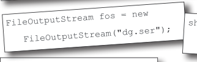

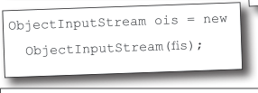

> *Figure/sidebar text on this page:* FileOutputStream fos = new / FileOutputStream("dg.ser"); / ObjectInputStream ois = new / ObjectInputStream(fis); / File Edit Window Help Torture / Answers on page 585.

<!-- HF p.584 -->

Exercise Solutions

**True or False**

**(from page 582)**

1. Serialization is appropriate when saving data for non-Java programs to use.
2. Object state can be saved only by using serialization.
3. ObjectOutputStream is a class used to save serializable objects.
4. Chain streams can be used on their own or with connection streams.
5. A single call to writeObject() can cause many objects to be saved.
6. All classes are serializable by default.
7. The java.nio.file.Path class can be used to locate files.
8. If a superclass is not serializable, then the subclass can’t be serializable.
9. Only classes that implement AutoCloseable can be used in try-with-resources statements.
10. When an object is deserialized, its constructor does not run.
11. Both serialization and saving to a text file can throw exceptions.
12. BufferedWriters can be chained to FileWriters.
13. File objects represent files, but not directories.
14. You can’t force a buffer to send its data before it’s full.
15. Both file readers and file writers can optionally be buffered.
16. The methods on the Files class let you operate on files and directories.
17. Try-with-resources statements cannot include explicit finally blocks.

> *Figure/sidebar text on this page:* False / False / True / False / True / False / False / False / True / True / True / True / False / False / True / True / False

<!-- HF p.585 -->

```java
                             import java.io.*;

                             class DungeonGame implements Serializable {
                               public int x = 3;
                               transient long y = 4;
                               private short z = 5;

                               int getX() {
                                 return x;
                               }
                               long getY() {
                                 return y;
                               }
                               short getZ() {
                                 return z;
                               }
                             }

                             class DungeonTest {
                               public static void main(String[] args) {
                                 DungeonGame d = new DungeonGame();
                                 System.out.println(d.getX() + d.getY() + d.getZ());
                                 try {
                                   FileOutputStream fos = new FileOutputStream("dg.ser");
                                   ObjectOutputStream oos = new ObjectOutputStream(fos);
                                   oos.writeObject(d);
                                   oos.close();

                                   FileInputStream fis = new FileInputStream("dg.ser");
                                   ObjectInputStream ois = new ObjectInputStream(fis);
                                   d = (DungeonGame) ois.readObject();
                                   ois.close();
                                 } catch (Exception e) {
% java DungeonTest
                                   e.printStackTrace();
12
                                 }
8
                                 System.out.println(d.getX() + d.getY() + d.getZ());
                               }
                             }
```

Code Magnets

**(from page 583)**


> *Figure/sidebar text on this page:* Good thing we’re / finally at the answers. / I was gettin’ kind of / tired of this chapter. / File Edit Window Help Escape
